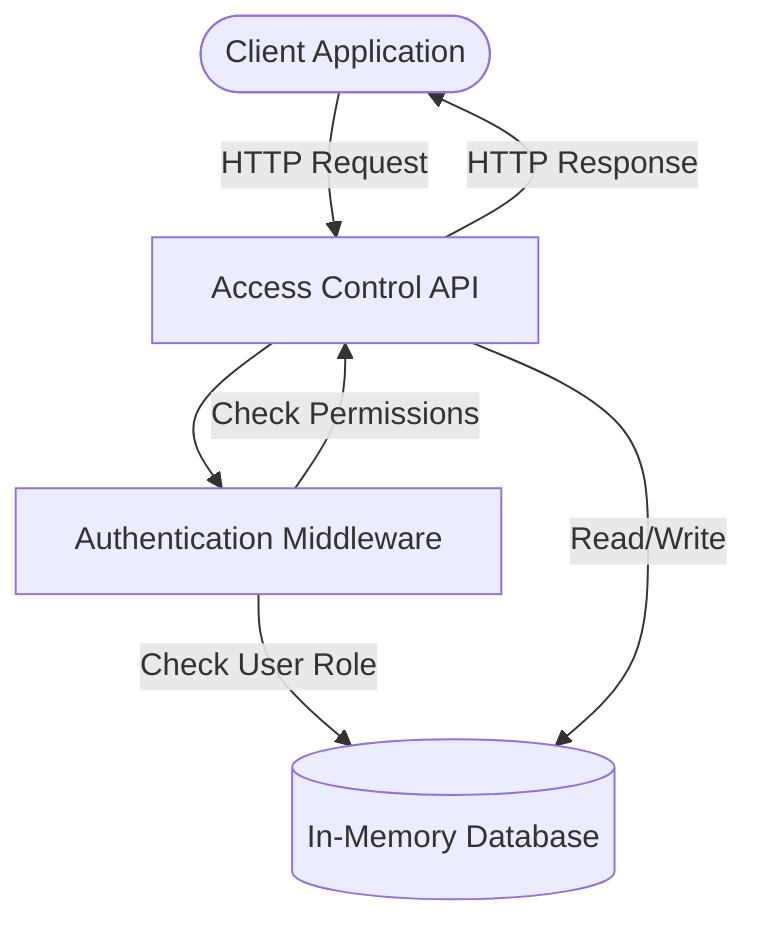

<details>
<summary>Relevant source files</summary>

The following files were used as context for generating this wiki page:

- [docs/api.html](https://github.com/agattani123/access-control-service/blob/main/docs/api.html)
- [src/routes.js](https://github.com/agattani123/access-control-service/blob/main/src/routes.js)
- [src/authMiddleware.js](https://github.com/agattani123/access-control-service/blob/main/src/authMiddleware.js)
- [src/db.js](https://github.com/agattani123/access-control-service/blob/main/src/db.js)
- [package.json](https://github.com/agattani123/access-control-service/blob/main/package.json)

</details>

# API Documentation

## Introduction

The Access Control Service provides a set of APIs for managing user roles, permissions, and access control within an application or system. It allows administrators to define roles, assign permissions to roles, and associate users with specific roles. The service also exposes endpoints for retrieving information about users, roles, and permissions.

The API is built using Express.js, a popular Node.js web application framework. It utilizes middleware functions for authentication and authorization, and stores data in an in-memory database. The service is designed to be easily integrated into other applications or systems that require role-based access control.

Sources: [docs/api.html](), [src/routes.js](), [package.json]()

## API Endpoints

### `GET /api/users`

This endpoint retrieves a list of all users and their associated roles.

**Required Permission:** `assign_user`

**Response:**

```json
[
  { "email": "admin@internal.company", "role": "admin" },
  { "email": "analyst@internal.company", "role": "analyst" }
]
```

Sources: [docs/api.html:11-16](), [src/routes.js:7-9]()

### `POST /api/roles`

This endpoint allows defining a new role and specifying the permissions associated with that role.

**Required Permission:** `view_permissions`

**Request Body:**

```json
{
  "name": "support",
  "permissions": ["view_users"]
}
```

**Response:**

```json
{
  "role": "support",
  "permissions": ["view_users"]
}
```

Sources: [docs/api.html:18-26](), [src/routes.js:11-18]()

### `GET /api/permissions`

This endpoint retrieves a mapping of all roles and their associated permissions.

**Required Permission:** `assign_user`

**Response:**

```json
{
  "admin": ["view_users", "create_role", "view_permissions", "assign_user"],
  "engineer": ["view_users", "view_permissions"],
  "analyst": ["view_users"]
}
```

Sources: [docs/api.html:28-34](), [src/routes.js:20-22]()

### `POST /api/tokens`

This endpoint is used to assign a role to a user, typically during the user onboarding process.

**Required Permission:** `assign_user`

**Request Body:**

```json
{
  "user": "newuser@internal.company",
  "role": "analyst"
}
```

**Response:**

```json
{
  "user": "newuser@internal.company",
  "role": "analyst"
}
```

Sources: [docs/api.html:36-48](), [src/routes.js:24-31]()

## Error Responses

The API returns the following common error responses:

| Code | Message                     |
|------|------------------------------|
| 400  | Invalid or missing request body |
| 401  | Unknown user                |
| 403  | Missing required permission  |

Sources: [docs/api.html:50-56]()

## Data Flow

The following diagram illustrates the high-level data flow and interactions between the API endpoints, middleware, and data storage:



1. The client application sends an HTTP request to the Access Control API, including the user's email in the `x-user-email` header.
2. The API routes the request to the authentication middleware (`authMiddleware.js`).
3. The middleware checks the user's role by looking up the user in the in-memory database (`db.js`).
4. The middleware then checks if the user's role has the required permission for the requested API endpoint.
5. If the user has the required permission, the middleware passes the request to the API endpoint handler.
6. The API endpoint handler reads or writes data to the in-memory database as needed.
7. The API endpoint handler sends the appropriate HTTP response back to the client application.

Sources: [src/routes.js](), [src/authMiddleware.js](), [src/db.js]()

## Authentication and Authorization

The Access Control Service uses a simple authentication and authorization mechanism based on the user's email and their assigned role.

### Authentication

All API requests must include the `x-user-email` header with a valid user email address. This email is used to look up the user's role in the in-memory database.

```
x-user-email: user@yourcompany.com
```

Sources: [docs/api.html:3-5]()

### Authorization

Each API endpoint requires a specific permission to be accessed. The `checkPermission` middleware function (`authMiddleware.js`) checks if the user's role has the required permission based on the role-permission mapping stored in the database.

```javascript
router.get('/users', checkPermission('view_users'), (req, res) => {
  // ...
});
```

If the user does not have the required permission, the middleware returns a 403 Forbidden response.

Sources: [src/routes.js:7](), [src/authMiddleware.js]()

## Data Storage

The Access Control Service uses an in-memory database (`db.js`) to store user information, roles, and role-permission mappings. The database is a simple JavaScript object with the following structure:

```javascript
const db = {
  users: {
    'admin@internal.company': 'admin',
    'analyst@internal.company': 'analyst',
    // ...
  },
  roles: {
    'admin': ['view_users', 'create_role', 'view_permissions', 'assign_user'],
    'engineer': ['view_users', 'view_permissions'],
    'analyst': ['view_users'],
    // ...
  }
};
```

- The `users` object maps user email addresses to their assigned roles.
- The `roles` object maps role names to an array of permissions associated with that role.

While this in-memory database is suitable for demonstration purposes, a production-ready implementation would likely use a more robust and persistent data storage solution, such as a relational database or a NoSQL database.

Sources: [src/db.js]()

## Conclusion

The Access Control Service provides a simple yet effective way to manage user roles, permissions, and access control within an application or system. It exposes a RESTful API that allows administrators to define roles, assign permissions to roles, associate users with roles, and retrieve information about users, roles, and permissions.

The service is built using Node.js and Express.js, and it utilizes middleware functions for authentication and authorization. The data is stored in an in-memory database, but a production-ready implementation would likely use a more robust and persistent data storage solution.

Overall, the Access Control Service demonstrates a basic implementation of role-based access control, which can be extended and integrated into larger applications or systems as needed.