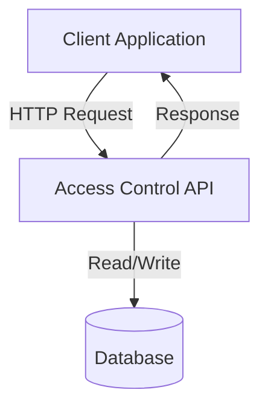
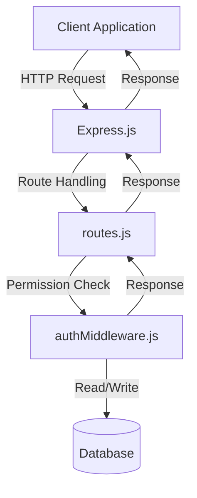
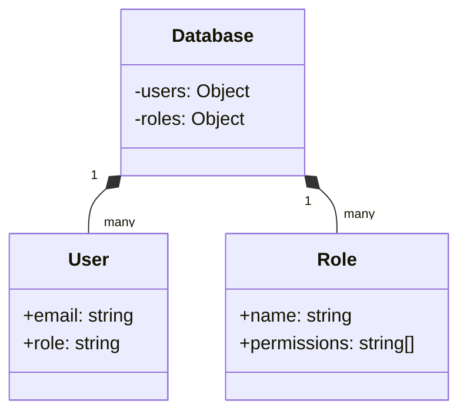

<details>
<summary>Relevant source files</summary>

The following files were used as context for generating this wiki page:

- [docs/api.html](https://github.com/agattani123/access-control-service/blob/main/docs/api.html)
- [src/routes.js](https://github.com/agattani123/access-control-service/blob/main/src/routes.js)
- [src/authMiddleware.js](https://github.com/agattani123/access-control-service/blob/main/src/authMiddleware.js)
- [src/db.js](https://github.com/agattani123/access-control-service/blob/main/src/db.js)
- [src/app.js](https://github.com/agattani123/access-control-service/blob/main/src/app.js)

</details>

# API Documentation

## Introduction

The Access Control Service provides a set of APIs for managing user roles, permissions, and access control within an application or system. It allows administrators to define roles, assign permissions to roles, and associate users with specific roles. This service acts as a centralized access control mechanism, ensuring that users have the appropriate permissions to perform certain actions or access specific resources.

The API documentation covers the available endpoints, their functionalities, request/response formats, and required permissions. It also provides insights into the underlying architecture and data structures used to manage roles, permissions, and user assignments.

Sources: [docs/api.html](), [src/routes.js]()

## API Endpoints

### `GET /api/users`

This endpoint retrieves a list of all users and their associated roles within the system.

**Required Permission:** `assign_user`

**Response:**

```json
[
  { "email": "admin@internal.company", "role": "admin" },
  { "email": "analyst@internal.company", "role": "analyst" }
]
```

Sources: [docs/api.html:11-16](), [src/routes.js:7-9]()

### `POST /api/roles`

This endpoint allows administrators to define a new role and specify the associated permissions.

**Required Permission:** `view_permissions`

**Request Body:**

```json
{
  "name": "support",
  "permissions": ["view_users"]
}
```

**Response:**

```json
{
  "role": "support",
  "permissions": ["view_users"]
}
```

Sources: [docs/api.html:18-27](), [src/routes.js:12-20]()

### `GET /api/permissions`

This endpoint retrieves a list of all current role-permission mappings within the system.

**Required Permission:** `assign_user`

**Response:**

```json
{
  "admin": ["view_users", "create_role", "view_permissions", "assign_user"],
  "engineer": ["view_users", "view_permissions"],
  "analyst": ["view_users"]
}
```

Sources: [docs/api.html:29-35](), [src/routes.js:22-26,28-30,32-34,36-38]()

### `POST /api/tokens`

This endpoint is used to assign a role to a user, typically during the bootstrapping process for new users.

**Required Permission:** `assign_user`

**Request Body:**

```json
{
  "user": "newuser@internal.company",
  "role": "analyst"
}
```

**Response:**

```json
{
  "user": "newuser@internal.company",
  "role": "analyst"
}
```

**Note:** This endpoint was previously unrestricted but now requires the `assign_user` permission to enforce accountability around role assignment.

Sources: [docs/api.html:37-49](), [src/routes.js:40-48]()

## Architecture and Data Flow

The Access Control Service follows a typical client-server architecture, where clients (e.g., web applications, mobile apps) interact with the service through HTTP requests to the provided API endpoints.



Sources: [src/routes.js](), [src/app.js]()

The service is built using Express.js, a popular Node.js web application framework. The `routes.js` file defines the API endpoints and their corresponding handlers, while the `authMiddleware.js` file contains middleware functions for checking user permissions before allowing access to certain endpoints.



Sources: [src/routes.js](), [src/authMiddleware.js](), [src/app.js]()

The service maintains two main data structures in memory:

1. `users` object: Stores user email addresses as keys and their associated roles as values.
2. `roles` object: Stores role names as keys and their associated permissions as values.



Sources: [src/db.js]()

## Error Handling

The API returns standard HTTP status codes for different error scenarios:

| Code | Message                    |
|------|----------------------------|
| 400  | Invalid or missing request body |
| 401  | Unknown user               |
| 403  | Missing required permission    |

Sources: [docs/api.html:53-59]()

## Conclusion

The Access Control Service provides a centralized mechanism for managing user roles, permissions, and access control within an application or system. It offers a set of APIs for defining roles, assigning permissions to roles, retrieving role-permission mappings, and associating users with specific roles. The service follows a client-server architecture, with Express.js handling the API routes and middleware for permission checks. The data is stored in memory using JavaScript objects, representing users, roles, and their relationships.