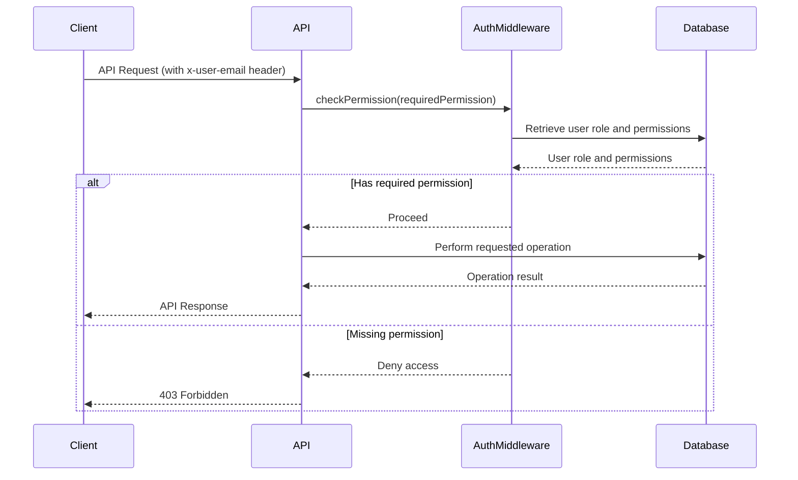

<details>
<summary>Relevant source files</summary>

The following files were used as context for generating this wiki page:

- [docs/api.html](https://github.com/agattani123/access-control-service/blob/main/docs/api.html)
- [src/routes.js](https://github.com/agattani123/access-control-service/blob/main/src/routes.js)
- [src/authMiddleware.js](https://github.com/agattani123/access-control-service/blob/main/src/authMiddleware.js)
- [src/db.js](https://github.com/agattani123/access-control-service/blob/main/src/db.js)
- [src/app.js](https://github.com/agattani123/access-control-service/blob/main/src/app.js)

</details>

# API Documentation

## Introduction

The Access Control Service provides a set of APIs for managing user roles, permissions, and access control within an application or system. It allows administrators to define roles, assign permissions to roles, and associate users with specific roles. This service acts as a centralized authority for enforcing access control policies and ensuring that users have the appropriate permissions to perform certain actions.

The API Documentation covers the various endpoints, request/response formats, and authentication mechanisms used by the Access Control Service. It also outlines the underlying data models and relationships between users, roles, and permissions.

Sources: [docs/api.html](), [src/routes.js]()

## API Endpoints

### User Management

#### `GET /api/users`

Retrieves a list of all users and their associated roles.

**Required Permission:** `assign_user`

**Response:**

```json
[
  { "email": "admin@internal.company", "role": "admin" },
  { "email": "analyst@internal.company", "role": "analyst" }
]
```

Sources: [docs/api.html:12-17](), [src/routes.js:7-9]()

### Role Management

#### `POST /api/roles`

Defines a new role and its associated permissions.

**Required Permission:** `view_permissions`

**Request Body:**

```json
{
  "name": "support",
  "permissions": ["view_users"]
}
```

**Response:**

```json
{
  "role": "support",
  "permissions": ["view_users"]
}
```

Sources: [docs/api.html:19-27](), [src/routes.js:12-19]()

#### `GET /api/permissions`

Lists all current role-permission mappings.

**Required Permission:** `assign_user`

**Response:**

```json
{
  "admin": ["view_users", "create_role", "view_permissions", "assign_user"],
  "engineer": ["view_users", "view_permissions"],
  "analyst": ["view_users"]
}
```

Sources: [docs/api.html:29-35](), [src/routes.js:21-24,26-28]()

### User-Role Assignment

#### `POST /api/tokens`

Assigns a role to a user. Used for bootstrapping new users.

**Required Permission:** `assign_user`

**Request Body:**

```json
{
  "user": "newuser@internal.company",
  "role": "analyst"
}
```

**Response:**

```json
{
  "user": "newuser@internal.company",
  "role": "analyst"
}
```

Sources: [docs/api.html:37-48](), [src/routes.js:30-37]()

## Data Models

### Users

The `users` object in the `db` module stores user-role mappings, where the key is the user's email, and the value is the assigned role.

```javascript
{
  "admin@internal.company": "admin",
  "analyst@internal.company": "analyst"
}
```

Sources: [src/db.js]()

### Roles

The `roles` object in the `db` module stores role-permission mappings, where the key is the role name, and the value is an array of associated permissions.

```javascript
{
  "admin": ["view_users", "create_role", "view_permissions", "assign_user"],
  "engineer": ["view_users", "view_permissions"],
  "analyst": ["view_users"]
}
```

Sources: [src/db.js](), [docs/api.html:33-35]()

## Authentication and Authorization

The Access Control Service uses an `x-user-email` header to identify the requesting user. This email is used to look up the user's role in the `users` object, and the associated permissions are retrieved from the `roles` object.

```javascript
import db from './db.js';

export const checkPermission = (requiredPermission) => {
  return (req, res, next) => {
    const userEmail = req.headers['x-user-email'];
    const userRole = db.users[userEmail];
    const permissions = db.roles[userRole] || [];

    if (permissions.includes(requiredPermission)) {
      next();
    } else {
      res.status(403).json({ error: 'Missing required permission' });
    }
  };
};
```

The `checkPermission` middleware function is used to enforce access control on protected routes. It checks if the user's role has the required permission before allowing the request to proceed.

Sources: [src/authMiddleware.js](), [docs/api.html:2-4]()

## Error Handling

The API returns the following common error responses:

| Code | Message                      |
|------|-------------------------------|
| 400  | Invalid or missing request body |
| 401  | Unknown user                 |
| 403  | Missing required permission  |

Sources: [docs/api.html:52-57]()

## Sequence Diagram

The following sequence diagram illustrates the flow of a typical API request and the interaction between the various components of the Access Control Service:



This diagram illustrates the following steps:

1. The client sends an API request with the `x-user-email` header.
2. The API router invokes the `checkPermission` middleware, passing the required permission for the requested route.
3. The `checkPermission` middleware retrieves the user's role and associated permissions from the database.
4. If the user's role has the required permission, the middleware allows the request to proceed to the API route handler.
5. The API route handler performs the requested operation, potentially interacting with the database.
6. The API responds with the operation result or an appropriate error message if the user lacks the required permission.

Sources: [src/routes.js](), [src/authMiddleware.js](), [docs/api.html]()

## Conclusion

The Access Control Service provides a robust and secure mechanism for managing user roles, permissions, and access control within an application or system. By leveraging the API endpoints and data models described in this documentation, developers can effectively implement role-based access control (RBAC) and ensure that users have the appropriate permissions to perform specific actions. The service also includes authentication and authorization mechanisms to verify user identities and enforce access control policies.