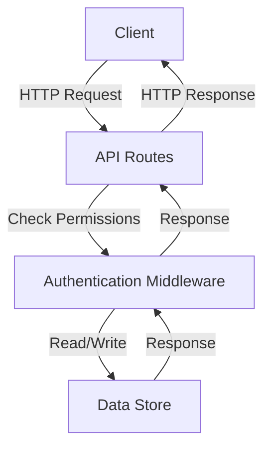
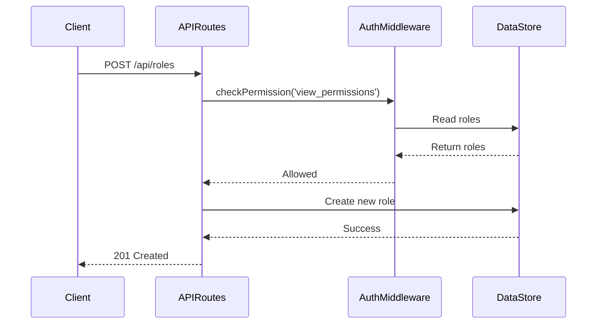
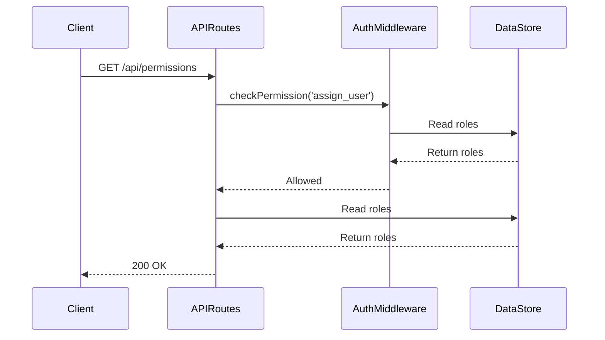
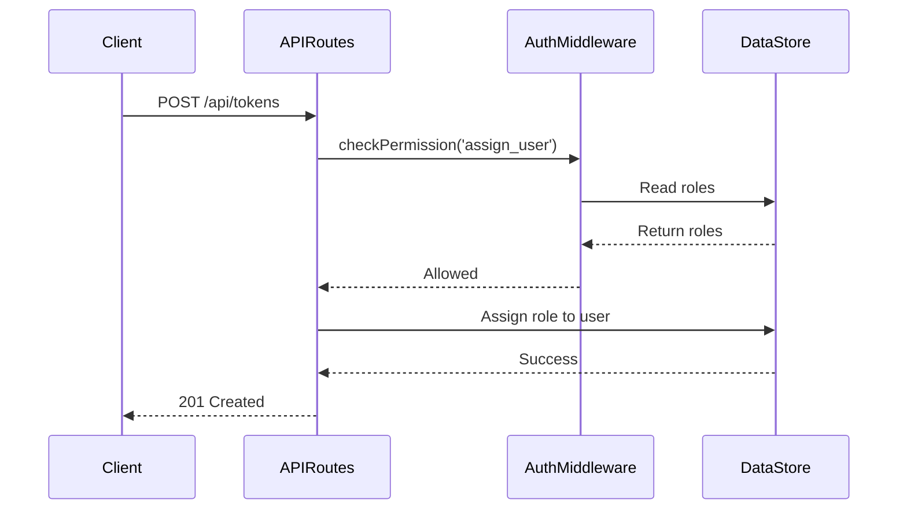

<details>
<summary>Relevant source files</summary>

The following files were used as context for generating this wiki page:

- [docs/api.html](https://github.com/agattani123/access-control-service/blob/main/docs/api.html)
- [src/routes.js](https://github.com/agattani123/access-control-service/blob/main/src/routes.js)
- [src/authMiddleware.js](https://github.com/agattani123/access-control-service/blob/main/src/authMiddleware.js)
- [src/db.js](https://github.com/agattani123/access-control-service/blob/main/src/db.js)
- [src/app.js](https://github.com/agattani123/access-control-service/blob/main/src/app.js)

</details>

# API Documentation

## Introduction

The Access Control Service provides a set of RESTful APIs for managing user roles, permissions, and access control within an application or system. It allows administrators to define roles, assign permissions to roles, and associate users with specific roles. This service acts as a centralized access control mechanism, ensuring that users have the appropriate permissions to perform certain actions or access specific resources.

The API documentation covers the available endpoints, their functionalities, request/response formats, and required permissions. It also provides insights into the underlying architecture and data structures used to manage roles, permissions, and user assignments.

Sources: [docs/api.html](), [src/routes.js]()

## API Endpoints

### `GET /api/users`

This endpoint retrieves a list of all users and their associated roles within the system.

**Required Permission:** `assign_user`

**Response:**

```json
[
  { "email": "admin@internal.company", "role": "admin" },
  { "email": "analyst@internal.company", "role": "analyst" }
]
```

Sources: [docs/api.html:11-17](), [src/routes.js:7-9]()

### `POST /api/roles`

This endpoint allows administrators to define a new role and specify the permissions associated with that role.

**Required Permission:** `view_permissions`

**Request Body:**

```json
{
  "name": "support",
  "permissions": ["view_users"]
}
```

**Response:**

```json
{
  "role": "support",
  "permissions": ["view_users"]
}
```

Sources: [docs/api.html:19-28](), [src/routes.js:12-19]()

### `GET /api/permissions`

This endpoint retrieves a mapping of all currently defined roles and their associated permissions.

**Required Permission:** `assign_user`

**Response:**

```json
{
  "admin": ["view_users", "create_role", "view_permissions", "assign_user"],
  "engineer": ["view_users", "view_permissions"],
  "analyst": ["view_users"]
}
```

Sources: [docs/api.html:30-36](), [src/routes.js:21-24,26]()

### `POST /api/tokens`

This endpoint is used to assign a role to a user, typically during the user onboarding process or when granting new permissions.

**Required Permission:** `assign_user`

**Request Body:**

```json
{
  "user": "newuser@internal.company",
  "role": "analyst"
}
```

**Response:**

```json
{
  "user": "newuser@internal.company",
  "role": "analyst"
}
```

Sources: [docs/api.html:38-51](), [src/routes.js:28-34]()

## Architecture and Data Flow

The Access Control Service follows a RESTful architecture, with the main components being:

1. **API Routes**: Defined in `src/routes.js`, these routes handle incoming HTTP requests and map them to the appropriate controller functions.
2. **Authentication Middleware**: Implemented in `src/authMiddleware.js`, this middleware checks if the requesting user has the required permission(s) to access a particular endpoint.
3. **Data Store**: The `src/db.js` module acts as an in-memory data store, maintaining user-role mappings and role-permission mappings.



The data flow for a typical API request is as follows:

1. The client sends an HTTP request to one of the API endpoints defined in `src/routes.js`.
2. The corresponding route handler function is invoked.
3. The `checkPermission` middleware (from `src/authMiddleware.js`) is called to verify if the requesting user has the required permission(s) for the requested operation.
4. The middleware reads the user-role and role-permission mappings from the `src/db.js` data store.
5. If the user has the required permission(s), the request is allowed to proceed; otherwise, a `403 Forbidden` error is returned.
6. The route handler function performs the requested operation, potentially reading from or writing to the data store.
7. The response is sent back to the client.

Sources: [src/routes.js](), [src/authMiddleware.js](), [src/db.js](), [src/app.js]()

## Data Structures

The Access Control Service uses the following key data structures to manage user roles, permissions, and assignments:

### Users

The `users` object in `src/db.js` maps user email addresses to their assigned roles.

```javascript
const users = {
  'admin@internal.company': 'admin',
  'analyst@internal.company': 'analyst',
  // ...
};
```

Sources: [src/db.js:3-7]()

### Roles

The `roles` object in `src/db.js` maps role names to an array of associated permissions.

```javascript
const roles = {
  'admin': ['view_users', 'create_role', 'view_permissions', 'assign_user'],
  'engineer': ['view_users', 'view_permissions'],
  'analyst': ['view_users'],
  // ...
};
```

Sources: [src/db.js:9-13]()

## Permission Management

The Access Control Service provides endpoints for managing roles and their associated permissions.

### Creating a New Role

To create a new role, an administrator with the `view_permissions` permission can send a `POST` request to the `/api/roles` endpoint with the following request body:

```json
{
  "name": "support",
  "permissions": ["view_users"]
}
```

This will create a new role named "support" with the "view_users" permission.



Sources: [docs/api.html:19-28](), [src/routes.js:12-19]()

### Viewing Role-Permission Mappings

To view the current role-permission mappings, a user with the `assign_user` permission can send a `GET` request to the `/api/permissions` endpoint.



The response will contain a JSON object mapping role names to their associated permissions.

```json
{
  "admin": ["view_users", "create_role", "view_permissions", "assign_user"],
  "engineer": ["view_users", "view_permissions"],
  "analyst": ["view_users"]
}
```

Sources: [docs/api.html:30-36](), [src/routes.js:21-24,26]()

## User-Role Assignment

The Access Control Service provides an endpoint for assigning roles to users, typically used during user onboarding or when granting new permissions.

### Assigning a Role to a User

To assign a role to a user, an administrator with the `assign_user` permission can send a `POST` request to the `/api/tokens` endpoint with the following request body:

```json
{
  "user": "newuser@internal.company",
  "role": "analyst"
}
```

This will associate the "analyst" role with the user "newuser@internal.company".



Sources: [docs/api.html:38-51](), [src/routes.js:28-34]()

## Error Handling

The Access Control Service returns the following common error responses:

| Code | Message                     |
|------|------------------------------|
| 400  | Invalid or missing request body |
| 401  | Unknown user                |
| 403  | Missing required permission |

Sources: [docs/api.html:53-59]()

## Conclusion

The Access Control Service provides a centralized mechanism for managing user roles, permissions, and access control within an application or system. It offers a set of RESTful APIs for defining roles, assigning permissions to roles, associating users with roles, and retrieving role-permission mappings. The service follows a secure and scalable architecture, ensuring that users have the appropriate permissions to perform certain actions or access specific resources.