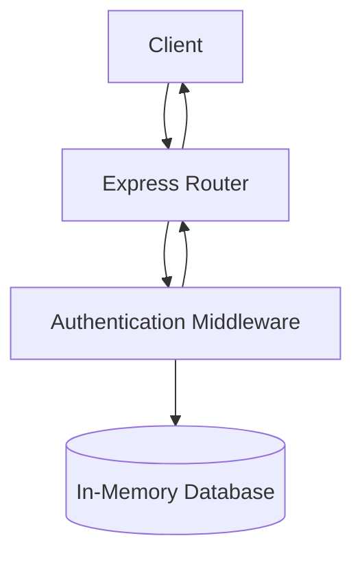
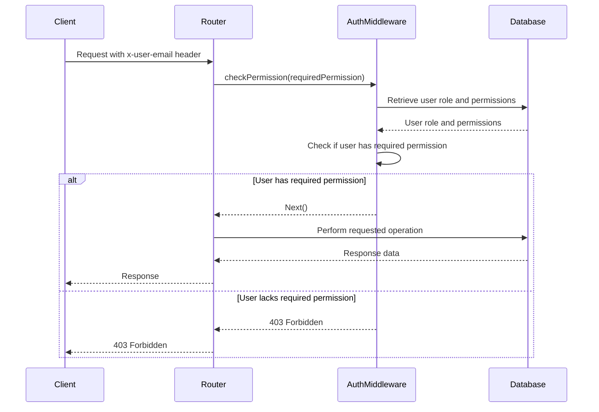

<details>
<summary>Relevant source files</summary>

The following files were used as context for generating this wiki page:

- [docs/api.html](https://github.com/agattani123/access-control-service/blob/main/docs/api.html)
- [src/routes.js](https://github.com/agattani123/access-control-service/blob/main/src/routes.js)
- [src/authMiddleware.js](https://github.com/agattani123/access-control-service/blob/main/src/authMiddleware.js)
- [src/db.js](https://github.com/agattani123/access-control-service/blob/main/src/db.js)
- [src/app.js](https://github.com/agattani123/access-control-service/blob/main/src/app.js)

</details>

# API Documentation

## Introduction

The Access Control Service provides a set of APIs for managing user roles, permissions, and access control within an application or system. It allows administrators to define roles, assign permissions to roles, and assign roles to users. The service also exposes endpoints for retrieving information about users, roles, and permissions.

The API documentation covers the available endpoints, their functionality, request/response formats, and required permissions. It also includes relevant code snippets and diagrams to illustrate the service's architecture and data flow.

Sources: [docs/api.html](), [src/routes.js]()

## API Endpoints

### `GET /api/users`

This endpoint returns a list of all users and their assigned roles.

**Required Permission:** `assign_user`

**Response:**

```json
[
  { "email": "admin@internal.company", "role": "admin" },
  { "email": "analyst@internal.company", "role": "analyst" }
]
```

Sources: [docs/api.html:11-16](), [src/routes.js:7-9]()

### `POST /api/roles`

This endpoint allows defining a new role and its associated permissions.

**Required Permission:** `view_permissions`

**Request Body:**

```json
{
  "name": "support",
  "permissions": ["view_users"]
}
```

**Response:**

```json
{
  "role": "support",
  "permissions": ["view_users"]
}
```

Sources: [docs/api.html:18-26](), [src/routes.js:12-19]()

### `GET /api/permissions`

This endpoint lists all current role-permission mappings.

**Required Permission:** `assign_user`

**Response:**

```json
{
  "admin": ["view_users", "create_role", "view_permissions", "assign_user"],
  "engineer": ["view_users", "view_permissions"],
  "analyst": ["view_users"]
}
```

Sources: [docs/api.html:28-33](), [src/routes.js:21-24,26]()

### `POST /api/tokens`

This endpoint assigns a role to a user, typically used for bootstrapping new users.

**Required Permission:** `assign_user`

**Request Body:**

```json
{
  "user": "newuser@internal.company",
  "role": "analyst"
}
```

**Response:**

```json
{
  "user": "newuser@internal.company",
  "role": "analyst"
}
```

Sources: [docs/api.html:35-46](), [src/routes.js:28-34]()

## Error Responses

The API returns the following common error responses:

| Code | Message                     |
|------|------------------------------|
| 400  | Invalid or missing request body |
| 401  | Unknown user                |
| 403  | Missing required permission |

Sources: [docs/api.html:48-54]()

## Architecture and Data Flow

The Access Control Service follows a typical API architecture, with an Express.js router handling incoming requests, performing authentication and authorization checks, and interacting with an in-memory data store.



1. The client sends a request to the Express router.
2. The router passes the request to the authentication middleware (`checkPermission`).
3. The middleware checks the user's role and permissions against the requested endpoint's requirements.
4. If authorized, the middleware interacts with the in-memory database to retrieve or update data.
5. The response is sent back to the client through the router.

Sources: [src/routes.js](), [src/authMiddleware.js](), [src/db.js]()

## Authentication and Authorization Flow

The service uses a custom authentication middleware (`checkPermission`) to verify the user's identity and authorize access to endpoints based on their assigned role and permissions.



1. The client sends a request with the `x-user-email` header.
2. The router passes the request to the `checkPermission` middleware, providing the required permission for the endpoint.
3. The middleware retrieves the user's role and permissions from the database.
4. The middleware checks if the user has the required permission based on their role.
5. If authorized, the middleware allows the request to proceed, and the router performs the requested operation.
6. If not authorized, the middleware returns a 403 Forbidden response.

Sources: [src/authMiddleware.js](), [src/routes.js]()

## Data Models

The service uses an in-memory data store to maintain user, role, and permission information. The data models are as follows:

### Users

```json
{
  "user@email.com": "admin",
  "another@email.com": "analyst"
}
```

- Keys represent user email addresses.
- Values represent the assigned role for the user.

Sources: [src/db.js:3-6]()

### Roles

```json
{
  "admin": ["view_users", "create_role", "view_permissions", "assign_user"],
  "engineer": ["view_users", "view_permissions"],
  "analyst": ["view_users"]
}
```

- Keys represent role names.
- Values are arrays of permissions associated with the role.

Sources: [src/db.js:8-12]()

## Conclusion

The Access Control Service provides a secure and flexible way to manage user roles, permissions, and access control within an application or system. It exposes a set of APIs that allow administrators to define roles, assign permissions to roles, and assign roles to users. The service also provides endpoints for retrieving information about users, roles, and permissions. The documentation covers the available endpoints, their functionality, request/response formats, and required permissions, as well as the service's architecture, data flow, and data models.