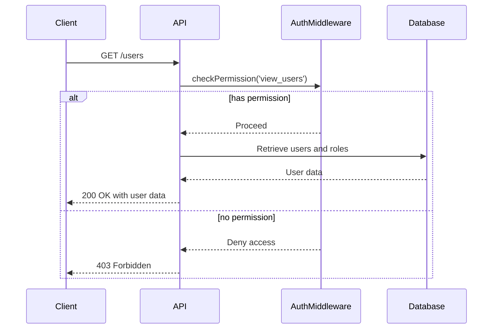
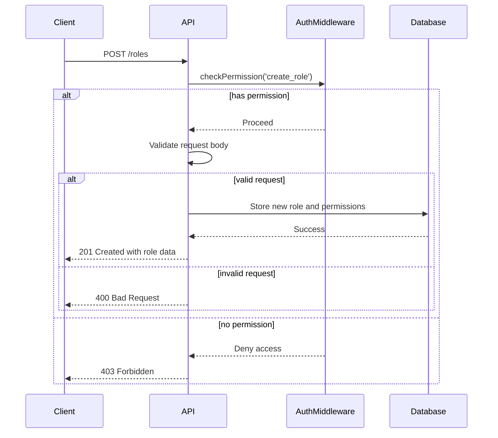
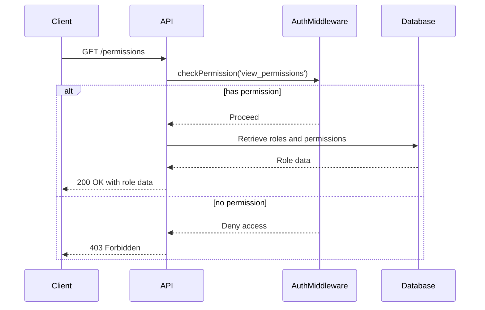
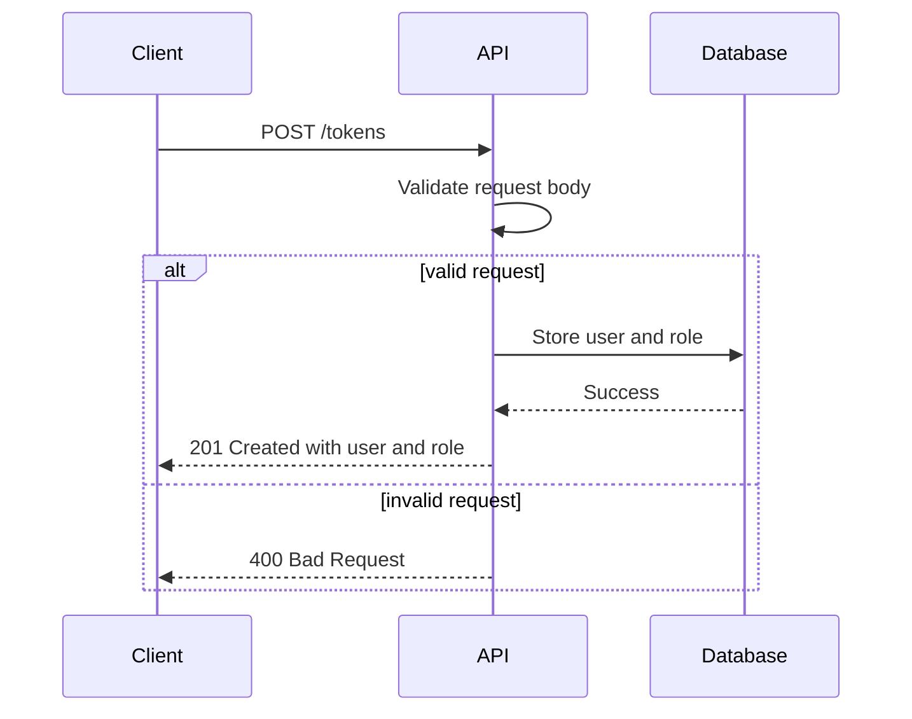
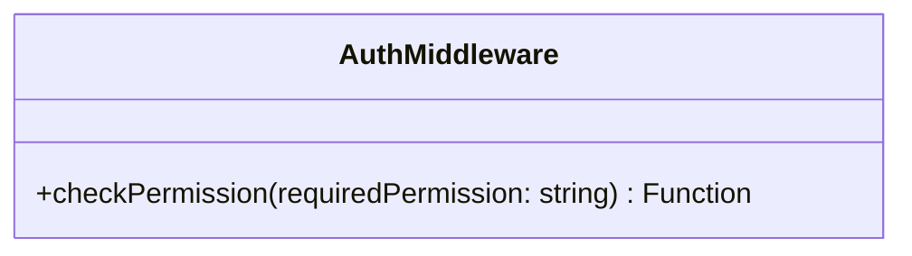
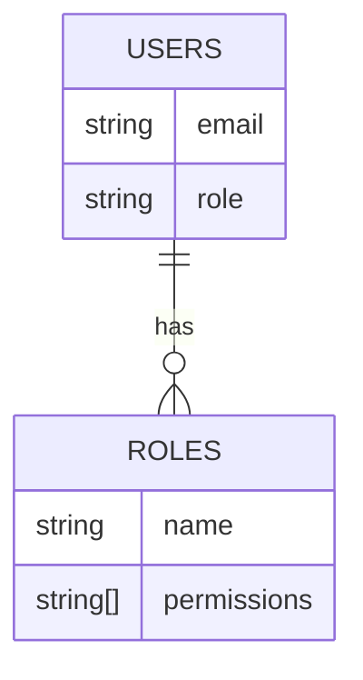

Relevant source files

The following files were used as context for generating this wiki page:

- [src/routes.js](https://github.com/agattani123/access-control-service/blob/main/src/routes.js)
- [src/authMiddleware.js](https://github.com/agattani123/access-control-service/blob/main/src/authMiddleware.js)
- [src/db.js](https://github.com/agattani123/access-control-service/blob/main/src/db.js)

# API Documentation

## Introduction

The API Documentation covers the implementation details of the access control service's API endpoints, which handle user authentication, role management, and permission checking. This service provides a centralized system for managing user roles and permissions within the application. It allows authorized users to view and create roles, assign roles to users, and check permissions for specific actions.

The API is built using Express.js, a popular Node.js web application framework, and utilizes a simple in-memory database for storing user roles and permissions. The service exposes several RESTful endpoints for interacting with the access control system.

## API Endpoints

### GET /users

This endpoint retrieves a list of all registered users and their associated roles.

Sources: [src/routes.js:5-7]()

### POST /roles

This endpoint allows authorized users to create a new role with a set of permissions.

Sources: [src/routes.js:9-16]()

### GET /permissions

This endpoint retrieves a list of all defined roles and their associated permissions.

Sources: [src/routes.js:18-20](), [src/routes.js:22-24]()

### POST /tokens

This endpoint allows clients to assign a role to a user, effectively creating an authentication token.

Sources: [src/routes.js:26-32]()

## Authentication Middleware

The `checkPermission` middleware is responsible for verifying if a user has the required permission to access a specific endpoint. It is implemented in the `authMiddleware.js` file and used in the API routes that require authentication.

The `checkPermission` function takes a `requiredPermission` string as input and returns a middleware function that can be used in the Express.js route handlers. The middleware function checks if the user's role has the required permission based on the data stored in the in-memory database.

Sources: [src/authMiddleware.js]()

## Data Storage

The service uses a simple in-memory data store implemented in the `db.js` file to store user roles and permissions. The data store consists of two objects:

- `users`: An object that maps user emails to their assigned roles.
- `roles`: An object that maps role names to an array of permissions.

This data store is used by the API routes and the authentication middleware to manage user roles and permissions.

Sources: [src/db.js]()

## Conclusion

The API Documentation provides an overview of the access control service's API endpoints, authentication middleware, and data storage implementation. It covers the functionality of each endpoint, including the required permissions, request/response formats, and error handling. The documentation also explains the role of the authentication middleware in checking user permissions and the structure of the in-memory data store used for storing user roles and permissions.