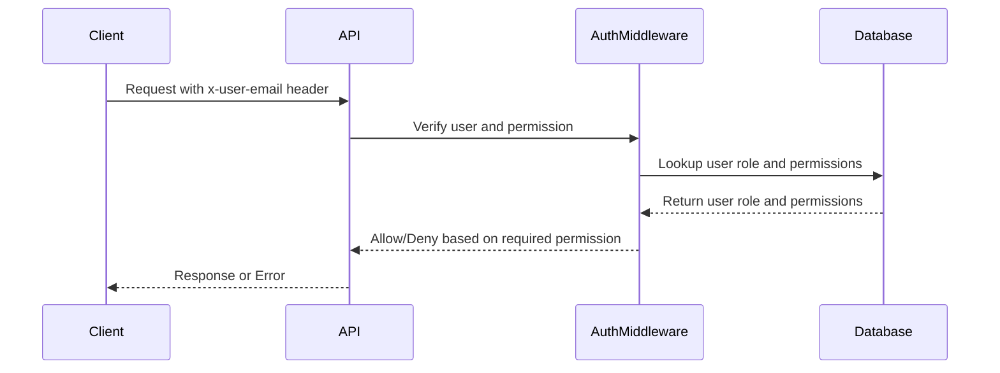
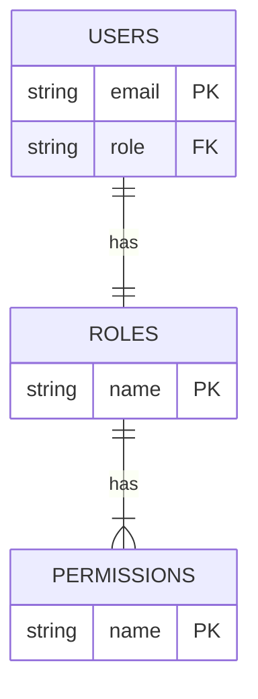

<details>
<summary>Relevant source files</summary>

The following files were used as context for generating this wiki page:

- [docs/api.html](https://github.com/agattani123/access-control-service/blob/main/docs/api.html)
- [src/routes.js](https://github.com/agattani123/access-control-service/blob/main/src/routes.js)
- [src/authMiddleware.js](https://github.com/agattani123/access-control-service/blob/main/src/authMiddleware.js)
- [src/db.js](https://github.com/agattani123/access-control-service/blob/main/src/db.js)
- [src/app.js](https://github.com/agattani123/access-control-service/blob/main/src/app.js)

</details>

# API Documentation

## Introduction

The Access Control Service provides a set of APIs to manage user roles, permissions, and access control within an application or system. It allows administrators to define roles, assign permissions to roles, and associate users with specific roles. The service also exposes endpoints for retrieving user and permission information.

This API documentation covers the various endpoints, request/response formats, and authentication mechanisms used by the Access Control Service. It serves as a reference for developers integrating with or extending the service.

Sources: [docs/api.html](), [src/routes.js]()

## API Endpoints

### `GET /api/users`

Retrieves a list of all users and their associated roles.

**Required Permission:** `assign_user`

**Response:**

```json
[
  { "email": "admin@internal.company", "role": "admin" },
  { "email": "analyst@internal.company", "role": "analyst" }
]
```

Sources: [docs/api.html:10-16](), [src/routes.js:7-9]()

### `POST /api/roles`

Defines a new role and its associated permissions.

**Required Permission:** `view_permissions`

**Request Body:**

```json
{
  "name": "support",
  "permissions": ["view_users"]
}
```

**Response:**

```json
{
  "role": "support",
  "permissions": ["view_users"]
}
```

Sources: [docs/api.html:18-26](), [src/routes.js:12-19]()

### `GET /api/permissions`

Lists all current role-permission mappings.

**Required Permission:** `assign_user`

**Response:**

```json
{
  "admin": ["view_users", "create_role", "view_permissions", "assign_user"],
  "engineer": ["view_users", "view_permissions"],
  "analyst": ["view_users"]
}
```

Sources: [docs/api.html:28-34](), [src/routes.js:21-24,27-29]()

### `POST /api/tokens`

Assigns a role to a user. Used for bootstrapping new users.

**Required Permission:** `assign_user`

**Request Body:**

```json
{
  "user": "newuser@internal.company",
  "role": "analyst"
}
```

**Response:**

```json
{
  "user": "newuser@internal.company",
  "role": "analyst"
}
```

This endpoint was previously unrestricted. As of May 2025, it now requires the `assign_user` permission to enforce accountability around role assignment.

Sources: [docs/api.html:36-48](), [src/routes.js:31-38]()

## Authentication

All requests to the API must include a valid `x-user-email` header containing the user's email address. This is used to look up the user's role and evaluate access permissions for the requested operation.

```
x-user-email: user@yourcompany.com
```

Sources: [docs/api.html:3-5]()

## Error Responses

The API returns the following common error responses:

| Code | Message                    |
|------|-----------------------------
| 400  | Invalid or missing request body |
| 401  | Unknown user                |
| 403  | Missing required permission |

Sources: [docs/api.html:51-57]()

## Access Control Flow

The following diagram illustrates the high-level flow of how the Access Control Service handles incoming requests and enforces permissions:



1. The client sends a request to the API, including the `x-user-email` header.
2. The API routes the request to the `authMiddleware` for authentication and authorization.
3. The `authMiddleware` looks up the user's role and associated permissions in the database.
4. Based on the required permission for the requested operation, the `authMiddleware` either allows or denies the request.
5. The API returns the appropriate response or error to the client.

Sources: [src/routes.js](), [src/authMiddleware.js](), [src/db.js]()

## Data Model

The Access Control Service uses the following data model to store user and role information:



- The `USERS` table stores user email addresses and their associated role.
- The `ROLES` table defines the available roles and their corresponding permissions.
- The `PERMISSIONS` table contains the list of all available permissions in the system.

Sources: [src/db.js]()

## Conclusion

The Access Control Service provides a robust set of APIs for managing user roles, permissions, and access control within an application or system. It follows industry-standard practices for authentication, authorization, and data modeling. Developers can leverage this service to ensure secure and controlled access to their applications based on user roles and permissions.

Sources: [docs/api.html](), [src/routes.js](), [src/authMiddleware.js](), [src/db.js](), [src/app.js]()