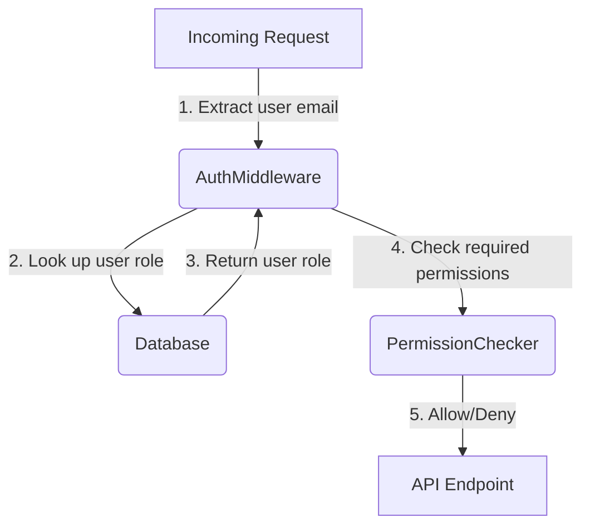
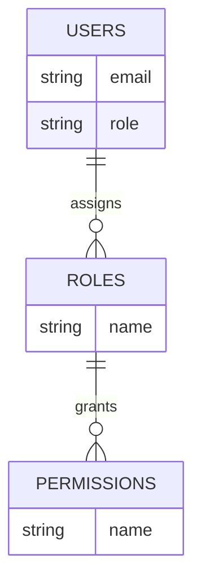

<details>
<summary>Relevant source files</summary>

The following files were used as context for generating this wiki page:

- [docs/api.html](https://github.com/agattani123/access-control-service/blob/main/docs/api.html)
- [src/routes.js](https://github.com/agattani123/access-control-service/blob/main/src/routes.js)
- [src/authMiddleware.js](https://github.com/agattani123/access-control-service/blob/main/src/authMiddleware.js)
- [src/db.js](https://github.com/agattani123/access-control-service/blob/main/src/db.js)
- [src/app.js](https://github.com/agattani123/access-control-service/blob/main/src/app.js)

</details>

# API Documentation

## Introduction

The Access Control Service provides a set of RESTful APIs for managing user roles, permissions, and access control within an application or system. It allows administrators to define roles, associate permissions with those roles, and assign roles to users. The service also exposes endpoints for retrieving information about users, roles, and permissions.

The API follows a role-based access control (RBAC) model, where users are assigned roles, and roles are granted specific permissions. This ensures that users can only perform actions they are authorized for based on their assigned role.

Sources: [docs/api.html](), [src/routes.js]()

## API Endpoints

### User Management

#### `GET /api/users`

Retrieves a list of all users and their assigned roles.

**Required Permission:** `assign_user`

**Response:**

```json
[
  { "email": "admin@internal.company", "role": "admin" },
  { "email": "analyst@internal.company", "role": "analyst" }
]
```

Sources: [docs/api.html:11-16](), [src/routes.js:7-9]()

### Role Management

#### `POST /api/roles`

Defines a new role and its associated permissions.

**Required Permission:** `view_permissions`

**Request Body:**

```json
{
  "name": "support",
  "permissions": ["view_users"]
}
```

**Response:**

```json
{
  "role": "support",
  "permissions": ["view_users"]
}
```

Sources: [docs/api.html:18-26](), [src/routes.js:12-19]()

#### `GET /api/permissions`

Lists all current role-permission mappings.

**Required Permission:** `assign_user`

**Response:**

```json
{
  "admin": ["view_users", "create_role", "view_permissions", "assign_user"],
  "engineer": ["view_users", "view_permissions"],
  "analyst": ["view_users"]
}
```

Sources: [docs/api.html:28-34](), [src/routes.js:21-24,26]()

### User Assignment

#### `POST /api/tokens`

Assigns a role to a user. Used for bootstrapping new users.

**Required Permission:** `assign_user`

**Request Body:**

```json
{
  "user": "newuser@internal.company",
  "role": "analyst"
}
```

**Response:**

```json
{
  "user": "newuser@internal.company",
  "role": "analyst"
}
```

Sources: [docs/api.html:36-48](), [src/routes.js:28-35]()

## Access Control Flow

The following diagram illustrates the high-level flow of how the API handles access control for incoming requests:



1. The `AuthMiddleware` extracts the user's email from the `x-user-email` header in the incoming request.
2. The middleware looks up the user's role in the database using the email.
3. The database returns the user's role to the middleware.
4. The middleware checks if the user's role has the required permissions for the requested API endpoint.
5. Based on the permission check, the middleware either allows or denies access to the API endpoint.

Sources: [src/routes.js](), [src/authMiddleware.js](), [src/db.js]()

## Role-Based Access Control (RBAC) Model

The Access Control Service follows the Role-Based Access Control (RBAC) model, where permissions are associated with roles, and users are assigned specific roles. This separation of roles and permissions provides a flexible and scalable approach to access control management.



- **Users** are assigned one or more **Roles**.
- **Roles** are granted one or more **Permissions**.
- When a user attempts to perform an action, the system checks if the user's assigned role(s) have the required permission(s) for that action.

This model allows for easy management of access control, as permissions can be granted or revoked at the role level, and users can be assigned or removed from roles as needed.

Sources: [src/routes.js](), [src/authMiddleware.js](), [src/db.js]()

## Error Handling

The API returns the following common error responses:

| Code | Message                      |
|------|-------------------------------|
| 400  | Invalid or missing request body |
| 401  | Unknown user                 |
| 403  | Missing required permission  |

Sources: [docs/api.html:51-57]()

## Conclusion

The Access Control Service provides a robust and flexible API for managing user roles, permissions, and access control within an application or system. It follows the Role-Based Access Control (RBAC) model, allowing for easy management of permissions and user assignments. The API endpoints cover essential functionality for user management, role management, and user assignment, while ensuring proper access control through permission checks.