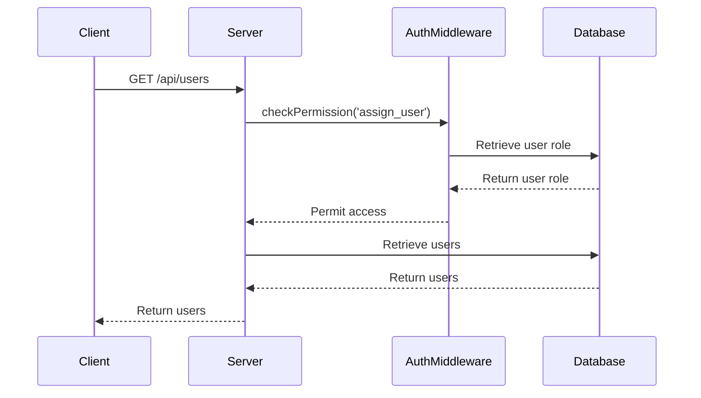
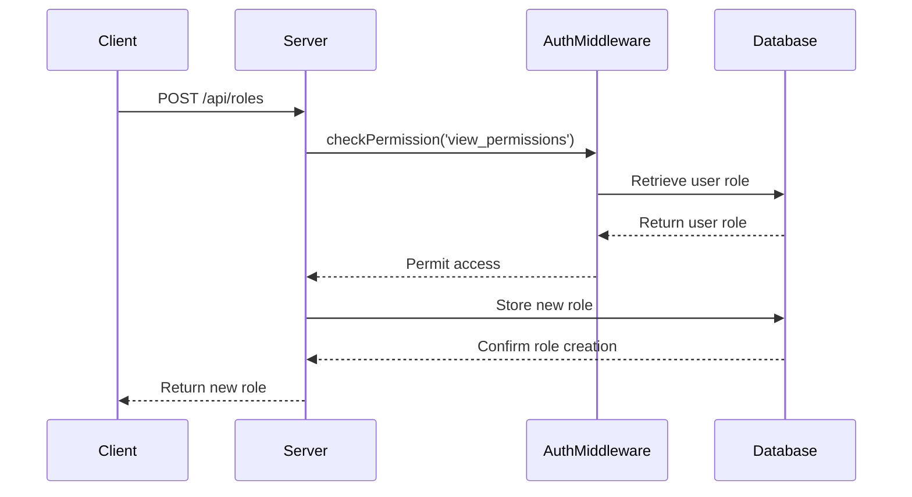
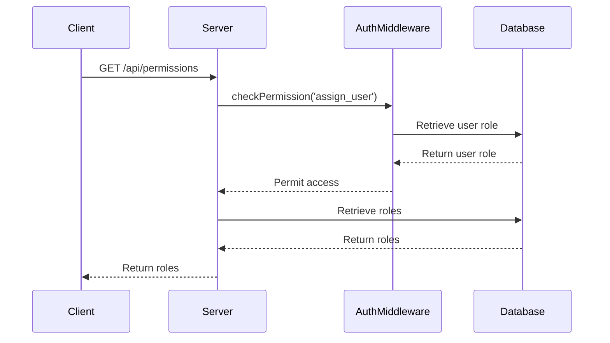

<details>
<summary>Relevant source files</summary>

The following files were used as context for generating this wiki page:

- [docs/api.html](https://github.com/agattani123/access-control-service/blob/main/docs/api.html)
- [src/routes.js](https://github.com/agattani123/access-control-service/blob/main/src/routes.js)
- [src/authMiddleware.js](https://github.com/agattani123/access-control-service/blob/main/src/authMiddleware.js)
- [src/db.js](https://github.com/agattani123/access-control-service/blob/main/src/db.js)
- [package.json](https://github.com/agattani123/access-control-service/blob/main/package.json)

</details>

# API Documentation

## Introduction

The Access Control Service provides a RESTful API for managing user roles, permissions, and access control within an application or system. It allows administrators to define roles, assign permissions to roles, and assign roles to users. The service also enforces access control by checking user permissions before allowing certain API operations.

This documentation covers the API endpoints, request/response formats, and the underlying data structures and logic used in the Access Control Service.

Sources: [docs/api.html](), [src/routes.js]()

## API Endpoints

### `GET /api/users`

This endpoint retrieves a list of all users and their assigned roles.

**Required Permission:** `assign_user`

**Response:**

```json
[
  { "email": "admin@internal.company", "role": "admin" },
  { "email": "analyst@internal.company", "role": "analyst" }
]
```

Sources: [docs/api.html:12-18](), [src/routes.js:7-9]()

### `POST /api/roles`

This endpoint defines a new role and its associated permissions.

**Required Permission:** `view_permissions`

**Request Body:**

```json
{
  "name": "support",
  "permissions": ["view_users"]
}
```

**Response:**

```json
{
  "role": "support",
  "permissions": ["view_users"]
}
```

Sources: [docs/api.html:20-28](), [src/routes.js:10-17]()

### `GET /api/permissions`

This endpoint lists all current role-permission mappings.

**Required Permission:** `assign_user`

**Response:**

```json
{
  "admin": ["view_users", "create_role", "view_permissions", "assign_user"],
  "engineer": ["view_users", "view_permissions"],
  "analyst": ["view_users"]
}
```

Sources: [docs/api.html:30-36](), [src/routes.js:18-20]()

### `POST /api/tokens`

This endpoint assigns a role to a user, typically used for bootstrapping new users.

**Required Permission:** `assign_user`

**Request Body:**

```json
{
  "user": "newuser@internal.company",
  "role": "analyst"
}
```

**Response:**

```json
{
  "user": "newuser@internal.company",
  "role": "analyst"
}
```

Sources: [docs/api.html:38-51](), [src/routes.js:21-28]()

## Data Structures

The Access Control Service uses the following data structures to store user, role, and permission information:

```javascript
const db = {
  users: {
    'admin@internal.company': 'admin',
    'analyst@internal.company': 'analyst'
  },
  roles: {
    'admin': ['view_users', 'create_role', 'view_permissions', 'assign_user'],
    'engineer': ['view_users', 'view_permissions'],
    'analyst': ['view_users']
  }
}
```

- `users`: An object mapping user emails to their assigned roles.
- `roles`: An object mapping role names to their associated permissions (an array of strings).

Sources: [src/db.js]()

## Access Control Flow

The Access Control Service enforces access control by checking the user's permissions before allowing certain API operations. This is implemented using the `checkPermission` middleware function:

```javascript
import db from './db.js';

export function checkPermission(requiredPermission) {
  return (req, res, next) => {
    const userEmail = req.headers['x-user-email'];
    if (!userEmail) {
      return res.status(401).json({ error: 'Unknown user' });
    }

    const userRole = db.users[userEmail];
    if (!userRole) {
      return res.status(401).json({ error: 'Unknown user' });
    }

    const rolePermissions = db.roles[userRole];
    if (!rolePermissions.includes(requiredPermission)) {
      return res.status(403).json({ error: 'Missing required permission' });
    }

    next();
  };
}
```

The `checkPermission` function takes a required permission as an argument and returns a middleware function. This middleware function:

1. Extracts the user email from the `x-user-email` request header.
2. Looks up the user's role in the `users` object.
3. Retrieves the permissions associated with the user's role from the `roles` object.
4. Checks if the required permission is present in the user's role permissions.
5. If the user has the required permission, the middleware calls `next()` to proceed to the route handler.
6. If the user is unknown or lacks the required permission, the middleware responds with a 401 or 403 error, respectively.

The `checkPermission` middleware is applied to the relevant routes in `routes.js` to enforce access control.

Sources: [src/authMiddleware.js](), [src/routes.js]()

## Sequence Diagrams

### User Retrieval Flow



1. The client sends a `GET /api/users` request to the server.
2. The server invokes the `checkPermission('assign_user')` middleware.
3. The middleware retrieves the user's role from the database.
4. If the user has the `assign_user` permission, the middleware permits access.
5. The server retrieves the list of users from the database.
6. The server returns the list of users to the client.

Sources: [src/routes.js:7-9](), [src/authMiddleware.js]()

### Role Creation Flow



1. The client sends a `POST /api/roles` request with the new role definition.
2. The server invokes the `checkPermission('view_permissions')` middleware.
3. The middleware retrieves the user's role from the database.
4. If the user has the `view_permissions` permission, the middleware permits access.
5. The server stores the new role in the database.
6. The server returns the new role to the client.

Sources: [src/routes.js:10-17](), [src/authMiddleware.js]()

### Permission Retrieval Flow



1. The client sends a `GET /api/permissions` request to the server.
2. The server invokes the `checkPermission('assign_user')` middleware.
3. The middleware retrieves the user's role from the database.
4. If the user has the `assign_user` permission, the middleware permits access.
5. The server retrieves the role-permission mappings from the database.
6. The server returns the role-permission mappings to the client.

Sources: [src/routes.js:18-20](), [src/authMiddleware.js]()

### User Role Assignment Flow


1. The client sends a `POST /api/tokens` request with the user and role to assign.
2. The server invokes the `checkPermission('assign_user')` middleware.
3. The middleware retrieves the user's role from the database.
4. If the user has the `assign_user` permission, the middleware permits access.
5. The server stores the user-role mapping in the database.
6. The server returns the user-role mapping to the client.

Sources: [src/routes.js:21-28](), [src/authMiddleware.js]()

## Error Handling

The Access Control Service returns the following common error responses:

| Code | Message                     |
|------|------------------------------|
| 400  | Invalid or missing request body |
| 401  | Unknown user                |
| 403  | Missing required permission |

Sources: [docs/api.html:54-60]()

## Dependencies

The Access Control Service is built using the following dependencies:

- `express`: A minimal and flexible Node.js web application framework.
- `express-validator`: A set of express.js middlewares for validating and sanitizing user input.

Sources: [package.json]()

## Conclusion

The Access Control Service provides a robust and secure way to manage user roles, permissions, and access control within an application or system. It offers a RESTful API for defining roles, assigning permissions to roles, and assigning roles to users. The service enforces access control by checking user permissions before allowing certain API operations, ensuring that only authorized users can perform sensitive actions.