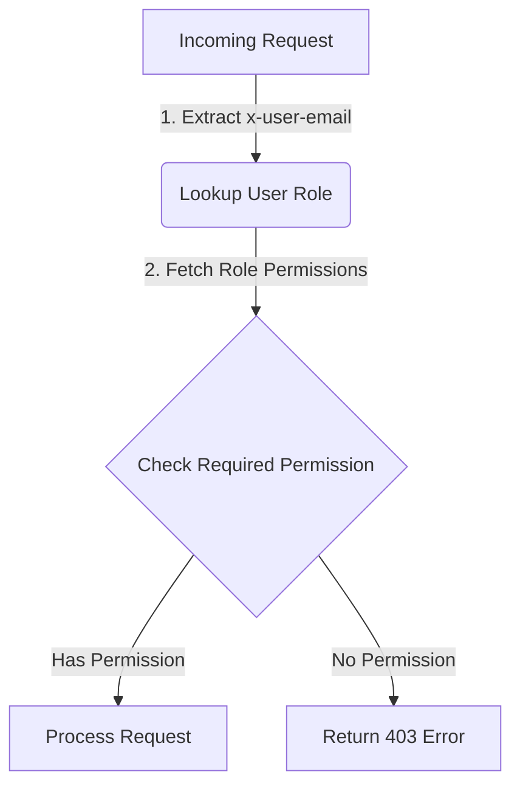
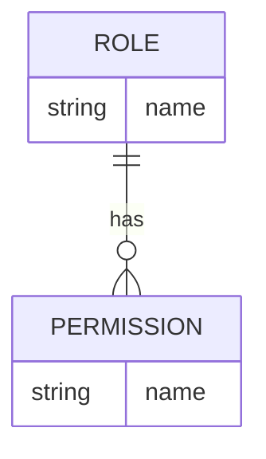

<details>
<summary>Relevant source files</summary>

The following files were used as context for generating this wiki page:

- [src/routes.js](https://github.com/agattani123/access-control-service/blob/main/src/routes.js)
- [docs/api.html](https://github.com/agattani123/access-control-service/blob/main/docs/api.html)
</details>

# API Documentation

## Introduction

The Access Control Service provides a set of APIs to manage user roles, permissions, and access control within the application. This documentation covers the available API endpoints, their functionalities, and the required permissions for each operation. The service utilizes an identity header (`x-user-email`) to identify the requesting user and evaluate their access based on their assigned role and permissions.

## API Endpoints

### User Management

#### `GET /api/users`

Retrieves a list of all users and their assigned roles.

**Required Permission:** `view_users`

**Response:**

```json
[
  { "email": "admin@internal.company", "role": "admin" },
  { "email": "analyst@internal.company", "role": "analyst" }
]
```

Sources: [src/routes.js:6-8](https://github.com/agattani123/access-control-service/blob/main/src/routes.js#L6-L8)

### Role Management

#### `POST /api/roles`

Defines a new role and its associated permissions.

**Required Permission:** `create_role`

**Request Body:**

```json
{
  "name": "support",
  "permissions": ["view_users"]
}
```

**Response:**

```json
{
  "role": "support",
  "permissions": ["view_users"]
}
```

Sources: [src/routes.js:12-18](https://github.com/agattani123/access-control-service/blob/main/src/routes.js#L12-L18)

#### `GET /api/permissions`

Lists all current role-permission mappings.

**Required Permission:** `view_permissions`

**Response:**

```json
{
  "admin": ["view_users", "create_role", "view_permissions", "assign_user"],
  "engineer": ["view_users", "view_permissions"],
  "analyst": ["view_users"]
}
```

Sources: [src/routes.js:21-24](https://github.com/agattani123/access-control-service/blob/main/src/routes.js#L21-L24), [docs/api.html](https://github.com/agattani123/access-control-service/blob/main/docs/api.html#L30-L33)

### User Assignment

#### `POST /api/tokens`

Assigns a role to a user. Used for bootstrapping new users.

**Required Permission:** `assign_user`

**Request Body:**

```json
{
  "user": "newuser@internal.company",
  "role": "analyst"
}
```

**Response:**

```json
{
  "user": "newuser@internal.company",
  "role": "analyst"
}
```

Sources: [src/routes.js:34-41](https://github.com/agattani123/access-control-service/blob/main/src/routes.js#L34-L41), [docs/api.html](https://github.com/agattani123/access-control-service/blob/main/docs/api.html#L34-L43)

## Access Control Flow

The following diagram illustrates the high-level flow of the Access Control Service:



1. The service extracts the `x-user-email` header from the incoming request.
2. It looks up the user's assigned role and fetches the associated permissions.
3. The required permission for the requested operation is checked against the user's permissions.
4. If the user has the required permission, the request is processed; otherwise, a 403 Forbidden error is returned.

Sources: [src/routes.js](https://github.com/agattani123/access-control-service/blob/main/src/routes.js), [docs/api.html](https://github.com/agattani123/access-control-service/blob/main/docs/api.html)

## Role-Permission Mapping

The following diagram illustrates the role-permission mapping structure:



- Each `ROLE` can have multiple `PERMISSION`s associated with it.
- The `ROLE` and `PERMISSION` entities have a name attribute.

Sources: [src/routes.js:12-18](https://github.com/agattani123/access-control-service/blob/main/src/routes.js#L12-L18), [docs/api.html](https://github.com/agattani123/access-control-service/blob/main/docs/api.html#L30-L33)

## Error Responses

The following table summarizes common error responses:

| Code | Message                     |
|------|------------------------------|
| 400  | Invalid or missing request body |
| 401  | Unknown user                |
| 403  | Missing required permission |

Sources: [docs/api.html](https://github.com/agattani123/access-control-service/blob/main/docs/api.html#L39-L43)

## Conclusion

The Access Control Service provides a comprehensive set of APIs for managing user roles, permissions, and access control within the application. It enforces role-based access control (RBAC) by evaluating the user's permissions against the required permissions for each operation. The service ensures that only authorized users can perform specific actions, enhancing the overall security and access management of the application.