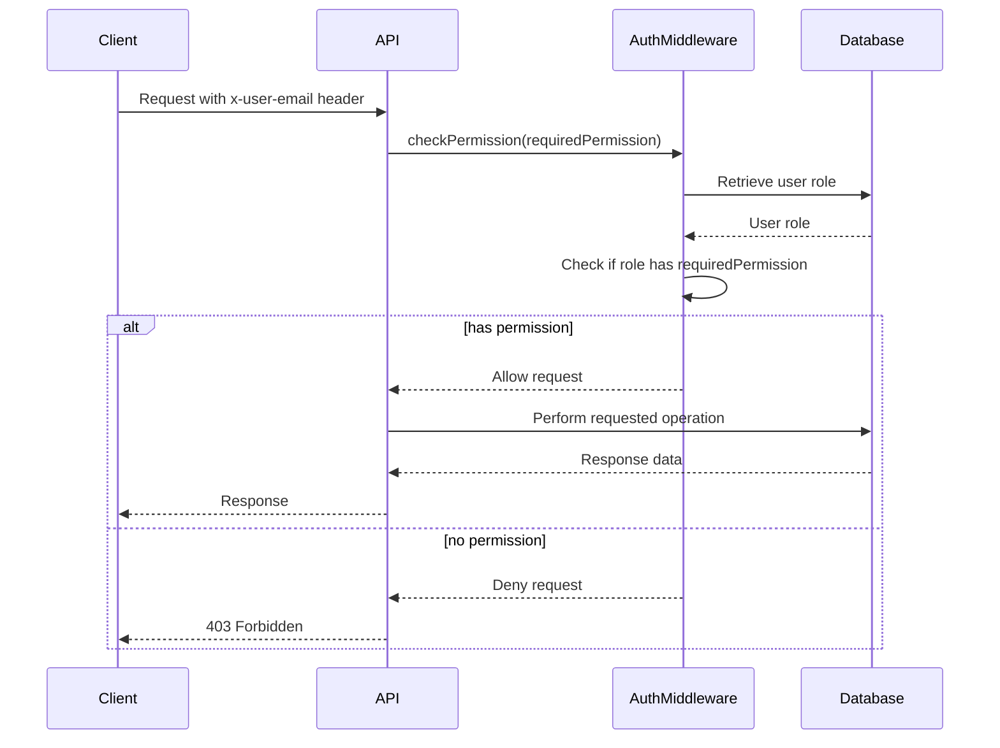

<details>
<summary>Relevant source files</summary>

The following files were used as context for generating this wiki page:

- [src/routes.js](https://github.com/agattani123/access-control-service/blob/main/src/routes.js)
- [docs/api.html](https://github.com/agattani123/access-control-service/blob/main/docs/api.html)
</details>

# API Endpoints

## Introduction

The Access Control Service provides a set of API endpoints for managing user roles, permissions, and access control within the application. These endpoints allow authorized users to view and assign roles, define role permissions, and retrieve information about users and their associated roles.

The API follows a RESTful design and uses JSON for request and response payloads. All requests must include the `x-user-email` header to identify the requesting user and evaluate their permissions.

## User Management

### Get Users

`GET /api/users`

This endpoint retrieves a list of all users and their assigned roles.

**Required Permission:** `assign_user`  
**Response:**

```json
[
  { "email": "admin@internal.company", "role": "admin" },
  { "email": "analyst@internal.company", "role": "analyst" }
]
```

Sources: [docs/api.html:17-22](https://github.com/agattani123/access-control-service/blob/main/docs/api.html#L17-L22), [src/routes.js:7-8](https://github.com/agattani123/access-control-service/blob/main/src/routes.js#L7-L8)

### Assign User Role

`POST /api/tokens`

This endpoint assigns a role to a user, typically used for bootstrapping new users.

**Required Permission:** `assign_user`  
**Request Body:**

```json
{
  "user": "newuser@internal.company",
  "role": "analyst"
}
```

**Response:**

```json
{
  "user": "newuser@internal.company",
  "role": "analyst"
}
```

Sources: [docs/api.html:47-58](https://github.com/agattani123/access-control-service/blob/main/docs/api.html#L47-L58), [src/routes.js:22-27](https://github.com/agattani123/access-control-service/blob/main/src/routes.js#L22-L27)

## Role Management

### Create Role

`POST /api/roles`

This endpoint defines a new role and its associated permissions.

**Required Permission:** `view_permissions`  
**Request Body:**

```json
{
  "name": "support",
  "permissions": ["view_users"]
}
```

**Response:**

```json
{
  "role": "support",
  "permissions": ["view_users"]
}
```

Sources: [docs/api.html:26-33](https://github.com/agattani123/access-control-service/blob/main/docs/api.html#L26-L33), [src/routes.js:11-16](https://github.com/agattani123/access-control-service/blob/main/src/routes.js#L11-L16)

### View Permissions

`GET /api/permissions`

This endpoint lists all current role-permission mappings.

**Required Permission:** `assign_user`  
**Response:**

```json
{
  "admin": ["view_users", "create_role", "view_permissions", "assign_user"],
  "engineer": ["view_users", "view_permissions"],
  "analyst": ["view_users"]
}
```

Sources: [docs/api.html:35-41](https://github.com/agattani123/access-control-service/blob/main/docs/api.html#L35-L41), [src/routes.js:17-20](https://github.com/agattani123/access-control-service/blob/main/src/routes.js#L17-L20)

## Access Control Flow

The following sequence diagram illustrates the high-level flow of access control in the API:



The `checkPermission` middleware function retrieves the user's role from the database based on the `x-user-email` header. It then checks if the role has the required permission to access the requested API endpoint. If the user has the necessary permission, the request is allowed to proceed. Otherwise, a 403 Forbidden response is returned.

Sources: [src/routes.js:3](https://github.com/agattani123/access-control-service/blob/main/src/routes.js#L3), [src/routes.js:7](https://github.com/agattani123/access-control-service/blob/main/src/routes.js#L7), [src/routes.js:11](https://github.com/agattani123/access-control-service/blob/main/src/routes.js#L11), [src/routes.js:17](https://github.com/agattani123/access-control-service/blob/main/src/routes.js#L17), [src/routes.js:22](https://github.com/agattani123/access-control-service/blob/main/src/routes.js#L22)

## Error Handling

The API returns the following common error responses:

| Code | Message                    |
|------|-----------------------------
| 400  | Invalid or missing request body |
| 401  | Unknown user                |
| 403  | Missing required permission |

Sources: [docs/api.html:61-67](https://github.com/agattani123/access-control-service/blob/main/docs/api.html#L61-L67)

## Summary

The Access Control Service API provides a set of endpoints for managing user roles, permissions, and access control within the application. It allows authorized users to view and assign roles, define role permissions, and retrieve information about users and their associated roles. The API follows a RESTful design and uses JSON for request and response payloads. All requests must include the `x-user-email` header to identify the requesting user and evaluate their permissions based on their assigned role.