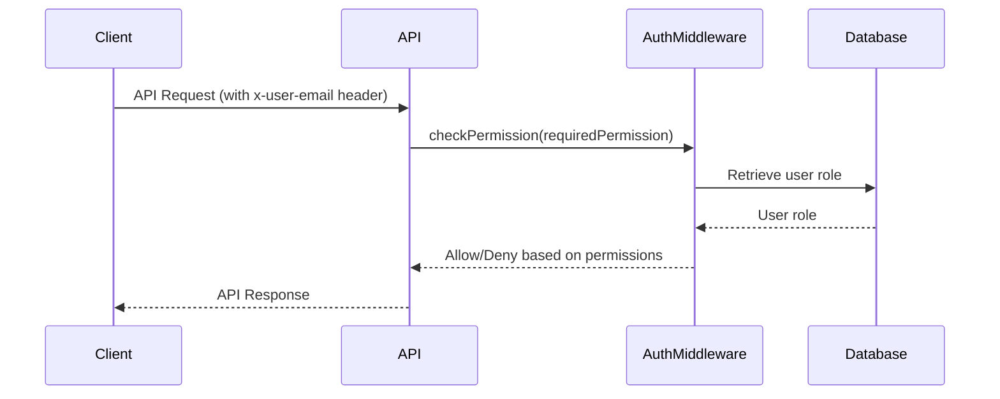

<details>
<summary>Relevant source files</summary>

The following files were used as context for generating this wiki page:

- [src/routes.js](https://github.com/agattani123/access-control-service/blob/main/src/routes.js)
- [docs/api.html](https://github.com/agattani123/access-control-service/blob/main/docs/api.html)
</details>

# API Endpoints

## Introduction

The Access Control Service provides a set of API endpoints for managing user roles, permissions, and access control within the application. These endpoints allow administrators and authorized users to view user information, define roles and their associated permissions, assign roles to users, and retrieve permission mappings.

The API follows a RESTful design and uses JSON for request and response payloads. All requests must include the `x-user-email` header to identify the authenticated user and evaluate their permissions. For more information on authentication and authorization, refer to the [Authentication and Authorization](#) wiki page.

## User Management

### GET /api/users

This endpoint retrieves a list of all users and their assigned roles.

**Required Permission:** `assign_user`  
**Response:**

```json
[
  { "email": "admin@internal.company", "role": "admin" },
  { "email": "analyst@internal.company", "role": "analyst" }
]
```

Sources: [docs/api.html:14-20](https://github.com/agattani123/access-control-service/blob/main/docs/api.html#L14-L20)

### POST /api/tokens

This endpoint is used to assign a role to a user, typically during the user onboarding process.

**Required Permission:** `assign_user`  
**Request Body:**

```json
{
  "user": "newuser@internal.company",
  "role": "analyst"
}
```

**Response:**

```json
{
  "user": "newuser@internal.company",
  "role": "analyst"
}
```

Sources: [docs/api.html:41-51](https://github.com/agattani123/access-control-service/blob/main/docs/api.html#L41-L51), [src/routes.js:25-32](https://github.com/agattani123/access-control-service/blob/main/src/routes.js#L25-L32)

## Role and Permission Management

### POST /api/roles

This endpoint allows administrators to define a new role and its associated permissions.

**Required Permission:** `view_permissions`  
**Request Body:**

```json
{
  "name": "support",
  "permissions": ["view_users"]
}
```

**Response:**

```json
{
  "role": "support",
  "permissions": ["view_users"]
}
```

Sources: [docs/api.html:23-29](https://github.com/agattani123/access-control-service/blob/main/docs/api.html#L23-L29), [src/routes.js:10-16](https://github.com/agattani123/access-control-service/blob/main/src/routes.js#L10-L16)

### GET /api/permissions

This endpoint retrieves a mapping of all defined roles and their associated permissions.

**Required Permission:** `assign_user`  
**Response:**

```json
{
  "admin": ["view_users", "create_role", "view_permissions", "assign_user"],
  "engineer": ["view_users", "view_permissions"],
  "analyst": ["view_users"]
}
```

Sources: [docs/api.html:31-37](https://github.com/agattani123/access-control-service/blob/main/docs/api.html#L31-L37), [src/routes.js:17-20](https://github.com/agattani123/access-control-service/blob/main/src/routes.js#L17-L20)

## API Flow

The following sequence diagram illustrates the typical flow when an API request is made:



1. The client sends an API request with the `x-user-email` header.
2. The API router invokes the `checkPermission` middleware, passing the required permission for the requested endpoint.
3. The `checkPermission` middleware retrieves the user's role from the database based on the provided email.
4. The middleware checks if the user's role has the required permission and either allows or denies the request.
5. If allowed, the API endpoint processes the request and returns the appropriate response to the client.

Sources: [src/routes.js:4](https://github.com/agattani123/access-control-service/blob/main/src/routes.js#L4), [src/routes.js:6](https://github.com/agattani123/access-control-service/blob/main/src/routes.js#L6)

## Error Handling

The API returns the following common error responses:

| Code | Message                      |
|------|-------------------------------|
| 400  | Invalid or missing request body |
| 401  | Unknown user                 |
| 403  | Missing required permission   |

Sources: [docs/api.html:54-60](https://github.com/agattani123/access-control-service/blob/main/docs/api.html#L54-L60)

## Summary

The Access Control Service API provides a set of endpoints for managing users, roles, and permissions within the application. Administrators and authorized users can view user information, define roles and their associated permissions, assign roles to users, and retrieve permission mappings. The API enforces access control by requiring specific permissions for each endpoint, ensuring that only authorized users can perform sensitive operations.