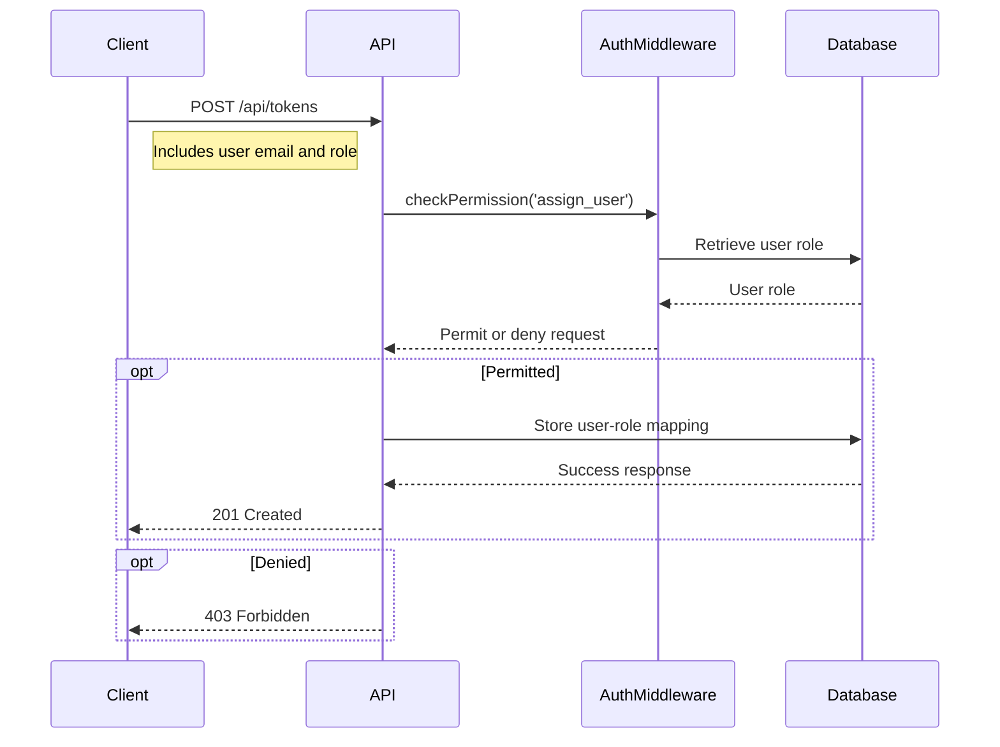

<details>
<summary>Relevant source files</summary>

The following files were used as context for generating this wiki page:

- [src/routes.js](https://github.com/agattani123/access-control-service/blob/main/src/routes.js)
- [docs/api.html](https://github.com/agattani123/access-control-service/blob/main/docs/api.html)
</details>

# API Endpoints

## Introduction

The Access Control Service provides a set of API endpoints to manage user roles, permissions, and access control within the application. These endpoints enable administrators and authorized users to view user information, define roles and their associated permissions, assign roles to users, and retrieve permission mappings.

The API follows a RESTful design and uses JSON for request and response payloads. All requests require an `x-user-email` header to identify the authenticated user and evaluate their permissions for the requested operation.

## User Management

### GET /api/users

This endpoint retrieves a list of all users and their assigned roles.

**Required Permission:** `assign_user`  
**Response:**

```json
[
  { "email": "admin@internal.company", "role": "admin" },
  { "email": "analyst@internal.company", "role": "analyst" }
]
```

Sources: [docs/api.html:16-21](https://github.com/agattani123/access-control-service/blob/main/docs/api.html#L16-L21), [src/routes.js:7-9](https://github.com/agattani123/access-control-service/blob/main/src/routes.js#L7-L9)

### POST /api/tokens

This endpoint assigns a role to a user, typically used for bootstrapping new users into the system.

**Required Permission:** `assign_user`  
**Request Body:**

```json
{
  "user": "newuser@internal.company",
  "role": "analyst"
}
```

**Response:**

```json
{
  "user": "newuser@internal.company",
  "role": "analyst"
}
```

Prior to May 2025, this endpoint was unrestricted. The `assign_user` permission was introduced to enforce accountability around role assignment.

Sources: [docs/api.html:43-54](https://github.com/agattani123/access-control-service/blob/main/docs/api.html#L43-L54), [src/routes.js:25-31](https://github.com/agattani123/access-control-service/blob/main/src/routes.js#L25-L31)

## Role and Permission Management

### POST /api/roles

This endpoint defines a new role and its associated permissions.

**Required Permission:** `view_permissions`  
**Request Body:**

```json
{
  "name": "support",
  "permissions": ["view_users"]
}
```

**Response:**

```json
{
  "role": "support",
  "permissions": ["view_users"]
}
```

Sources: [docs/api.html:24-31](https://github.com/agattani123/access-control-service/blob/main/docs/api.html#L24-L31), [src/routes.js:12-18](https://github.com/agattani123/access-control-service/blob/main/src/routes.js#L12-L18)

### GET /api/permissions

This endpoint lists all current role-permission mappings.

**Required Permission:** `assign_user`  
**Response:**

```json
{
  "admin": ["view_users", "create_role", "view_permissions", "assign_user"],
  "engineer": ["view_users", "view_permissions"],
  "analyst": ["view_users"]
}
```

Sources: [docs/api.html:33-38](https://github.com/agattani123/access-control-service/blob/main/docs/api.html#L33-L38), [src/routes.js:19-22](https://github.com/agattani123/access-control-service/blob/main/src/routes.js#L19-L22)

## Error Handling

The API returns the following common error responses:

| Code | Message                      |
|------|-------------------------------|
| 400  | Invalid or missing request body |
| 401  | Unknown user                 |
| 403  | Missing required permission  |

Sources: [docs/api.html:57-63](https://github.com/agattani123/access-control-service/blob/main/docs/api.html#L57-L63)

## Sequence Diagram: User Role Assignment

The following sequence diagram illustrates the flow of assigning a role to a user via the `POST /api/tokens` endpoint:



The `checkPermission` middleware retrieves the user's role from the database and evaluates whether they have the required `assign_user` permission. If permitted, the new user-role mapping is stored in the database, and a successful response is returned. Otherwise, a 403 Forbidden error is sent.

Sources: [src/routes.js:25-31](https://github.com/agattani123/access-control-service/blob/main/src/routes.js#L25-L31), [src/routes.js:3](https://github.com/agattani123/access-control-service/blob/main/src/routes.js#L3)

## Conclusion

The Access Control Service API provides a comprehensive set of endpoints for managing user roles, permissions, and access control within the application. It follows a RESTful design and enforces permissions for sensitive operations, ensuring proper authorization and accountability. The API enables administrators and authorized users to view user information, define roles and their associated permissions, assign roles to users, and retrieve permission mappings.