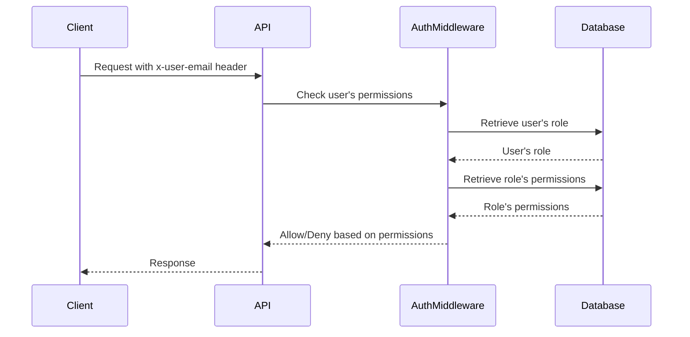

<details>
<summary>Relevant source files</summary>

The following files were used as context for generating this wiki page:

- [src/routes.js](https://github.com/agattani123/access-control-service/blob/main/src/routes.js)
- [docs/api.html](https://github.com/agattani123/access-control-service/blob/main/docs/api.html)
</details>

# API Endpoints

## Introduction

The Access Control Service provides a set of API endpoints for managing user roles, permissions, and access control within an application or system. These endpoints allow authorized users to view user information, define roles and their associated permissions, assign roles to users, and retrieve role-permission mappings.

The API follows a RESTful design and uses JSON for request and response payloads. All requests must include an `x-user-email` header to identify the requesting user and evaluate their permissions based on their assigned role.

Sources: [docs/api.html](https://github.com/agattani123/access-control-service/blob/main/docs/api.html)

## Endpoint Details

### User Management

#### `GET /api/users`

This endpoint returns a list of all users and their assigned roles.

**Required Permission:** `assign_user`

**Response:**

```json
[
  { "email": "admin@internal.company", "role": "admin" },
  { "email": "analyst@internal.company", "role": "analyst" }
]
```

Sources: [docs/api.html:14-20](https://github.com/agattani123/access-control-service/blob/main/docs/api.html#L14-L20), [src/routes.js:6-8](https://github.com/agattani123/access-control-service/blob/main/src/routes.js#L6-L8)

#### `POST /api/tokens`

This endpoint assigns a role to a user, typically used for bootstrapping new users into the system.

**Required Permission:** `assign_user`

**Request Body:**

```json
{
  "user": "newuser@internal.company",
  "role": "analyst"
}
```

**Response:**

```json
{
  "user": "newuser@internal.company",
  "role": "analyst"
}
```

Sources: [docs/api.html:41-51](https://github.com/agattani123/access-control-service/blob/main/docs/api.html#L41-L51), [src/routes.js:22-28](https://github.com/agattani123/access-control-service/blob/main/src/routes.js#L22-L28)

### Role and Permission Management

#### `POST /api/roles`

This endpoint defines a new role and its associated permissions.

**Required Permission:** `view_permissions`

**Request Body:**

```json
{
  "name": "support",
  "permissions": ["view_users"]
}
```

**Response:**

```json
{
  "role": "support",
  "permissions": ["view_users"]
}
```

Sources: [docs/api.html:24-32](https://github.com/agattani123/access-control-service/blob/main/docs/api.html#L24-L32), [src/routes.js:10-16](https://github.com/agattani123/access-control-service/blob/main/src/routes.js#L10-L16)

#### `GET /api/permissions`

This endpoint lists all current role-permission mappings.

**Required Permission:** `assign_user`

**Response:**

```json
{
  "admin": ["view_users", "create_role", "view_permissions", "assign_user"],
  "engineer": ["view_users", "view_permissions"],
  "analyst": ["view_users"]
}
```

Sources: [docs/api.html:35-39](https://github.com/agattani123/access-control-service/blob/main/docs/api.html#L35-L39), [src/routes.js:18-20](https://github.com/agattani123/access-control-service/blob/main/src/routes.js#L18-L20)

### Access Control Flow

The following diagram illustrates the high-level flow of how the API endpoints interact with the access control system:



Sources: [src/routes.js:3](https://github.com/agattani123/access-control-service/blob/main/src/routes.js#L3), [src/routes.js:6](https://github.com/agattani123/access-control-service/blob/main/src/routes.js#L6), [src/routes.js:10](https://github.com/agattani123/access-control-service/blob/main/src/routes.js#L10), [src/routes.js:18](https://github.com/agattani123/access-control-service/blob/main/src/routes.js#L18), [src/routes.js:22](https://github.com/agattani123/access-control-service/blob/main/src/routes.js#L22)

### Error Handling

The API returns the following common error responses:

| Code | Message                     |
|------|------------------------------|
| 400  | Invalid or missing request body |
| 401  | Unknown user                |
| 403  | Missing required permission  |

Sources: [docs/api.html:55-61](https://github.com/agattani123/access-control-service/blob/main/docs/api.html#L55-L61)

## Summary

The Access Control Service API provides a set of endpoints for managing user roles, permissions, and access control within an application or system. It allows authorized users to view user information, define roles and their associated permissions, assign roles to users, and retrieve role-permission mappings. The API follows a RESTful design and uses JSON for request and response payloads, with all requests requiring an `x-user-email` header for authentication and authorization.

Sources: [src/routes.js](https://github.com/agattani123/access-control-service/blob/main/src/routes.js), [docs/api.html](https://github.com/agattani123/access-control-service/blob/main/docs/api.html)