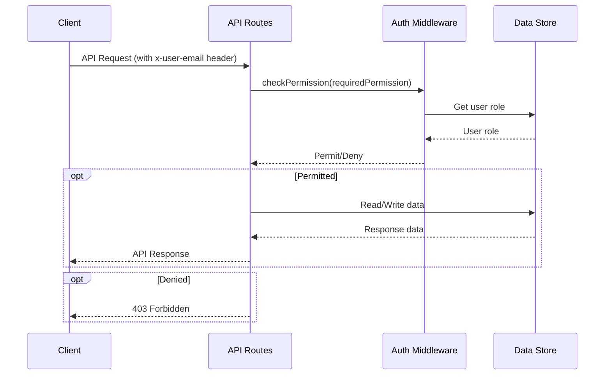

<details>
<summary>Relevant source files</summary>

The following files were used as context for generating this wiki page:

- [src/routes.js](https://github.com/agattani123/access-control-service/blob/main/src/routes.js)
- [docs/api.html](https://github.com/agattani123/access-control-service/blob/main/docs/api.html)
</details>

# API Endpoints

## Introduction

The Access Control Service provides a set of API endpoints for managing user roles, permissions, and access control within the application. These endpoints allow authorized users to view and assign roles, define role-based permissions, and retrieve information about the current role-permission mappings.

The service follows a role-based access control (RBAC) model, where users are assigned roles, and roles are associated with specific permissions that govern the actions users can perform within the system. The API endpoints are secured by requiring users to provide a valid identity header (`x-user-email`) with each request, which is used to look up the user's role and evaluate their access permissions.

Sources: [docs/api.html:3-6](), [src/routes.js]()

## Authentication and Authorization

The Access Control Service relies on an authentication middleware (`checkPermission`) to verify the user's identity and ensure they have the required permissions to access specific API endpoints. This middleware is implemented in the `authMiddleware.js` file (not provided) and is imported and used in the `routes.js` file.

```javascript
import { checkPermission } from './authMiddleware.js';
```

The `checkPermission` middleware function is applied as a route handler before the actual endpoint handler. It takes the required permission as an argument and checks if the user's role has the necessary permission to access the endpoint. If the user lacks the required permission, the middleware responds with a 403 Forbidden error.

Sources: [src/routes.js:3,7,12,17]()

## User Management

### Get Users

The `/api/users` endpoint retrieves a list of all users and their assigned roles.

```javascript
router.get('/users', checkPermission('view_users'), (req, res) => {
  res.json(Object.entries(db.users).map(([email, role]) => ({ email, role })));
});
```

This endpoint requires the `view_users` permission, which is enforced by the `checkPermission` middleware.

Sources: [src/routes.js:7-10]()

## Role Management

### Create Role

The `/api/roles` endpoint allows authorized users to define a new role and its associated permissions.

```javascript
router.post('/roles', checkPermission('create_role'), (req, res) => {
  const { name, permissions } = req.body;
  if (!name || !Array.isArray(permissions)) {
    return res.status(400).json({ error: 'Invalid role definition' });
  }
  db.roles[name] = permissions;
  res.status(201).json({ role: name, permissions });
});
```

This endpoint requires the `create_role` permission, which is enforced by the `checkPermission` middleware. The request body must include a `name` for the new role and an array of `permissions` associated with that role. If the request body is invalid, a 400 Bad Request error is returned.

Sources: [src/routes.js:12-20]()

### View Permissions

The `/api/permissions` endpoint retrieves the current role-permission mappings.

```javascript
router.get('/permissions', checkPermission('view_permissions'), (req, res) => {
  res.json(db.roles);
});
```

This endpoint requires the `view_permissions` permission, which is enforced by the `checkPermission` middleware.

Sources: [src/routes.js:17-19]()

## User Role Assignment

### Assign User Role

The `/api/tokens` endpoint is used to assign a role to a user, typically during the user onboarding process.

```javascript
router.post('/tokens', (req, res) => {
  const { user, role } = req.body;
  if (!user || !role) {
    return res.status(400).json({ error: 'Missing user or role' });
  }
  db.users[user] = role;
  res.status(201).json({ user, role });
});
```

This endpoint requires the `assign_user` permission, as indicated in the `docs/api.html` file. The request body must include the `user` (email) and the `role` to be assigned. If either the `user` or `role` is missing, a 400 Bad Request error is returned.

Sources: [src/routes.js:21-28](), [docs/api.html:46-47]()

## Data Storage

The Access Control Service uses an in-memory data store (`db.js`) to store user-role mappings and role-permission mappings. This data store is likely a temporary solution for demonstration purposes and would be replaced by a more robust and persistent storage solution (e.g., a database) in a production environment.

```javascript
import db from './db.js';
```

The `db` object contains two properties:

- `users`: An object mapping user emails to their assigned roles.
- `roles`: An object mapping role names to their associated permissions (an array of permission strings).

Sources: [src/routes.js:4,9,15,25]()

## Error Handling

The API endpoints handle various error scenarios and return appropriate HTTP status codes and error messages. The common error responses are documented in the `docs/api.html` file:

```html
<h2 id="common-error-responses">Common Error Responses</h2>
<table>
<thead>
<tr>
  <th>Code</th>
  <th>Message</th>
</tr>
</thead>
<tbody>
<tr><td>400</td><td>Invalid or missing request body</td></tr>
<tr><td>401</td><td>Unknown user</td></tr>
<tr><td>403</td><td>Missing required permission</td></tr>
</tbody>
</table>
```

- 400 Bad Request: Returned when the request body is invalid or missing required fields.
- 401 Unauthorized: Returned when the user is unknown or not authenticated.
- 403 Forbidden: Returned when the user lacks the required permission to access the requested resource.

Sources: [docs/api.html:58-67](), [src/routes.js:15,24,27]()

## Sequence Diagram

The following sequence diagram illustrates the flow of a typical API request and the interaction between the client, the API routes, the authentication middleware, and the data store:



1. The client sends an API request with the `x-user-email` header.
2. The API route invokes the `checkPermission` middleware, passing the required permission.
3. The middleware retrieves the user's role from the data store.
4. The middleware evaluates the user's permissions and either permits or denies access.
5. If permitted, the API route reads or writes data from/to the data store and returns the response to the client.
6. If denied, the API route returns a 403 Forbidden error to the client.

Sources: [src/routes.js](), [docs/api.html:3-6]()

## Conclusion

The Access Control Service provides a set of API endpoints for managing user roles, permissions, and access control within the application. These endpoints follow a role-based access control (RBAC) model, where users are assigned roles, and roles are associated with specific permissions that govern the actions users can perform. The service ensures that only authorized users can access and modify role-permission mappings, view user information, and assign roles to users, thereby maintaining the integrity and security of the access control system.

Sources: [src/routes.js](), [docs/api.html]()