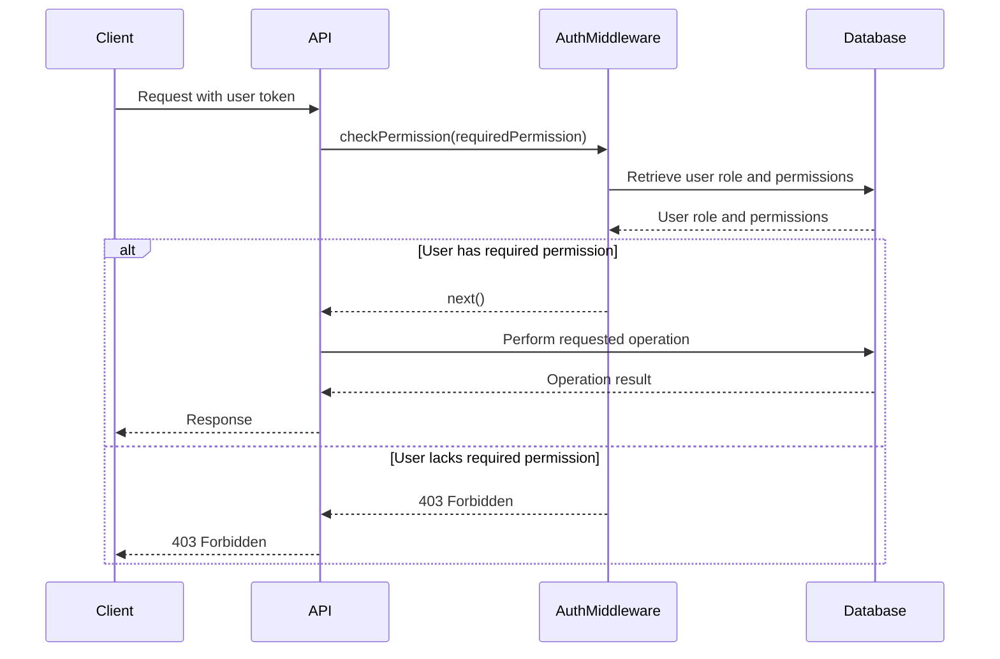

<details>
<summary>Relevant source files</summary>

The following files were used as context for generating this wiki page:

- [src/routes.js](https://github.com/agattani123/access-control-service/blob/main/src/routes.js)
- [src/authMiddleware.js](https://github.com/agattani123/access-control-service/blob/main/src/authMiddleware.js)
- [src/db.js](https://github.com/agattani123/access-control-service/blob/main/src/db.js)

</details>

# API Reference

The API Reference provides a comprehensive overview of the API endpoints and their associated functionality within the access control service. This service manages user roles, permissions, and authentication tokens, enabling controlled access to various resources based on defined roles and permissions.

## API Endpoints

### GET /users

Retrieves a list of all registered users and their associated roles.

#### Request

```http
GET /users
```

#### Response

```json
[
  {
    "email": "user1@example.com",
    "role": "admin"
  },
  {
    "email": "user2@example.com",
    "role": "viewer"
  }
]
```

#### Permissions Required

- `view_users`

Sources: [src/routes.js:5-7](https://github.com/agattani123/access-control-service/blob/main/src/routes.js#L5-L7)

### POST /roles

Creates a new role with a specified set of permissions.

#### Request

```http
POST /roles
```

```json
{
  "name": "editor",
  "permissions": ["edit_content", "publish_content"]
}
```

#### Response

```json
{
  "role": "editor",
  "permissions": ["edit_content", "publish_content"]
}
```

#### Permissions Required

- `create_role`

#### Error Responses

- `400 Bad Request` if the request body is missing the `name` or `permissions` field, or if `permissions` is not an array.

Sources: [src/routes.js:9-16](https://github.com/agattani123/access-control-service/blob/main/src/routes.js#L9-L16)

### GET /permissions

Retrieves a list of all defined roles and their associated permissions.

#### Request

```http
GET /permissions
```

#### Response

```json
{
  "admin": ["view_users", "create_role", "view_permissions"],
  "editor": ["edit_content", "publish_content"],
  "viewer": ["view_content"]
}
```

#### Permissions Required

- `view_permissions`

Sources: [src/routes.js:18-20](https://github.com/agattani123/access-control-service/blob/main/src/routes.js#L18-L20), [src/routes.js:22-24](https://github.com/agattani123/access-control-service/blob/main/src/routes.js#L22-L24)

### POST /tokens

Assigns a role to a user, effectively creating an authentication token for that user.

#### Request

```http
POST /tokens
```

```json
{
  "user": "user1@example.com",
  "role": "admin"
}
```

#### Response

```json
{
  "user": "user1@example.com",
  "role": "admin"
}
```

#### Error Responses

- `400 Bad Request` if the request body is missing the `user` or `role` field.

Sources: [src/routes.js:26-32](https://github.com/agattani123/access-control-service/blob/main/src/routes.js#L26-L32)

## Authentication Middleware

The `checkPermission` middleware is used to enforce role-based access control for API endpoints. It verifies if the authenticated user has the required permission(s) to access the requested resource.

```javascript
import db from './db.js';

export function checkPermission(requiredPermission) {
  return (req, res, next) => {
    const userRole = db.users[req.user];
    const userPermissions = db.roles[userRole] || [];

    if (userPermissions.includes(requiredPermission)) {
      next();
    } else {
      res.status(403).json({ error: 'Forbidden' });
    }
  };
}
```

The middleware expects the `req.user` property to be set with the authenticated user's identifier (e.g., email address). It then looks up the user's role in the `db.users` object and retrieves the associated permissions from the `db.roles` object. If the user's role has the required permission, the request is allowed to proceed; otherwise, a `403 Forbidden` response is sent.

Sources: [src/authMiddleware.js](https://github.com/agattani123/access-control-service/blob/main/src/authMiddleware.js)

## Data Storage

The service uses an in-memory data store to persist user roles, permissions, and authentication tokens. The `db` module exports an object with the following properties:

- `users`: An object mapping user identifiers (e.g., email addresses) to their assigned roles.
- `roles`: An object mapping role names to arrays of associated permissions.

```javascript
const db = {
  users: {
    'user1@example.com': 'admin',
    'user2@example.com': 'viewer',
  },
  roles: {
    'admin': ['view_users', 'create_role', 'view_permissions'],
    'editor': ['edit_content', 'publish_content'],
    'viewer': ['view_content'],
  },
};

export default db;
```

Sources: [src/db.js](https://github.com/agattani123/access-control-service/blob/main/src/db.js)

## Sequence Diagram

The following sequence diagram illustrates the flow of a typical API request and the interaction between the components involved:



This diagram illustrates the following steps:

1. The client sends an API request with a user token.
2. The API router invokes the `checkPermission` middleware, passing the required permission for the requested endpoint.
3. The middleware retrieves the user's role and associated permissions from the database.
4. If the user has the required permission, the middleware allows the request to proceed to the API endpoint.
5. The API endpoint performs the requested operation, potentially interacting with the database.
6. The API endpoint sends the response back to the client.
7. If the user lacks the required permission, the middleware sends a `403 Forbidden` response to the client.

Sources: [src/routes.js](https://github.com/agattani123/access-control-service/blob/main/src/routes.js), [src/authMiddleware.js](https://github.com/agattani123/access-control-service/blob/main/src/authMiddleware.js), [src/db.js](https://github.com/agattani123/access-control-service/blob/main/src/db.js)

## Summary

The API Reference provides a comprehensive overview of the access control service's API endpoints, authentication middleware, and data storage mechanisms. It covers the available endpoints for managing users, roles, permissions, and authentication tokens, as well as the role-based access control enforcement implemented by the `checkPermission` middleware. The service uses an in-memory data store to persist user roles, permissions, and authentication tokens.