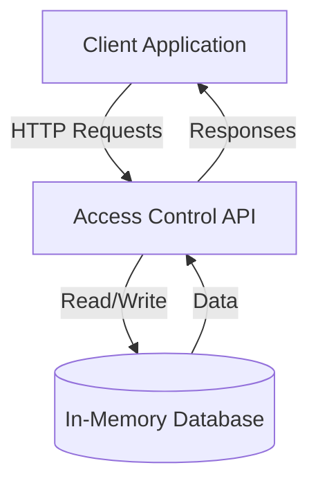
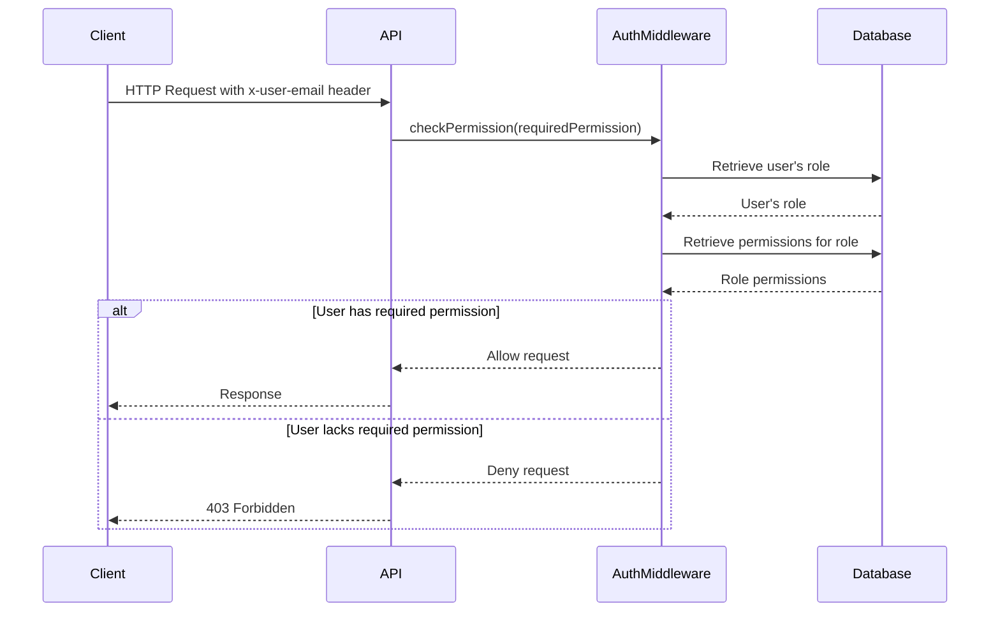
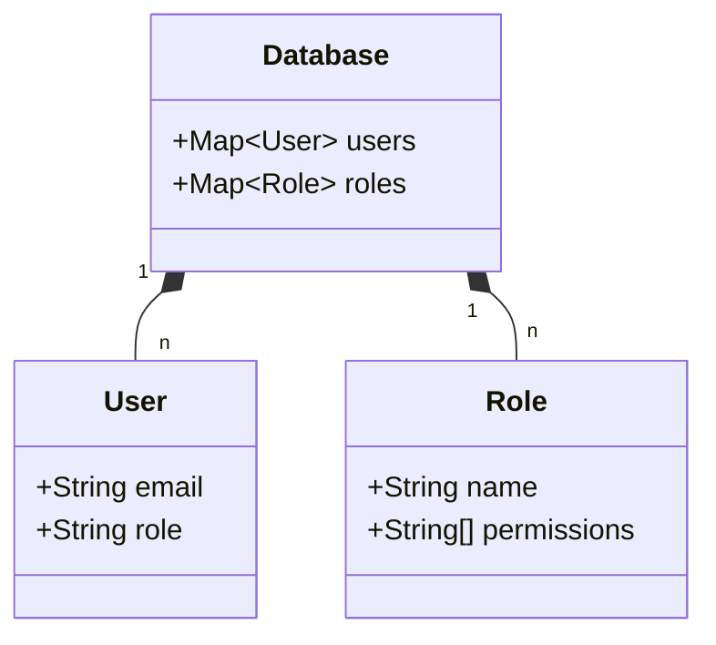

<details>
<summary>Relevant source files</summary>

The following files were used as context for generating this wiki page:

- [docs/api.html](https://github.com/agattani123/access-control-service/blob/main/docs/api.html)
- [src/routes.js](https://github.com/agattani123/access-control-service/blob/main/src/routes.js)
- [src/authMiddleware.js](https://github.com/agattani123/access-control-service/blob/main/src/authMiddleware.js)
- [src/db.js](https://github.com/agattani123/access-control-service/blob/main/src/db.js)
- [package.json](https://github.com/agattani123/access-control-service/blob/main/package.json)

</details>

# API Reference

## Introduction

The Access Control Service provides a set of RESTful APIs for managing user roles, permissions, and role assignments within an application or system. It serves as a centralized authorization service, allowing administrators to define roles, associate permissions with those roles, and assign roles to users. This service plays a crucial role in implementing access control and ensuring that users have the appropriate permissions to perform various actions within the application.

The API Reference covers the available endpoints, their functionalities, request/response formats, and required permissions. It also provides insights into the underlying architecture and data structures used to manage roles, permissions, and user assignments.

Sources: [docs/api.html](), [src/routes.js]()

## Architecture Overview

The Access Control Service follows a simple architecture consisting of an Express.js server that exposes a set of API endpoints. The server interacts with an in-memory data store (`db.js`) to manage and persist role definitions, permissions, and user-role assignments.



Sources: [src/routes.js](), [src/db.js]()

## API Endpoints

### `GET /api/users`

This endpoint retrieves a list of all users and their associated roles.

**Required Permission:** `assign_user`

**Response Body:**

```json
[
  { "email": "admin@internal.company", "role": "admin" },
  { "email": "analyst@internal.company", "role": "analyst" }
]
```

Sources: [docs/api.html:15-21](), [src/routes.js:6-8]()

### `POST /api/roles`

This endpoint allows defining a new role and specifying the permissions associated with that role.

**Required Permission:** `view_permissions`

**Request Body:**

```json
{
  "name": "support",
  "permissions": ["view_users"]
}
```

**Response Body:**

```json
{
  "role": "support",
  "permissions": ["view_users"]
}
```

Sources: [docs/api.html:23-32](), [src/routes.js:9-16]()

### `GET /api/permissions`

This endpoint retrieves a mapping of all currently defined roles and their associated permissions.

**Required Permission:** `assign_user`

**Response Body:**

```json
{
  "admin": ["view_users", "create_role", "view_permissions", "assign_user"],
  "engineer": ["view_users", "view_permissions"],
  "analyst": ["view_users"]
}
```

Sources: [docs/api.html:34-40](), [src/routes.js:17-19]()

### `POST /api/tokens`

This endpoint assigns a role to a user, typically used for bootstrapping new users into the system.

**Required Permission:** `assign_user`

**Request Body:**

```json
{
  "user": "newuser@internal.company",
  "role": "analyst"
}
```

**Response Body:**

```json
{
  "user": "newuser@internal.company",
  "role": "analyst"
}
```

Sources: [docs/api.html:42-54](), [src/routes.js:20-27]()

## Error Responses

The API returns the following common error responses:

| Code | Message                      |
|------|-------------------------------|
| 400  | Invalid or missing request body |
| 401  | Unknown user                   |
| 403  | Missing required permission    |

Sources: [docs/api.html:56-62]()

## Authentication and Authorization

The Access Control Service relies on an `x-user-email` header in the request to identify the user making the request. This email is used to look up the user's role and evaluate whether they have the required permissions to access the requested endpoint.



The `checkPermission` middleware function, defined in `authMiddleware.js`, is responsible for verifying the user's permissions based on their role and the required permission for the requested endpoint.

Sources: [docs/api.html:2-4](), [src/routes.js:3,6,9,17,20](), [src/authMiddleware.js]()

## Data Structures

The Access Control Service uses the following key data structures to manage roles, permissions, and user assignments:



- `users`: A map that associates user emails with their assigned roles.
- `roles`: A map that associates role names with their respective permissions (an array of permission strings).

These data structures are defined and managed in the `db.js` module, which serves as an in-memory database for the Access Control Service.

Sources: [src/db.js](), [src/routes.js:7,12,18,23]()

## Conclusion

The Access Control Service provides a robust set of APIs for managing user roles, permissions, and role assignments within an application or system. It follows a simple architecture with an Express.js server and an in-memory data store. The API endpoints allow defining roles, associating permissions with roles, retrieving role-permission mappings, and assigning roles to users. The service enforces access control by verifying the user's permissions based on their role before allowing access to specific endpoints. The data structures used to manage roles, permissions, and user assignments are straightforward and efficient for the service's requirements.