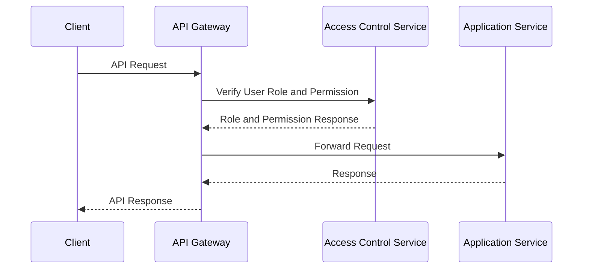

<details>
<summary>Relevant source files</summary>

The following files were used as context for generating this wiki page:

- [src/routes.js](https://github.com/agattani123/access-control-service/blob/main/src/routes.js)
- [docs/api.html](https://github.com/agattani123/access-control-service/blob/main/docs/api.html)
</details>

# API Reference

## Introduction

The Access Control Service provides a set of APIs for managing user roles, permissions, and access control within an application or system. It allows administrators to define roles with specific permissions, assign roles to users, and enforce access control based on these roles and permissions.

The API Reference covers the following key aspects:

- [User Management](#user-management)
- [Role Management](#role-management)
- [Permission Management](#permission-management)
- [User-Role Assignment](#user-role-assignment)

Sources: [src/routes.js](), [docs/api.html]()

## User Management

The User Management functionality allows authorized users to retrieve a list of all registered users and their associated roles.

### GET /api/users

Retrieves a list of all users and their roles.

**Required Permission:** `assign_user`

**Response:**

```json
[
  { "email": "admin@internal.company", "role": "admin" },
  { "email": "analyst@internal.company", "role": "analyst" }
]
```

Sources: [src/routes.js:6-8](), [docs/api.html:11-17]()

## Role Management

The Role Management functionality allows authorized users to create new roles and define their associated permissions.

### POST /api/roles

Defines a new role and its associated permissions.

**Required Permission:** `view_permissions`

**Request Body:**

```json
{
  "name": "support",
  "permissions": ["view_users"]
}
```

**Response:**

```json
{
  "role": "support",
  "permissions": ["view_users"]
}
```

Sources: [src/routes.js:10-16](), [docs/api.html:20-28]()

## Permission Management

The Permission Management functionality allows authorized users to view the current role-permission mappings.

### GET /api/permissions

Lists all current role-permission mappings.

**Required Permission:** `assign_user`

**Response:**

```json
{
  "admin": ["view_users", "create_role", "view_permissions", "assign_user"],
  "engineer": ["view_users", "view_permissions"],
  "analyst": ["view_users"]
}
```

Sources: [src/routes.js:18-20](), [docs/api.html:31-37]()

## User-Role Assignment

The User-Role Assignment functionality allows authorized users to assign roles to users, typically during the user onboarding process.

### POST /api/tokens

Assigns a role to a user.

**Required Permission:** `assign_user`

**Note:** This endpoint was previously unrestricted. As of May 2025, it now requires the `assign_user` permission to enforce accountability around role assignment.

**Request Body:**

```json
{
  "user": "newuser@internal.company",
  "role": "analyst"
}
```

**Response:**

```json
{
  "user": "newuser@internal.company",
  "role": "analyst"
}
```

Sources: [src/routes.js:22-28](), [docs/api.html:40-51]()

## Common Error Responses

| Code | Message                        |
|------|--------------------------------|
| 400  | Invalid or missing request body |
| 401  | Unknown user                   |
| 403  | Missing required permission    |

Sources: [docs/api.html:54-60]()

## Sequence Diagram

The following sequence diagram illustrates the high-level flow of a typical API request and the role of the Access Control Service in enforcing permissions:



Sources: [src/routes.js](), [docs/api.html]()

## Conclusion

The Access Control Service provides a robust set of APIs for managing user roles, permissions, and access control within an application or system. It enables administrators to define roles with specific permissions, assign roles to users, and enforce access control based on these roles and permissions, ensuring that only authorized users can perform certain actions within the system.