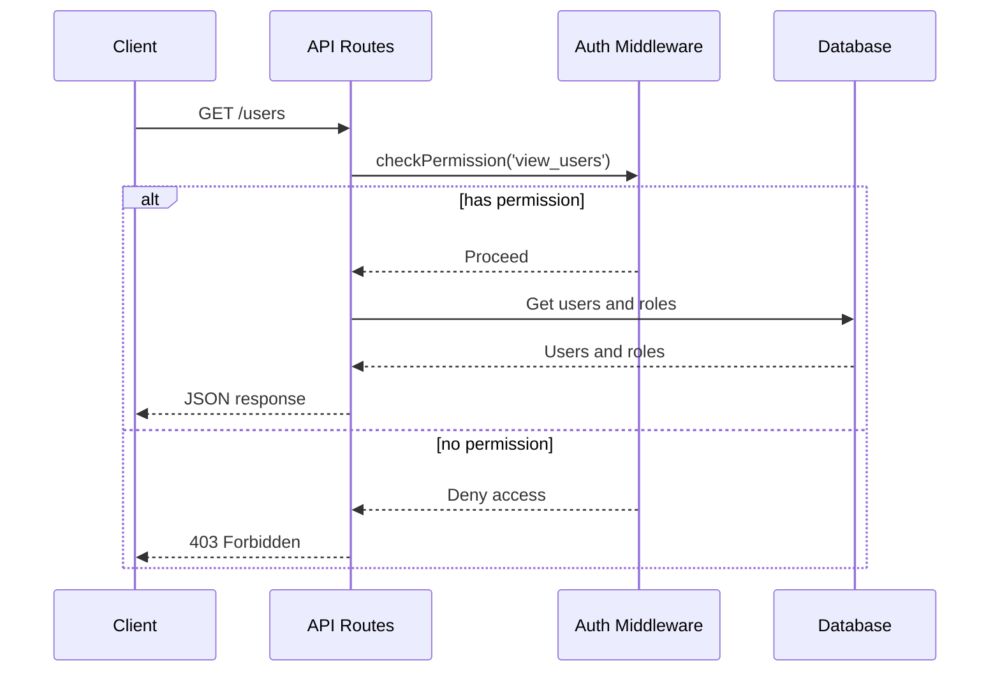
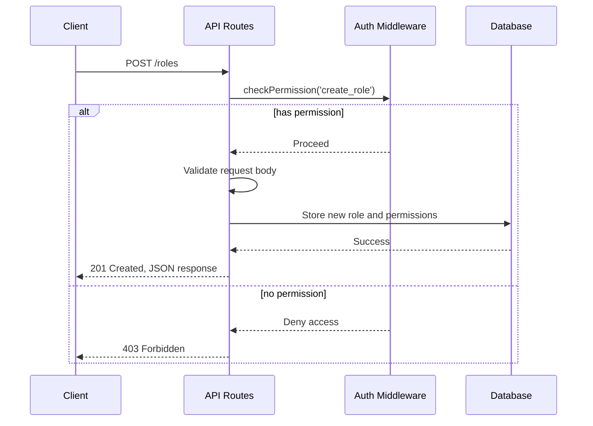
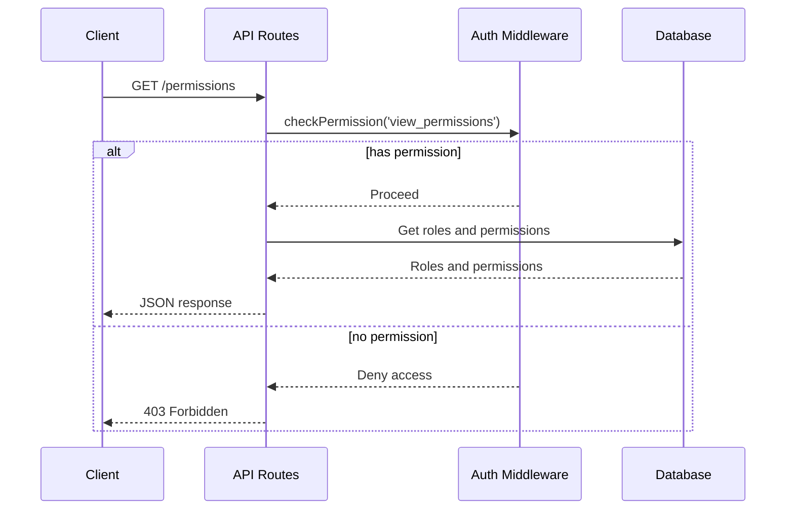
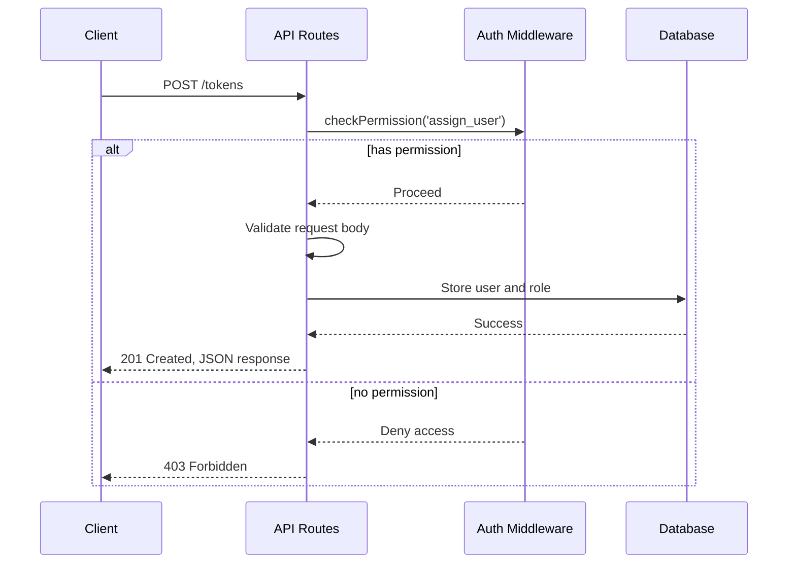

Relevant source files

The following files were used as context for generating this wiki page:

- [src/routes.js](https://github.com/agattani123/access-control-service/blob/main/src/routes.js)
- [docs/api.html](https://github.com/agattani123/access-control-service/blob/main/docs/api.html)

# API Routes

## Introduction

The API Routes module is a core component of the Access Control Service project, responsible for handling incoming HTTP requests and providing access to various functionalities related to user management, role definition, and permission assignment. It serves as the entry point for client applications to interact with the service's features.

The module utilizes the Express.js framework to define and handle API routes. It imports necessary dependencies, such as the `checkPermission` middleware for authorization and the in-memory database (`db`) for storing user roles and permissions.

Sources: [src/routes.js]()

## Route Handlers

### GET /users

This route retrieves a list of all registered users and their associated roles. It requires the `view_users` permission to access.

Sources: [src/routes.js:5-8](), [docs/api.html:13-18]()

### POST /roles

This route allows creating a new role with a set of associated permissions. It requires the `create_role` permission to access.

Sources: [src/routes.js:9-16](), [docs/api.html:20-28]()

### GET /permissions

This route retrieves a list of all defined roles and their associated permissions. It requires the `view_permissions` permission to access.

Sources: [src/routes.js:17-20](), [docs/api.html:30-36]()

### POST /tokens

This route assigns a role to a user, typically used for bootstrapping new users. It requires the `assign_user` permission to access.

Sources: [src/routes.js:21-28](), [docs/api.html:38-48]()

## Error Handling

The API Routes module handles common error scenarios and returns appropriate HTTP status codes and error messages.

| Code | Message                    | Description                                                |
|------|-----------------------------|------------------------------------------------------------|
| 400  | Invalid or missing request body | The request body is missing or does not conform to the expected format. |
| 401  | Unknown user                   | The provided user email is not recognized by the system. |
| 403  | Missing required permission    | The authenticated user does not have the required permission to access the requested resource. |

Sources: [docs/api.html:50-57]()

## Conclusion

The API Routes module serves as the central hub for handling incoming requests, enforcing access control based on user roles and permissions, and interacting with the underlying data store. It follows a modular and middleware-based approach, leveraging the Express.js framework for routing and middleware functionality. The module's design and implementation align with the overall goals of the Access Control Service project, providing a secure and scalable way to manage user access and permissions.