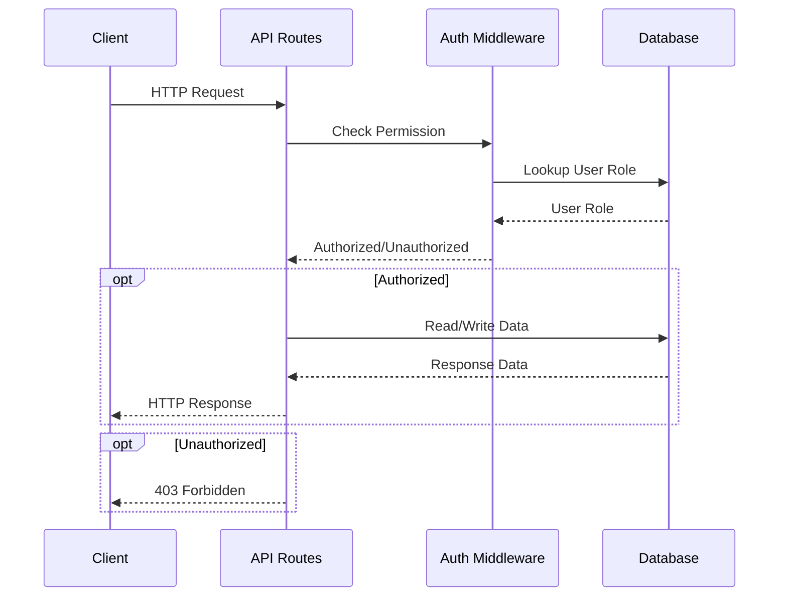

<details>
<summary>Relevant source files</summary>

The following files were used as context for generating this wiki page:

- [src/routes.js](https://github.com/agattani123/access-control-service/blob/main/src/routes.js)
- [docs/api.html](https://github.com/agattani123/access-control-service/blob/main/docs/api.html)
</details>

# API and Routes

## Introduction

The Access Control Service provides a set of APIs and routes for managing user roles, permissions, and access control within an application or system. These APIs allow administrators to define roles, assign permissions to roles, and associate users with specific roles. Additionally, the service includes endpoints for retrieving information about users, roles, and their associated permissions.

The API and routing system is implemented using the Express.js framework for Node.js. It defines a set of routes that handle HTTP requests and perform the necessary operations on an in-memory database (`db.js`). The routes are protected by an authentication middleware (`authMiddleware.js`) that checks if the requesting user has the required permission for each operation.

## API Endpoints

### User Management

#### `GET /api/users`

Retrieves a list of all users and their associated roles.

**Required Permission:** `assign_user`  
**Response:**

```json
[
  { "email": "admin@internal.company", "role": "admin" },
  { "email": "analyst@internal.company", "role": "analyst" }
]
```

Sources: [docs/api.html:16-22](https://github.com/agattani123/access-control-service/blob/main/docs/api.html#L16-L22), [src/routes.js:6-8](https://github.com/agattani123/access-control-service/blob/main/src/routes.js#L6-L8)

#### `POST /api/tokens`

Assigns a role to a user, typically used for bootstrapping new users.

**Required Permission:** `assign_user`  
**Request Body:**

```json
{
  "user": "newuser@internal.company",
  "role": "analyst"
}
```

**Response:**

```json
{
  "user": "newuser@internal.company",
  "role": "analyst"
}
```

Sources: [docs/api.html:48-59](https://github.com/agattani123/access-control-service/blob/main/docs/api.html#L48-L59), [src/routes.js:22-27](https://github.com/agattani123/access-control-service/blob/main/src/routes.js#L22-L27)

### Role and Permission Management

#### `POST /api/roles`

Defines a new role and its associated permissions.

**Required Permission:** `view_permissions`  
**Request Body:**

```json
{
  "name": "support",
  "permissions": ["view_users"]
}
```

**Response:**

```json
{
  "role": "support",
  "permissions": ["view_users"]
}
```

Sources: [docs/api.html:24-32](https://github.com/agattani123/access-control-service/blob/main/docs/api.html#L24-L32), [src/routes.js:10-16](https://github.com/agattani123/access-control-service/blob/main/src/routes.js#L10-L16)

#### `GET /api/permissions`

Lists all current role-permission mappings.

**Required Permission:** `assign_user`  
**Response:**

```json
{
  "admin": ["view_users", "create_role", "view_permissions", "assign_user"],
  "engineer": ["view_users", "view_permissions"],
  "analyst": ["view_users"]
}
```

Sources: [docs/api.html:34-40](https://github.com/agattani123/access-control-service/blob/main/docs/api.html#L34-L40), [src/routes.js:18-20](https://github.com/agattani123/access-control-service/blob/main/src/routes.js#L18-L20)

### Authentication and Authorization

The Access Control Service uses an authentication middleware (`authMiddleware.js`) to check if the requesting user has the required permission for each operation. The middleware is imported and used in the routes file (`src/routes.js`).

```javascript
import { checkPermission } from './authMiddleware.js';

router.get('/users', checkPermission('view_users'), (req, res) => {
  // ...
});
```

The `checkPermission` function likely retrieves the user's role from the request headers or session data, looks up the associated permissions in the `db.roles` object, and verifies if the requested permission is present.

Sources: [src/routes.js:3](https://github.com/agattani123/access-control-service/blob/main/src/routes.js#L3), [src/routes.js:6](https://github.com/agattani123/access-control-service/blob/main/src/routes.js#L6)

## Data Flow

The following diagram illustrates the high-level data flow and interactions between the API routes, the authentication middleware, and the in-memory database:



Sources: [src/routes.js](https://github.com/agattani123/access-control-service/blob/main/src/routes.js), [docs/api.html](https://github.com/agattani123/access-control-service/blob/main/docs/api.html)

## Error Handling

The API routes handle various error scenarios and return appropriate HTTP status codes and error messages. The following table summarizes the common error responses:

| Code | Message                        |
|------|--------------------------------|
| 400  | Invalid or missing request body|
| 401  | Unknown user                   |
| 403  | Missing required permission    |

Sources: [docs/api.html:61-67](https://github.com/agattani123/access-control-service/blob/main/docs/api.html#L61-L67)

## Conclusion

The Access Control Service provides a comprehensive set of APIs and routes for managing user roles, permissions, and access control within an application or system. It allows administrators to define roles, assign permissions to roles, and associate users with specific roles. The service also includes endpoints for retrieving information about users, roles, and their associated permissions. The API and routing system is implemented using the Express.js framework for Node.js and is secured by an authentication middleware that checks if the requesting user has the required permission for each operation.