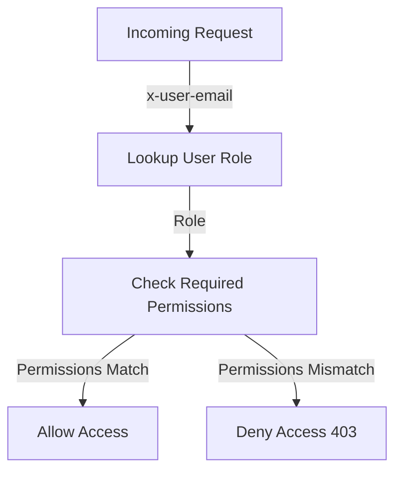

<details>
<summary>Relevant source files</summary>

The following files were used as context for generating this wiki page:

- [src/routes.js](https://github.com/agattani123/access-control-service/blob/main/src/routes.js)
- [docs/api.html](https://github.com/agattani123/access-control-service/blob/main/docs/api.html)
</details>

# API and Routes

## Introduction

The Access Control Service provides a set of APIs and routes for managing user roles, permissions, and access control within an application or system. These APIs allow authorized users to view and assign roles, define role-based permissions, and manage user-role mappings. The service acts as a centralized access control mechanism, ensuring that only users with the appropriate permissions can perform certain actions or access specific resources.

## API Routes

### User Management

#### `GET /api/users`

Returns a list of all registered users and their assigned roles.

**Required Permission:** `assign_user`  
**Response:**

```json
[
  { "email": "admin@internal.company", "role": "admin" },
  { "email": "analyst@internal.company", "role": "analyst" }
]
```

Sources: [docs/api.html:18-22](https://github.com/agattani123/access-control-service/blob/main/docs/api.html#L18-L22), [src/routes.js:7-9](https://github.com/agattani123/access-control-service/blob/main/src/routes.js#L7-L9)

#### `POST /api/tokens`

Assigns a role to a user. Used for bootstrapping new users into the system.

**Required Permission:** `assign_user`  
**Request Body:**

```json
{
  "user": "newuser@internal.company",
  "role": "analyst"
}
```

**Response:**

```json
{
  "user": "newuser@internal.company",
  "role": "analyst"
}
```

Sources: [docs/api.html:41-51](https://github.com/agattani123/access-control-service/blob/main/docs/api.html#L41-L51), [src/routes.js:25-31](https://github.com/agattani123/access-control-service/blob/main/src/routes.js#L25-L31)

### Role and Permission Management

#### `POST /api/roles`

Defines a new role and its associated permissions.

**Required Permission:** `view_permissions`  
**Request Body:**

```json
{
  "name": "support",
  "permissions": ["view_users"]
}
```

**Response:**

```json
{
  "role": "support",
  "permissions": ["view_users"]
}
```

Sources: [docs/api.html:25-32](https://github.com/agattani123/access-control-service/blob/main/docs/api.html#L25-L32), [src/routes.js:11-17](https://github.com/agattani123/access-control-service/blob/main/src/routes.js#L11-L17)

#### `GET /api/permissions`

Lists all current role-permission mappings.

**Required Permission:** `assign_user`  
**Response:**

```json
{
  "admin": ["view_users", "create_role", "view_permissions", "assign_user"],
  "engineer": ["view_users", "view_permissions"],
  "analyst": ["view_users"]
}
```

Sources: [docs/api.html:34-39](https://github.com/agattani123/access-control-service/blob/main/docs/api.html#L34-L39), [src/routes.js:19-22](https://github.com/agattani123/access-control-service/blob/main/src/routes.js#L19-L22)

## Access Control Flow

The following diagram illustrates the high-level flow of how the Access Control Service evaluates permissions and grants or denies access to API routes:



1. An incoming API request includes the `x-user-email` header, which is used to look up the user's assigned role in the system.
2. The required permissions for the requested API route are checked against the user's role permissions.
3. If the user's role has all the required permissions, access is granted, and the API route is executed.
4. If the user's role lacks the required permissions, access is denied with a `403 Forbidden` error.

Sources: [docs/api.html:3-5](https://github.com/agattani123/access-control-service/blob/main/docs/api.html#L3-L5), [src/routes.js:7](https://github.com/agattani123/access-control-service/blob/main/src/routes.js#L7)

## Error Handling

The following table summarizes common error responses from the Access Control Service APIs:

| Code | Message                     |
|------|------------------------------|
| 400  | Invalid or missing request body |
| 401  | Unknown user                |
| 403  | Missing required permission  |

Sources: [docs/api.html:57-63](https://github.com/agattani123/access-control-service/blob/main/docs/api.html#L57-L63)

## Conclusion

The Access Control Service provides a centralized mechanism for managing user roles, permissions, and access control within an application or system. It offers APIs for viewing and assigning user roles, defining role-based permissions, and managing user-role mappings. The service ensures that only authorized users with the appropriate permissions can perform certain actions or access specific resources, enhancing the overall security and access control of the application.