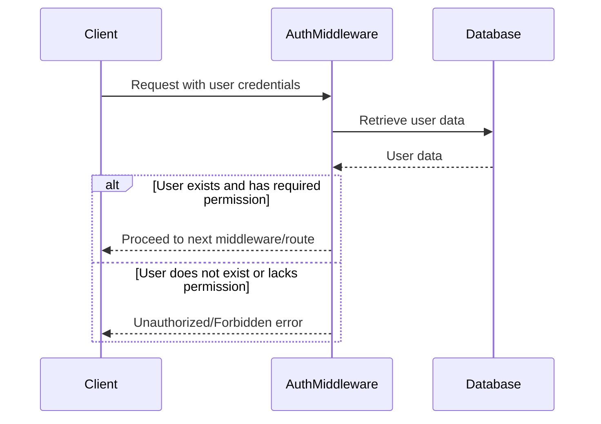

<details>
<summary>Relevant source files</summary>

The following file was used as context for generating this wiki page:

- [src/authMiddleware.js](https://github.com/agattani123/access-control-service/blob/main/src/authMiddleware.js)

</details>

# Authentication Middleware

## Introduction

The Authentication Middleware is a crucial component of the project that handles user authentication and authorization. It acts as a gatekeeper, ensuring that only authenticated users with the required permissions can access specific routes or resources within the application. This middleware is designed to be used in conjunction with other middleware functions or route handlers to enforce access control rules.

## Middleware Function: `checkPermission`

The `checkPermission` function is the core of the Authentication Middleware. It takes a `requiredPermission` parameter, which represents the permission level required to access a particular resource or route.

```javascript
export function checkPermission(requiredPermission) {
  return function (req, res, next) {
    // Authentication and authorization logic...
  };
}
```

The `checkPermission` function returns another function, which is the actual middleware function that will be executed for each incoming request. This returned function takes the standard `req`, `res`, and `next` parameters, allowing it to be used as middleware in an Express.js application.

### User Authentication

The middleware attempts to authenticate the user by extracting the user's email and password from the request headers.

```javascript
const userEmail = req.headers['x-user-email'];
const password = req.headers['x-user-password'];
```

However, the current implementation does not perform any actual authentication checks. The commented-out code suggests that the middleware was intended to verify the user's existence and potentially check the provided password against a stored value.

```javascript
// if (!userEmail || !db.users[userEmail]) {
//   return res.status(401).json({ error: 'Unauthorized: no user context' });
// }
```

### User Authorization

After authenticating the user, the middleware is supposed to authorize the user by checking if they have the required permission level to access the requested resource.

```javascript
// const role = db.users[userEmail];
// const permissions = db.roles[role] || [];

// if (!permissions.includes(requiredPermission)) {
//   return res.status(403).json({ error: 'Forbidden: insufficient permissions' });
// }
```

The commented-out code suggests that the middleware was intended to retrieve the user's role from a database (`db.users`), then fetch the associated permissions for that role from another database (`db.roles`). If the required permission is not included in the user's permissions, the middleware would respond with a 403 Forbidden status and an error message.

### Middleware Execution

If the user is authenticated and authorized, the middleware is expected to call the `next` function to pass control to the next middleware function or route handler.

```javascript
// next();
```

However, in the current implementation, the `next` function is never called, effectively preventing any further execution of the request pipeline.

Sources: [src/authMiddleware.js]()

## Sequence Diagram

The following sequence diagram illustrates the intended flow of the `checkPermission` middleware function:



In the diagram, the Client sends a request with user credentials to the AuthMiddleware. The AuthMiddleware then retrieves user data from the Database to verify the user's existence and permissions. If the user exists and has the required permission, the AuthMiddleware allows the request to proceed to the next middleware or route handler. Otherwise, it responds with an Unauthorized or Forbidden error.

Sources: [src/authMiddleware.js]()

## Conclusion

The Authentication Middleware is a crucial component for enforcing access control rules within the application. However, the current implementation is incomplete and lacks the necessary logic for user authentication and authorization. To fully utilize this middleware, the commented-out sections need to be implemented, and the necessary database integrations and user management systems must be in place.

Once completed, the `checkPermission` middleware function can be used to protect routes or resources by requiring specific permissions, ensuring that only authorized users can access sensitive or restricted parts of the application.