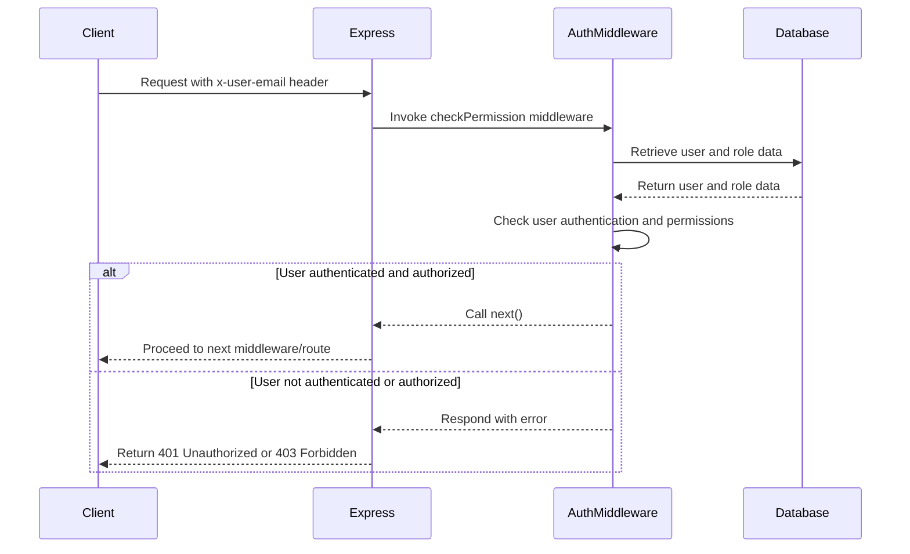

<details>
<summary>Relevant source files</summary>

The following file was used as context for generating this wiki page:

- [src/authMiddleware.js](https://github.com/agattani123/access-control-service/blob/main/src/authMiddleware.js)

</details>

# Authentication Middleware

## Introduction

The Authentication Middleware is a crucial component of the project that handles user authentication and authorization. It ensures that only authenticated users with the required permissions can access specific routes or perform certain actions within the application. This middleware acts as a gatekeeper, verifying user credentials and checking if the user has the necessary permissions before allowing them to proceed.

## Middleware Function

### `checkPermission(requiredPermission)`

This function is the core of the Authentication Middleware. It takes a `requiredPermission` parameter, which represents the permission level required to access a particular route or resource. The function returns a middleware function that can be used in the Express.js route handlers.

```javascript
export function checkPermission(requiredPermission) {
  return function (req, res, next) {
    // Authentication and authorization logic...
    next();
  };
}
```

Sources: [src/authMiddleware.js:1-8]()

### User Authentication

The middleware function first checks if the user is authenticated by looking for the `x-user-email` header in the request. If the header is missing or the user is not found in the `db.users` object, the middleware responds with a 401 Unauthorized status and an error message.

```javascript
const userEmail = req.headers['x-user-email'];
if (!userEmail || !db.users[userEmail]) {
  return res.status(401).json({ error: 'Unauthorized: no user context' });
}
```

Sources: [src/authMiddleware.js:4-6]()

### User Authorization

After authenticating the user, the middleware retrieves the user's role from the `db.users` object. It then checks if the user's role has the required permission by looking up the permissions associated with the role in the `db.roles` object.

```javascript
const role = db.users[userEmail];
const permissions = db.roles[role] || [];

if (!permissions.includes(requiredPermission)) {
  return res.status(403).json({ error: 'Forbidden: insufficient permissions' });
}
```

Sources: [src/authMiddleware.js:8-12]()

If the user's role does not have the required permission, the middleware responds with a 403 Forbidden status and an error message. Otherwise, the middleware calls the `next()` function, allowing the request to proceed to the next middleware or route handler.

## Data Flow

The following sequence diagram illustrates the data flow and interactions within the Authentication Middleware:



Sources: [src/authMiddleware.js]()

## Conclusion

The Authentication Middleware plays a crucial role in securing the application by ensuring that only authenticated users with the required permissions can access specific routes or perform certain actions. It acts as a gatekeeper, verifying user credentials and checking permissions before allowing requests to proceed. By leveraging this middleware, the application can effectively control access to sensitive resources and maintain a secure environment for its users.