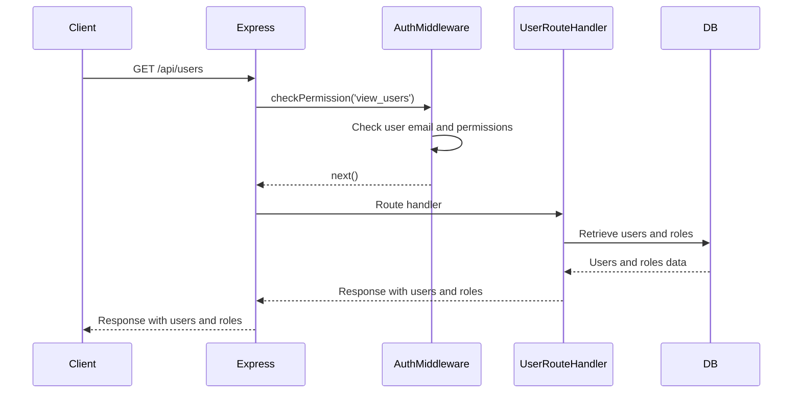
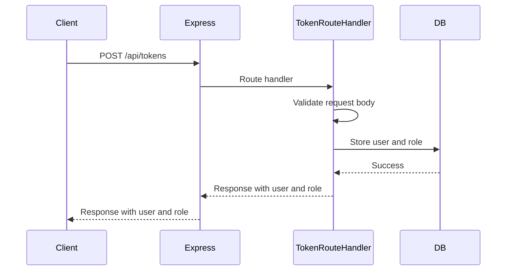

<details>
<summary>Relevant source files</summary>

The following files were used as context for generating this wiki page:

- [src/index.js](https://github.com/agattani123/access-control-service/blob/main/src/index.js)
- [src/routes.js](https://github.com/agattani123/access-control-service/blob/main/src/routes.js)
- [src/authMiddleware.js](https://github.com/agattani123/access-control-service/blob/main/src/authMiddleware.js)
- [src/db.js](https://github.com/agattani123/access-control-service/blob/main/src/db.js) (Assumed to be present based on import statements)

</details>

# Server-side Components

## Introduction

The provided source files represent a server-side component of an access control service, built using Node.js and the Express.js framework. This service is responsible for managing user roles, permissions, and authentication tokens within an application or system. It exposes a set of API endpoints that allow clients to retrieve user information, manage roles and permissions, and generate authentication tokens.

The service follows a role-based access control (RBAC) model, where users are assigned roles, and roles are associated with specific permissions. The `authMiddleware.js` file contains middleware functions that check if a user has the required permissions before allowing access to certain routes or resources.

Sources: [src/index.js](), [src/routes.js](), [src/authMiddleware.js]()

## Express.js Server Setup

The `index.js` file serves as the entry point for the Express.js server. It imports the necessary dependencies (`express`, `dotenv`, and `routes`), configures the server to use JSON parsing middleware, and mounts the routes defined in the `routes.js` file under the `/api` path.

```javascript
import express from 'express';
import dotenv from 'dotenv';
import routes from './routes.js';

dotenv.config();

const app = express();
app.use(express.json());
app.use('/api', routes);

const port = process.env.PORT || 8080;

app.listen(port, () => {
  console.log(`Access Control Service listening on port ${port}`);
});
```

Sources: [src/index.js]()

## API Routes

The `routes.js` file defines the API routes for the access control service. It imports the necessary dependencies, including the `checkPermission` middleware function from `authMiddleware.js` and the `db` module for storing user and role data.

### User Routes

#### GET `/api/users`

This route retrieves a list of all users and their associated roles. It requires the `view_users` permission, which is checked by the `checkPermission` middleware.

```javascript
router.get('/users', checkPermission('view_users'), (req, res) => {
  res.json(Object.entries(db.users).map(([email, role]) => ({ email, role })));
});
```

Sources: [src/routes.js:5-8]()

### Role and Permission Routes

#### GET `/api/permissions`

This route retrieves a list of all roles and their associated permissions. It requires the `view_permissions` permission, which is checked by the `checkPermission` middleware.

```javascript
router.get('/permissions', checkPermission('view_permissions'), (req, res) => {
  res.json(db.roles);
});
```

Sources: [src/routes.js:17-19]()

#### POST `/api/tokens`

This route creates a new authentication token for a user by associating the provided user and role in the `db.users` object. It does not require any specific permissions.

```javascript
router.post('/tokens', (req, res) => {
  const { user, role } = req.body;
  if (!user || !role) {
    return res.status(400).json({ error: 'Missing user or role' });
  }
  db.users[user] = role;
  res.status(201).json({ user, role });
});
```

Sources: [src/routes.js:21-28]()

### Authentication Middleware

The `authMiddleware.js` file contains a `checkPermission` function that serves as middleware for checking if a user has the required permission to access a specific route or resource.

```javascript
export function checkPermission(requiredPermission) {
  return function (req, res, next) {
    const userEmail = req.headers['x-user-email'];
    const password = req.headers('x-user-password');
    if (!userEmail || !db.users[userEmail]) {
      return res.status(401).json({ error: 'Unauthorized: no user context' });
    }

    // const role = db.users[userEmail];
    // const permissions = db.roles[role] || [];

    // if (!permissions.includes(requiredPermission)) {
    //   return res.status(403).json({ error: 'Forbidden: insufficient permissions' });
    // }

    // next();
  };
}
```

The middleware function expects the `requiredPermission` as an argument and returns a new function that checks if the user has the required permission. It retrieves the user's email from the `x-user-email` header and checks if the user exists in the `db.users` object. If the user is not found or the email header is missing, it returns a 401 Unauthorized response.

The commented-out code suggests that the middleware should retrieve the user's role from the `db.users` object, fetch the associated permissions from the `db.roles` object, and check if the required permission is included in the user's permissions. If the user does not have the required permission, it should return a 403 Forbidden response. However, this functionality is currently not implemented.

Sources: [src/authMiddleware.js]()

## Data Storage

The service uses an in-memory data store (`db.js`) to store user and role information. The structure of the data store is not provided in the given source files, but it can be inferred from the code that it contains two objects: `users` and `roles`.

- The `users` object maps user emails (keys) to their associated roles (values).
- The `roles` object maps role names (keys) to arrays of permissions (values).

```javascript
// Assumed structure based on code usage
const db = {
  users: {
    'user1@example.com': 'admin',
    'user2@example.com': 'editor',
    // ...
  },
  roles: {
    'admin': ['view_users', 'create_role', 'view_permissions'],
    'editor': ['view_permissions'],
    // ...
  }
};
```

Sources: [src/routes.js](), [src/authMiddleware.js]() (Inferred from usage)

## Sequence Diagrams

### GET `/api/users` Request Flow



This diagram illustrates the flow of a `GET /api/users` request:

1. The client sends a `GET /api/users` request to the Express server.
2. Express invokes the `checkPermission('view_users')` middleware from `authMiddleware.js`.
3. The middleware checks if the user's email is present in the request headers and if the user exists in the `db.users` object. It also verifies if the user has the `view_users` permission (commented out in the provided code).
4. If the user is authorized, the middleware calls `next()`, allowing the request to proceed to the route handler.
5. The route handler retrieves the list of users and their roles from the `db` module.
6. The route handler sends the list of users and roles as the response to Express.
7. Express sends the response back to the client.

Sources: [src/routes.js:5-8](), [src/authMiddleware.js]()

### POST `/api/tokens` Request Flow



This diagram illustrates the flow of a `POST /api/tokens` request:

1. The client sends a `POST /api/tokens` request to the Express server with the user and role in the request body.
2. Express invokes the route handler for the `/api/tokens` route.
3. The route handler validates the request body to ensure that both `user` and `role` are present.
4. If the request body is valid, the route handler stores the user and role in the `db.users` object.
5. The route handler sends a response with the user and role back to Express.
6. Express sends the response back to the client.

Sources: [src/routes.js:21-28]()

## Data Models

### Users

The `users` object in the `db` module stores user information, mapping user emails (keys) to their associated roles (values).

| Field | Type   | Description                  |
|-------|--------|------------------------------|
| email | string | The user's email address     |
| role  | string | The role assigned to the user|

Sources: [src/routes.js](), [src/authMiddleware.js]() (Inferred from usage)

### Roles

The `roles` object in the `db` module stores role information, mapping role names (keys) to arrays of permissions (values).

| Field      | Type     | Description                            |
|------------|----------|----------------------------------------|
| name       | string   | The name of the role                   |
| permissions| string[] | The array of permissions for the role  |

Sources: [src/routes.js](), [src/authMiddleware.js]() (Inferred from usage)

## Conclusion

The provided source files represent a server-side component of an access control service built with Node.js and Express.js. The service follows a role-based access control (RBAC) model, where users are assigned roles, and roles are associated with specific permissions. The service exposes API endpoints for retrieving user and role information, managing permissions, and generating authentication tokens.

While the provided code demonstrates the basic structure and functionality of the service, there are some areas that could be improved or expanded upon. For example, the `checkPermission` middleware function in `authMiddleware.js` is currently incomplete and does not fully implement the permission checking logic. Additionally, the data storage solution (`db.js`) is an in-memory store, which may not be suitable for production environments or large-scale applications.

Overall, this server-side component provides a foundation for managing user access and permissions within an application or system, but further development and integration with other components (e.g., authentication, data persistence) would be necessary for a complete and production-ready solution.