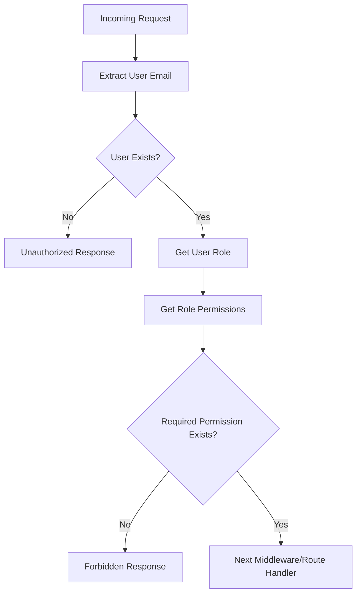
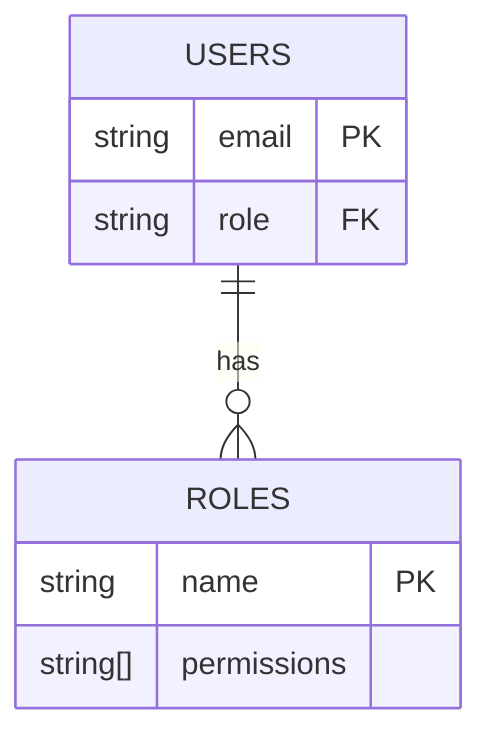

Relevant source files

The following files were used as context for generating this wiki page:

- [src/index.js](https://github.com/agattani123/access-control-service/blob/main/src/index.js)
- [src/routes.js](https://github.com/agattani123/access-control-service/blob/main/src/routes.js)
- [src/authMiddleware.js](https://github.com/agattani123/access-control-service/blob/main/src/authMiddleware.js)
- [src/db.js](https://github.com/agattani123/access-control-service/blob/main/src/db.js)
- [config/roles.json](https://github.com/agattani123/access-control-service/blob/main/config/roles.json)

# Server-side Components

## Introduction

The provided source files represent a server-side component of an access control service, built using Node.js and Express.js. This service is responsible for managing user roles, permissions, and authentication within the application. It provides a set of API endpoints for retrieving user information, creating and viewing roles and permissions, and generating authentication tokens.

The main components of the server-side architecture include:

- **Express.js Application**: The entry point of the application, which sets up the Express server and mounts the API routes.
- **API Routes**: Defined in `routes.js`, these handle various API endpoints for managing users, roles, permissions, and authentication tokens.
- **Authentication Middleware**: Implemented in `authMiddleware.js`, this middleware checks user permissions based on their assigned roles before allowing access to certain routes.
- **Data Storage**: A simple in-memory data store (`db.js`) is used to store user information, roles, and permissions. In a production environment, this would likely be replaced by a persistent database.

Sources: [src/index.js](), [src/routes.js](), [src/authMiddleware.js](), [src/db.js]()

## API Routes

The server exposes the following API endpoints for managing users, roles, permissions, and authentication tokens:

### User Management

#### `GET /api/users`

Retrieves a list of all registered users and their assigned roles.

- **Permission Required**: `view_users`

Sources: [src/routes.js:5-8]()

### Role Management

#### `POST /api/roles`

Creates a new role with the specified name and permissions.

- **Permission Required**: `create_role`
- **Request Body**:
  - `name` (string): The name of the new role.
  - `permissions` (array): An array of permission strings associated with the role.

Sources: [src/routes.js:11-17]()

#### `GET /api/permissions`

Retrieves a list of all defined roles and their associated permissions.

- **Permission Required**: `view_permissions`

Sources: [src/routes.js:19-21](), [src/routes.js:23-25]()

### Authentication

#### `POST /api/tokens`

Generates an authentication token for a user by assigning them a role.

- **Request Body**:
  - `user` (string): The email or identifier of the user.
  - `role` (string): The role to be assigned to the user.

Sources: [src/routes.js:27-32]()

## Authentication Middleware

The `checkPermission` middleware function in `authMiddleware.js` is responsible for checking if a user has the required permission to access a specific route. It follows these steps:

1. Extracts the user's email from the `x-user-email` header.
2. Checks if the user exists in the `db.users` object.
3. Retrieves the user's assigned role from `db.users`.
4. Looks up the permissions associated with the user's role in `db.roles`.
5. Verifies if the required permission is present in the user's permissions.
6. If the user has the required permission, the request is allowed to proceed to the next middleware or route handler.
7. If the user is not authenticated or lacks the required permission, an appropriate error response is sent.

Sources: [src/authMiddleware.js:1-22]()

## Data Storage

The application uses a simple in-memory data store (`db.js`) to store user information, roles, and permissions. In a production environment, this would likely be replaced by a persistent database.

The `db` object has two properties:

- `users`: An object mapping user emails to their assigned roles.
- `roles`: An object mapping role names to arrays of associated permissions.

The `roles.json` file contains the initial set of roles and their associated permissions. This data is imported into the `db.roles` object when the application starts.

Sources: [src/db.js](), [config/roles.json]()

## Conclusion

The server-side components of this access control service provide a foundation for managing user authentication, roles, and permissions within an application. The Express.js server exposes a set of API endpoints for retrieving user information, creating and viewing roles and permissions, and generating authentication tokens. The `authMiddleware` ensures that only authorized users with the required permissions can access certain routes. While the current implementation uses a simple in-memory data store, in a production environment, a persistent database would be used to store user and role information securely.