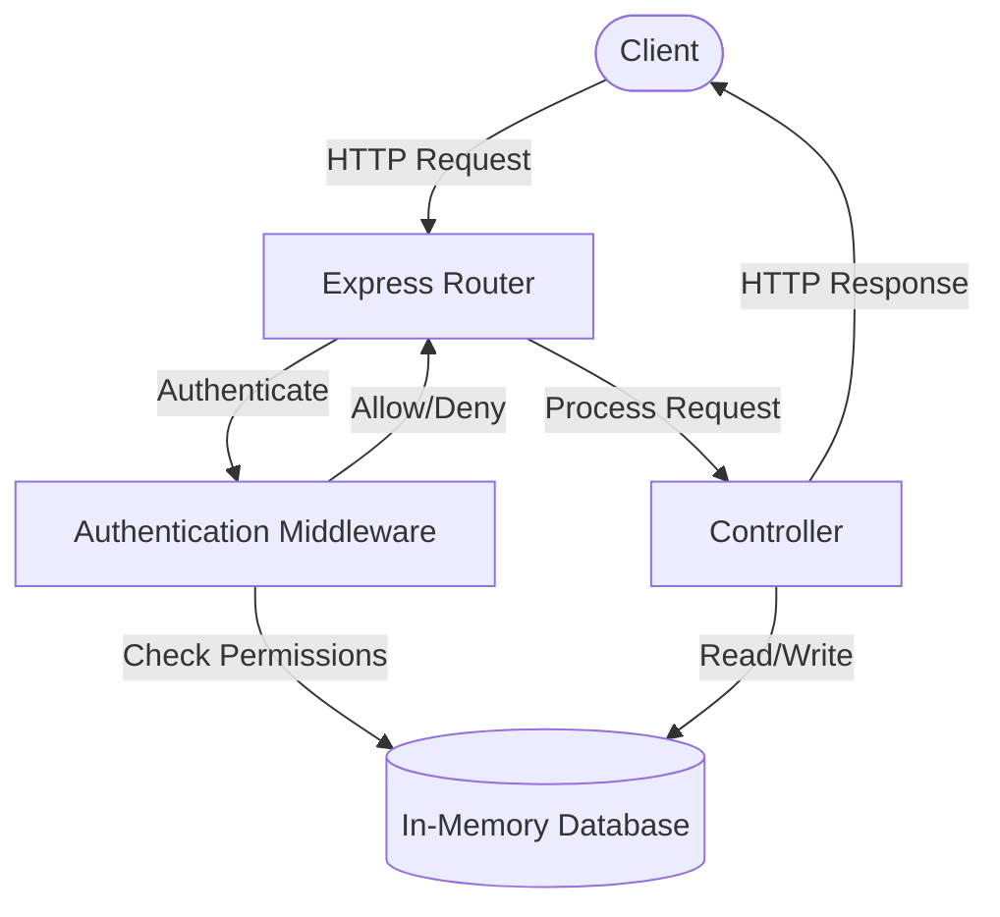
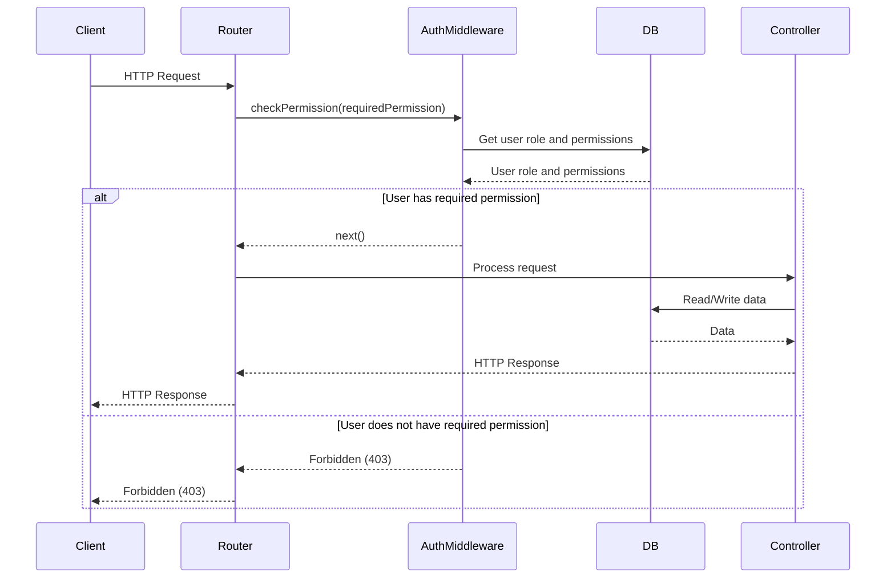

<details>
<summary>Relevant source files</summary>

The following files were used as context for generating this wiki page:

- [src/index.js](https://github.com/agattani123/access-control-service/blob/main/src/index.js)
- [src/routes.js](https://github.com/agattani123/access-control-service/blob/main/src/routes.js)
- [src/authMiddleware.js](https://github.com/agattani123/access-control-service/blob/main/src/authMiddleware.js)
- [src/db.js](https://github.com/agattani123/access-control-service/blob/main/src/db.js)
- [config/roles.json](https://github.com/agattani123/access-control-service/blob/main/config/roles.json)

</details>

# Server-side Components

## Introduction

The provided source files represent a server-side component of an access control system, implemented using Node.js and the Express.js framework. This component is responsible for managing user roles, permissions, and authentication within the application. It exposes various API endpoints to handle user and role management, as well as enforcing access control based on user roles and permissions.

The server-side components consist of an Express.js application, a set of routes for handling API requests, an authentication middleware for checking permissions, and a simple in-memory database for storing user and role information.

Sources: [src/index.js](), [src/routes.js](), [src/authMiddleware.js](), [src/db.js]()

## Application Setup

The `index.js` file serves as the entry point for the Express.js application. It imports the necessary dependencies, configures the Express app, and sets up the API routes. The application listens on a specified port for incoming requests.

```javascript
import express from 'express';
import routes from './routes.js';

const app = express();
app.use(express.json());
app.use('/api', routes);

const port = process.env.PORT || 8080;

app.listen(port, () => {
  console.log(`Access Control Service listening on port ${port}`);
});
```

Sources: [src/index.js]()

## API Routes

The `routes.js` file defines the API routes for the access control service. It imports the necessary dependencies, including the `checkPermission` middleware for authentication and the in-memory database (`db.js`).

### User Management

The `/users` route retrieves a list of all registered users and their associated roles. This route is protected by the `checkPermission` middleware, which ensures that only users with the `view_users` permission can access this endpoint.

```javascript
router.get('/users', checkPermission('view_users'), (req, res) => {
  res.json(Object.entries(db.users).map(([email, role]) => ({ email, role })));
});
```

Sources: [src/routes.js:5-8]()

### Role Management

The `/roles` route allows creating a new role by providing a name and an array of associated permissions. This route is protected by the `checkPermission` middleware, requiring the `create_role` permission.

```javascript
router.post('/roles', checkPermission('create_role'), (req, res) => {
  const { name, permissions } = req.body;
  if (!name || !Array.isArray(permissions)) {
    return res.status(400).json({ error: 'Invalid role definition' });
  }
  db.roles[name] = permissions;
  res.status(201).json({ role: name, permissions });
});
```

Sources: [src/routes.js:11-18]()

The `/permissions` route retrieves a list of all defined roles and their associated permissions. This route is protected by the `checkPermission` middleware, requiring the `view_permissions` permission.

```javascript
router.get('/permissions', checkPermission('view_permissions'), (req, res) => {
  res.json(db.roles);
});
```

Sources: [src/routes.js:20-22]()

### Token Management

The `/tokens` route allows creating a new user token by providing a user email and a role. This route is not protected by any authentication middleware.

```javascript
router.post('/tokens', (req, res) => {
  const { user, role } = req.body;
  if (!user || !role) {
    return res.status(400).json({ error: 'Missing user or role' });
  }
  db.users[user] = role;
  res.status(201).json({ user, role });
});
```

Sources: [src/routes.js:24-31]()

### Authentication Middleware

The `authMiddleware.js` file contains the `checkPermission` middleware function, which is responsible for authenticating users and checking their permissions before allowing access to protected routes.

```javascript
export function checkPermission(requiredPermission) {
  return function (req, res, next) {
    const userEmail = req.headers['x-user-email'];
    if (!userEmail || !db.users[userEmail]) {
      return res.status(401).json({ error: 'Unauthorized: no user context' });
    }

    const role = db.users[userEmail];
    const permissions = db.roles[role] || [];

    if (!permissions.includes(requiredPermission)) {
      return res.status(403).json({ error: 'Forbidden: insufficient permissions' });
    }

    next();
  };
}
```

The middleware checks the `x-user-email` header for the user's email address. If the user is not found in the `db.users` object, it returns a 401 Unauthorized response. Otherwise, it retrieves the user's role and associated permissions from the `db.roles` object. If the user's permissions do not include the required permission, it returns a 403 Forbidden response. If the user has the required permission, the middleware calls the `next()` function to proceed with the request.

Sources: [src/authMiddleware.js:2-19]()

## Data Storage

The `db.js` file provides a simple in-memory data storage for users and roles. It imports the `roles.json` file, which contains the initial role definitions.

```javascript
import roles from '../config/roles.json' assert { type: 'json' };

const db = {
  users: {
    'admin@internal.company': 'admin',
    'analyst@internal.company': 'analyst',
  },
  roles: roles
};

export default db;
```

The `db` object contains two properties: `users` and `roles`. The `users` property is an object that maps user email addresses to their respective roles. The `roles` property is an object that maps role names to arrays of associated permissions, imported from the `roles.json` file.

Sources: [src/db.js](), [config/roles.json]()

## Data Flow Diagram

The following diagram illustrates the high-level data flow and interactions between the server-side components:



1. The client sends an HTTP request to the Express Router.
2. The Router passes the request to the Authentication Middleware for authentication and permission checking.
3. The Authentication Middleware checks the user's email and role in the in-memory database.
4. If the user has the required permission, the Authentication Middleware allows the request to proceed to the Router.
5. The Router passes the request to the appropriate Controller for processing.
6. The Controller reads or writes data from/to the in-memory database as needed.
7. The Controller sends the HTTP response back to the client.

Sources: [src/routes.js](), [src/authMiddleware.js](), [src/db.js]()

## Sequence Diagram: User Authentication

The following sequence diagram illustrates the flow of user authentication and permission checking:



1. The client sends an HTTP request to the Router.
2. The Router invokes the `checkPermission` middleware with the required permission.
3. The `checkPermission` middleware retrieves the user's role and associated permissions from the in-memory database.
4. If the user has the required permission, the middleware calls `next()` to proceed with the request.
5. The Router passes the request to the appropriate Controller for processing.
6. The Controller reads or writes data from/to the in-memory database as needed.
7. The Controller sends the HTTP response back to the client through the Router.
8. If the user does not have the required permission, the `checkPermission` middleware returns a 403 Forbidden response to the client.

Sources: [src/routes.js](), [src/authMiddleware.js](), [src/db.js]()

## Role and Permission Management

The access control system defines roles and associated permissions. The following table summarizes the available roles and their corresponding permissions based on the `roles.json` file:

| Role     | Permissions                                                                                                                                                                                                                                                                                                                                                                                                                                                                                                                                                                                                                                                                                                                                                                                                                                                                                                                                                                                                                                                                                                                                                                                                                                                                                                                                                                                                                                                                                                                                                                                                                                                                                                                                                                                                                                                                                                                                                                                                                                                                                                                                                                                                                                                                                                                                                                                                                                                                                                                                                                                                                                                                                                                                                                                                                                                                                                                                                                                                                                                                                                                                                                                                                                                                                                                                                                                                                                                                                                                                                                                                                                                                                                                                                                                                                                                                                                                                                                                                                                                                                                                                                                                                                                                                                                                                                                                                                                                                                                                                                                                                                                                                                                                                                                                                                                                                                                                                                                                                                                                                                                                                                                                                                                                                                                                                                                                                                                                                                                                                                                                                                                                                                                                                                                                                                                                                                                                                                                                                                                                                                                                                                                                                                                                                                                                                                                                                                                                                                                                                                                                                                                                                                                                                                                                                                                                                                                                                                                                                                                                                                                                                                                                                                                                                                                                                                                                                                                                                                                                                                                                                                                                                                                                                                                                                                                                                                                                                                                                                                                                                                                                                                                                                                                                                                                                                                                                                                                                                                                                                                                                                                                                                                                                                                                                                                                                                                                                                                                                                                                                                                                                                                                                                                                                                                                                                                                                                                                                                                                                                                                                                                                                                                                                                                                                                                                                                                                                                                                                                                                                                                                                                                                                                                                                                                                                                                                                                                                                                                                                                                                                                                                                                                                                                                                                                                                                                                                                                                                                                                                                                                                                                                                                                                                                                                                                                                                                                                                                                                                                                                                                                                                                                                                                                                                                                                                                                                                                                                                                                                                                                                                                                                                                                                                                                                                                                                                                                                                                                                                                                                                                                                                                                                                                                                                                                                                                                                                                                                                                                                                                                                                                                                                                                                                                                                                                                                                                                                                                                                                                                                                                                                                                                                                                                                                                                                                                                                                                                                                                                                                                                                                                                                                                                                                                                                                                                                                                                                                                                                                                                                                                                                                                                                                                                                                                                                                                                                                                                                                                                                                                                                                                                                                                                                                                                                                                                                                                                                                                                                                                                                                                                                                                                                                                                                                                                                                                                                                                                                                                                                                                                                                                                                                                                                                                                                                                                                                                                                                                                                                                                                                                                                                                                                                                                                                                                                                                                                                                                                                                                                                                                                                                                                                                                                                                                                                                                                                                                                                                                                                                                                                                                                                                                                                                                                                                                                                                                                                                                                                                                                                                                                                                                                                                                                                                                                                                                                                                                                                                                                                                                                                                                                                                                                                                                                                                                                                                                                                                                                                                                                                                                                                                                                                                                                                                                                                                                                                                                                                                                                                                                                                                                                                                                                                                                                                                                                                                                                                                                                                                                                                                                                                                                                                                                                                                                                                                                                                                                                                                                                                                                                                                                                                                                                                                                                                                                                                                                                                                                                                                                                                                                                                                                                                                                                                                                                                                                                                                                                                                                                                                                                                                                                                                                                                                                                                                                                                                                                                                                                                                                                                                                                                                                                                                                                                                                                                                                                                                                                                                                                                                                                                                                                                                                                                                                                                                                                                                                                                                                                                                                                                                                                                                                                                                                                                                                                                                                                                                                                                                                                                                                                                                                                                                                                                                                                                                                                                                                                                                                                                                                                                                                                                                                                                                                                                                                                                                                                                                                                                                                                                                                                                                                                                                                                                                                                                                                                                                                                                                                                                                                                                                                                                                                                                                                                                                                                                                                                                                                                                                                                                                                                                                                                                                                                                                                                                                                                                                                                                                                                                                                                                                                                                                                                                                                                                                                                                                                                                                                                                                                                                                                                                                                                                                                                                                                                                                                                                                                                                                                                                                                                                                                                                                                                                                                                                                                                                                                                                                                                                                                                                                                                                                                                                                                                                                                                                                                                                                                                                                                                                                                                                                                                                                                                                                                                                                                                                                                                                                                                                                                                                