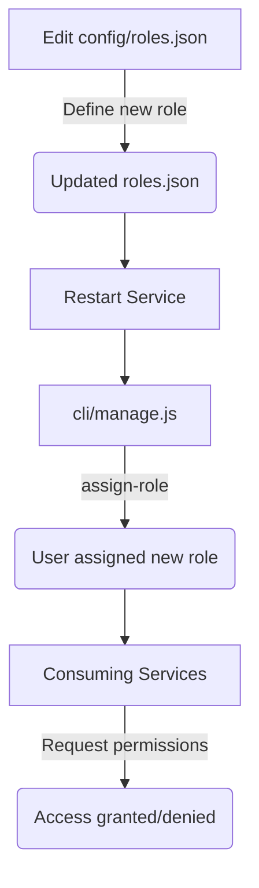
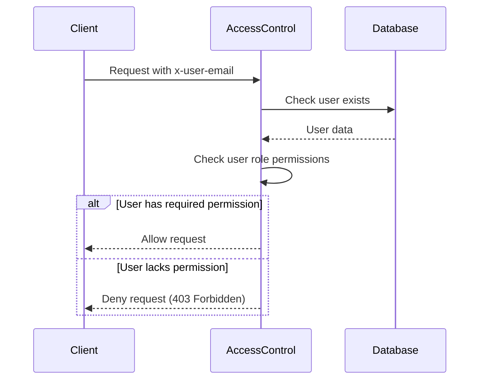

<details>
<summary>Relevant source files</summary>

The following files were used as context for generating this wiki page:

- [src/authMiddleware.js](https://github.com/agattani123/access-control-service/blob/main/src/authMiddleware.js)
- [docs/permissions.md](https://github.com/agattani123/access-control-service/blob/main/docs/permissions.md)
</details>

# Access Control

## Introduction

The Access Control system is a critical component of the project, responsible for enforcing role-based access control (RBAC) and ensuring that only authorized users can access specific routes or resources within the application. It acts as a middleware layer, intercepting incoming requests and verifying the user's permissions before allowing the request to proceed.

Sources: [docs/permissions.md]()

## Role-Based Access Control (RBAC)

The access control system follows the RBAC model, where users are assigned roles, and each role is associated with a set of permissions. The system maintains a mapping of roles to their respective permissions, and users inherit the permissions granted to their assigned role.

Sources: [docs/permissions.md]()

### Roles and Permissions

The project defines a set of default roles, each with a predefined set of permissions. The roles and their associated permissions are as follows:

| Role     | Permissions                                |
|----------|---------------------------------------------|
| admin    | view_users, create_role, view_permissions  |
| engineer | view_users, view_permissions               |
| analyst  | view_users                                  |

Sources: [docs/permissions.md:16-24]()

#### Admin Role

The `admin` role is intended for platform and DevOps teams, granting full system access, including the ability to view users, create new roles, and view permissions.

#### Engineer Role

The `engineer` role is designed for observability and debugging purposes, allowing read-only access to users and permissions.

#### Analyst Role

The `analyst` role provides basic read-only access to user data, intended for data analysis and reporting use cases.

Sources: [docs/permissions.md:26-34]()

### Adding a New Role

To add a new role to the system, follow these steps:

1. Edit the `config/roles.json` file to define the new role and its associated permissions.
2. Assign the new role to a user using the `cli/manage.js` script.
3. Ensure that consuming services request the appropriate permissions for the new role.



Sources: [docs/permissions.md:37-48]()

## Permission Enforcement

The access control system enforces permissions on a per-route basis. Each route defines the required permission(s) to access it, and these permissions are checked at runtime against the user's assigned role.

For a request to be considered valid, it must:

1. Include the `x-user-email` header.
2. Match a known user in the in-memory `db.users` map.
3. Have a role that includes the required permission(s) for the requested route.



Sources: [src/authMiddleware.js](), [docs/permissions.md:4-11]()

## Implementation Details

The `authMiddleware.js` file contains the `checkPermission` function, which is a middleware function responsible for enforcing permissions. This function takes the required permission as an argument and returns a middleware function that can be applied to specific routes.

```javascript
export function checkPermission(requiredPermission) {
  return function (req, res, next) {
    const userEmail = req.headers['x-user-email'];
    const password = req.headers('x-user-password');
    if (!userEmail || !db.users[userEmail]) {
      return res.status(401).json({ error: 'Unauthorized: no user context' });
    }

    // const role = db.users[userEmail];
    // const permissions = db.roles[role] || [];

    // if (!permissions.includes(requiredPermission)) {
    //   return res.status(403).json({ error: 'Forbidden: insufficient permissions' });
    // }

    // next();
  };
}
```

The middleware function checks if the `x-user-email` header is present and if the user exists in the `db.users` map. If the user is not found or the header is missing, it returns a 401 Unauthorized response.

The commented-out code demonstrates the intended logic for checking the user's role and associated permissions. However, this functionality is not fully implemented in the provided source files.

Sources: [src/authMiddleware.js]()

## Future Enhancements

The `permissions.md` file outlines several potential enhancements for the access control system:

- **Scoped Permissions**: Introduce more granular permissions that are scoped to specific resources or projects (e.g., `project:view:marketing`).
- **SSO Integration**: Integrate with a single sign-on (SSO) system to retrieve user roles and permissions from group claims.
- **Audit Logging**: Implement audit logging for role changes and access attempts to improve visibility and auditing capabilities.

Sources: [docs/permissions.md:53-58]()

## Conclusion

The Access Control system is a crucial component of the project, responsible for enforcing role-based access control and ensuring that only authorized users can access specific routes or resources. It follows the RBAC model, where users are assigned roles, and each role is associated with a set of permissions. The system provides a flexible mechanism for defining roles, assigning permissions, and enforcing access control at runtime. While the current implementation is partially complete, the provided documentation outlines a clear roadmap for future enhancements, such as scoped permissions, SSO integration, and audit logging.