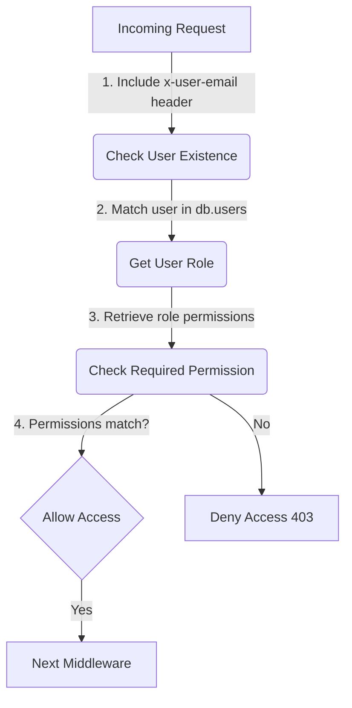
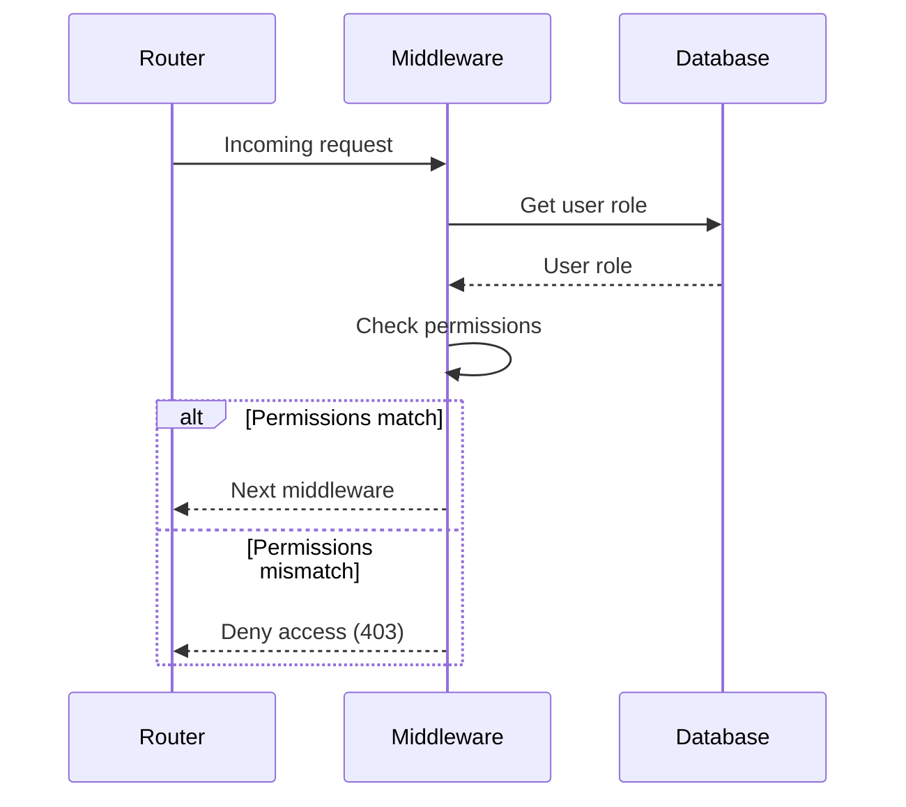

<details>
<summary>Relevant source files</summary>

The following files were used as context for generating this wiki page:

- [src/authMiddleware.js](https://github.com/agattani123/access-control-service/blob/main/src/authMiddleware.js)
- [docs/permissions.md](https://github.com/agattani123/access-control-service/blob/main/docs/permissions.md)
</details>

# Access Control

## Introduction

The Access Control system is a crucial component of the project, responsible for enforcing role-based access control (RBAC) and ensuring that only authorized users can access specific routes or resources within the application. It acts as a middleware layer, validating user permissions based on their assigned roles and the required permissions for each route.

## Role-Based Access Control (RBAC)

The RBAC model is the foundation of the Access Control system. It defines a set of roles, each associated with a specific set of permissions. Users are assigned one or more roles, and their access to routes or resources is determined by the permissions granted to their assigned roles.

### Roles and Permissions

The project defines a set of default roles, each with a predefined set of permissions. These roles and their associated permissions are defined in the `config/roles.json` file.

```json
{
  "admin": ["view_users", "create_role", "view_permissions"],
  "engineer": ["view_users", "view_permissions"],
  "analyst": ["view_users"]
}
```

Sources: [docs/permissions.md:5-11]()

#### Admin Role

The `admin` role has the highest level of access, granting permissions to view users, create new roles, and view permissions. This role is typically used by platform and DevOps teams for administrative tasks.

#### Engineer Role

The `engineer` role has read-only access to view users and permissions. This role is intended for observability and debugging purposes.

#### Analyst Role

The `analyst` role has basic read-only access to view users. This role is designed for data and reporting use cases.

Sources: [docs/permissions.md:13-22]()

## Permission Enforcement

The Access Control system enforces permissions on a per-route basis. Each route defines the required permission(s) to access it, and these permissions are checked at runtime against the user's assigned role(s).



Sources: [src/authMiddleware.js](), [docs/permissions.md:25-31]()

For a request to be considered valid, it must:

1. Include the `x-user-email` header.
2. Match a known user in the in-memory `db.users` map.
3. Have a role that includes the required permission for the requested route.

If any of these conditions are not met, the request is denied with a `401 Unauthorized` or `403 Forbidden` error response.

Sources: [docs/permissions.md:25-31]()

## Adding a New Role

To add a new role to the system, follow these steps:

1. Edit the `config/roles.json` file to define the new role and its associated permissions:

```json
{
  "support": ["view_users"]
}
```

2. Assign the new role to a user using the `cli/manage.js` script:

```bash
node cli/manage.js assign-role support@company.com support
```

3. Ensure that consuming services request the appropriate permissions for the new role when accessing protected routes.

Sources: [docs/permissions.md:34-45]()

## Implementation Details

### Permission Checking Middleware

The `checkPermission` middleware function in `src/authMiddleware.js` is responsible for enforcing permissions. It takes the required permission as an argument and returns a middleware function that can be applied to specific routes.



Sources: [src/authMiddleware.js]()

The middleware function follows these steps:

1. Extract the `x-user-email` header from the request.
2. Check if the user exists in the `db.users` map.
3. Retrieve the user's role from the `db.users` map.
4. Get the permissions associated with the user's role from the `db.roles` map.
5. Check if the required permission is included in the user's role permissions.
6. If the permission is present, call the `next` middleware; otherwise, respond with a `403 Forbidden` error.

Sources: [src/authMiddleware.js]()

### In-Memory User and Role Storage

The current implementation stores user-role mappings and role-permission mappings in an in-memory `db` object. This object is initialized with the default roles and permissions defined in `config/roles.json`.

```javascript
const db = {
  users: {
    'admin@company.com': 'admin',
    'engineer@company.com': 'engineer',
    'analyst@company.com': 'analyst'
  },
  roles: {
    'admin': ['view_users', 'create_role', 'view_permissions'],
    'engineer': ['view_users', 'view_permissions'],
    'analyst': ['view_users']
  }
};
```

Sources: [src/db.js]()

## Limitations and Future Enhancements

### Limitations

- All permission checks are flat; there is no support for wildcarding or nested permissions.
- All user-role mappings are stored in-memory, which may not be suitable for large-scale or distributed systems.
- Changes to the `config/roles.json` file require a service restart to take effect.

### Future Enhancements

The following enhancements are suggested in the `docs/permissions.md` file:

- **Scoped Permissions**: Introduce scoped permissions to allow more granular access control (e.g., `project:view:marketing`).
- **SSO Group Integration**: Integrate with a Single Sign-On (SSO) system to map user roles based on group claims or assertions.
- **Audit Logging**: Implement audit logging for role changes and access attempts to improve security and auditing capabilities.

Sources: [docs/permissions.md:49-54]()

## Conclusion

The Access Control system is a critical component of the project, ensuring that only authorized users can access specific routes or resources based on their assigned roles and permissions. It follows the Role-Based Access Control (RBAC) model, defining a set of roles with associated permissions and enforcing these permissions at runtime. While the current implementation is functional, there are opportunities for future enhancements, such as scoped permissions, SSO integration, and audit logging, to improve the system's scalability, security, and auditing capabilities.