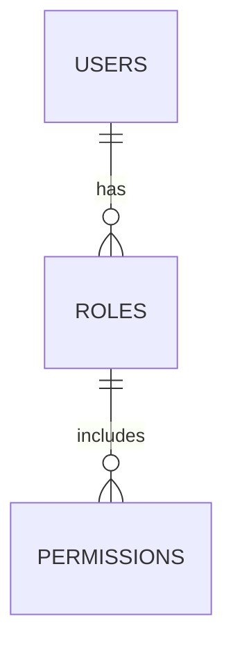
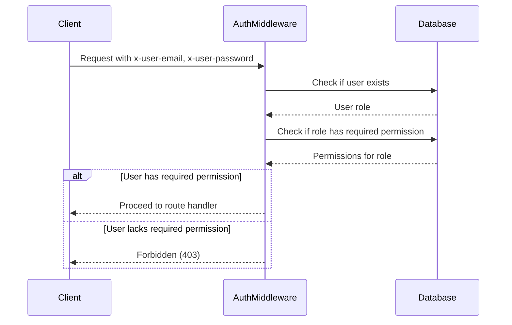

<details>
<summary>Relevant source files</summary>

The following files were used as context for generating this wiki page:

- [src/authMiddleware.js](https://github.com/agattani123/access-control-service/blob/main/src/authMiddleware.js)
- [docs/permissions.md](https://github.com/agattani123/access-control-service/blob/main/docs/permissions.md)
</details>

# Access Control

## Introduction

The access control system is a crucial component of the project, responsible for enforcing role-based access control (RBAC) and ensuring that users have the necessary permissions to access specific routes or resources. It acts as a middleware layer, intercepting incoming requests and verifying the user's permissions before allowing the request to proceed.

The access control system is based on a simple yet flexible model, where users are assigned roles, and each role is associated with a set of permissions. The system checks the user's role against the required permissions for a particular route and grants or denies access accordingly.

## Role-Based Access Control (RBAC) Model

The RBAC model used in this project is a flat, non-hierarchical structure. Each role is assigned a set of permissions, and users are mapped to these roles. The permissions are simple strings without any wildcarding or nesting.



Sources: [docs/permissions.md](https://github.com/agattani123/access-control-service/blob/main/docs/permissions.md)

### Default Roles and Permissions

The project comes with a set of predefined roles and their associated permissions:

| Role     | Permissions                                |
|----------|---------------------------------------------|
| admin    | view_users, create_role, view_permissions  |
| engineer | view_users, view_permissions               |
| analyst  | view_users                                 |

Sources: [docs/permissions.md:10-18](https://github.com/agattani123/access-control-service/blob/main/docs/permissions.md#L10-L18)

## Authentication and Authorization Flow

The authentication and authorization flow for each incoming request is as follows:



Sources: [src/authMiddleware.js](https://github.com/agattani123/access-control-service/blob/main/src/authMiddleware.js)

The `checkPermission` middleware function is responsible for this flow:

1. It checks if the `x-user-email` header is present and matches a user in the in-memory `db.users` map.
2. If the user exists, it retrieves the user's role from the `db.users` map.
3. It then checks if the user's role includes the required permission for the requested route.
4. If the permission is present, the request is allowed to proceed; otherwise, a `403 Forbidden` response is sent.

Sources: [src/authMiddleware.js:3-19](https://github.com/agattani123/access-control-service/blob/main/src/authMiddleware.js#L3-L19)

## Managing Roles and Permissions

### Adding a New Role

To add a new role with specific permissions, follow these steps:

1. Edit the `config/roles.json` file to define the new role and its associated permissions:

```json
{
  "support": ["view_users"]
}
```

2. Assign the new role to a user using the provided CLI tool:

```bash
node cli/manage.js assign-role support@company.com support
```

3. Ensure that consuming services request the appropriate permissions when accessing routes or resources.

Sources: [docs/permissions.md:24-34](https://github.com/agattani123/access-control-service/blob/main/docs/permissions.md#L24-L34)

### Limitations and Future Enhancements

The current implementation has the following limitations:

- All permission checks are flat; there is no support for wildcarding or nested permissions.
- All user-role mappings are stored in-memory, which may not be suitable for larger-scale deployments.
- Changes to the `roles.json` file require a service restart to take effect.

Potential future enhancements include:

- Scoped permissions (e.g., `project:view:marketing`) for finer-grained access control.
- Integration with single sign-on (SSO) group claims for role assignment.
- Audit logging for role changes and access attempts.

Sources: [docs/permissions.md:37-43](https://github.com/agattani123/access-control-service/blob/main/docs/permissions.md#L37-L43)

## Conclusion

The access control system plays a crucial role in ensuring secure and controlled access to resources within the project. By implementing a role-based access control model, it provides a flexible and scalable way to manage permissions and user access. While the current implementation is relatively simple, it lays the foundation for future enhancements and integration with more advanced authentication and authorization mechanisms.