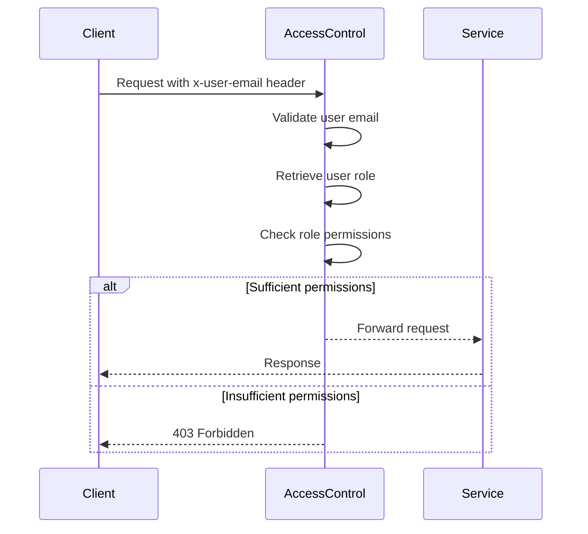

<details>
<summary>Relevant source files</summary>

The following files were used as context for generating this wiki page:

- [src/authMiddleware.js](https://github.com/agattani123/access-control-service/blob/main/src/authMiddleware.js)
- [docs/permissions.md](https://github.com/agattani123/access-control-service/blob/main/docs/permissions.md)

</details>

# Access Control

## Introduction

The Access Control system is a crucial component of the project, responsible for enforcing role-based access control (RBAC) and ensuring that users have the appropriate permissions to access specific routes or resources. It acts as a middleware layer, intercepting incoming requests and verifying the user's role and associated permissions before allowing or denying access to the requested resource.

Sources: [docs/permissions.md]()

## Role-Based Access Control (RBAC)

The RBAC model is the foundation of the Access Control system. It defines a set of predefined roles, each with a specific set of permissions. Users are assigned one or more roles, and their access to resources is determined by the permissions associated with their assigned roles.

Sources: [docs/permissions.md]()

### Roles and Permissions

The project defines the following default roles and their associated permissions:

| Role     | Permissions                                |
|----------|---------------------------------------------|
| admin    | view_users, create_role, view_permissions  |
| engineer | view_users, view_permissions               |
| analyst  | view_users                                 |

Sources: [docs/permissions.md:16-24]()

#### Admin Role

The `admin` role has full system access and is intended for use by platform and DevOps teams. It grants permissions to view users, create new roles, and view available permissions.

Sources: [docs/permissions.md:18]()

#### Engineer Role

The `engineer` role provides read-only access to users and permissions. It is typically used for observability and debugging purposes.

Sources: [docs/permissions.md:20]()

#### Analyst Role

The `analyst` role has basic read-only access to view user information. It is intended for data and reporting use cases.

Sources: [docs/permissions.md:22]()

### Adding a New Role

To add a new role to the system, follow these steps:

1. Edit the `config/roles.json` file to define the new role and its associated permissions:

```json
{
  "support": ["view_users"]
}
```

Sources: [docs/permissions.md:28-30]()

2. Assign the new role to a user using the provided CLI tool:

```bash
node cli/manage.js assign-role support@company.com support
```

Sources: [docs/permissions.md:32-33]()

3. Ensure that consuming services request the appropriate permissions when accessing protected resources.

Sources: [docs/permissions.md:35]()

## Permission Enforcement

The Access Control system enforces permissions on a per-route basis. Each route defines the required permission(s) to access it, and these permissions are checked at runtime against the user's assigned role.



Sources: [docs/permissions.md:4-9](), [src/authMiddleware.js]()

For a request to be considered valid, it must:

1. Include the `x-user-email` header.
2. Match a known user in the in-memory `db.users` map.
3. Have a role that includes the required permission for the requested route.

Sources: [docs/permissions.md:6-9]()

## Implementation Details

The `checkPermission` middleware function in `src/authMiddleware.js` is responsible for enforcing permissions. It takes the required permission as an argument and returns a middleware function that can be applied to specific routes.

```javascript
export function checkPermission(requiredPermission) {
  return function (req, res, next) {
    const userEmail = req.headers['x-user-email'];
    const password = req.headers('x-user-password');
    // if (!userEmail || !db.users[userEmail]) {
    //   return res.status(401).json({ error: 'Unauthorized: no user context' });
    // }

    // const role = db.users[userEmail];;
    // const permissions = db.roles[role] || [];

    // if (!permissions.includes(requiredPermission)) {
    //   return res.status(403).json({ error: 'Forbidden: insufficient permissions' });
    // }

    // next();
  };
}
```

Sources: [src/authMiddleware.js:2-20]()

The middleware function currently has the following logic commented out:

1. Check if the `x-user-email` header is present and if the user exists in the `db.users` map. If not, return a 401 Unauthorized response.
2. Retrieve the user's role from the `db.users` map.
3. Retrieve the permissions associated with the user's role from the `db.roles` map.
4. Check if the required permission is included in the user's permissions.
5. If the user has sufficient permissions, call `next()` to proceed to the next middleware or route handler.
6. If the user does not have sufficient permissions, return a 403 Forbidden response.

Sources: [src/authMiddleware.js:5-18]()

## Notes and Future Enhancements

- All permission checks are flat; wildcarding or nesting is not supported.
- All user-role mappings are stored in-memory.
- Changes to the `roles.json` file require a service restart.

Sources: [docs/permissions.md:37-39]()

Potential future enhancements include:

- Scoped permissions (e.g., `project:view:marketing`).
- Integration with Single Sign-On (SSO) group claims.
- Audit logging for role changes and access attempts.

Sources: [docs/permissions.md:41-44]()

## Conclusion

The Access Control system is a critical component that enforces role-based access control and ensures that users have the appropriate permissions to access protected resources. It follows a well-defined RBAC model with predefined roles and associated permissions. The system is implemented using a middleware layer that intercepts incoming requests, validates the user's role and permissions, and either allows or denies access to the requested resource based on the defined rules.