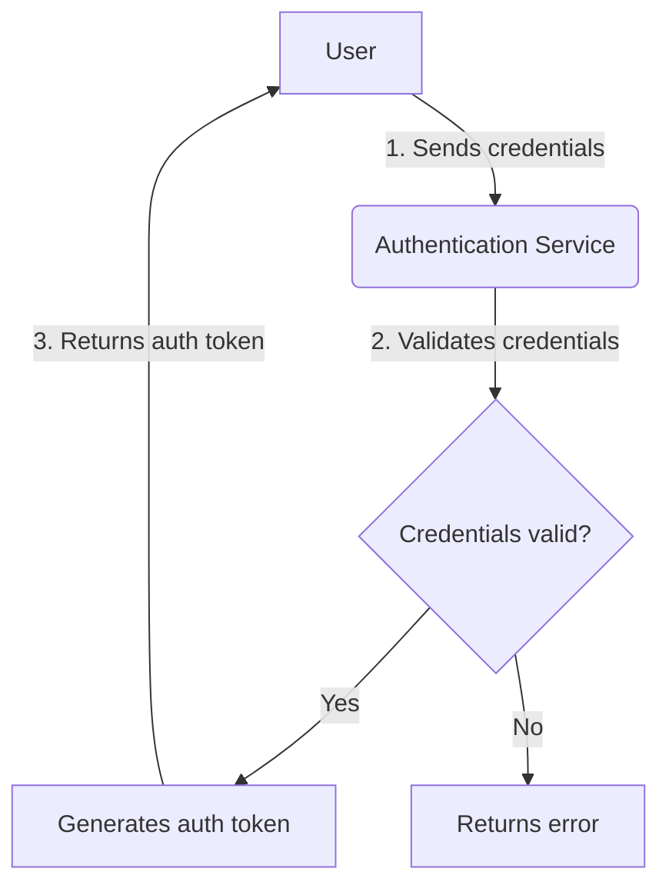
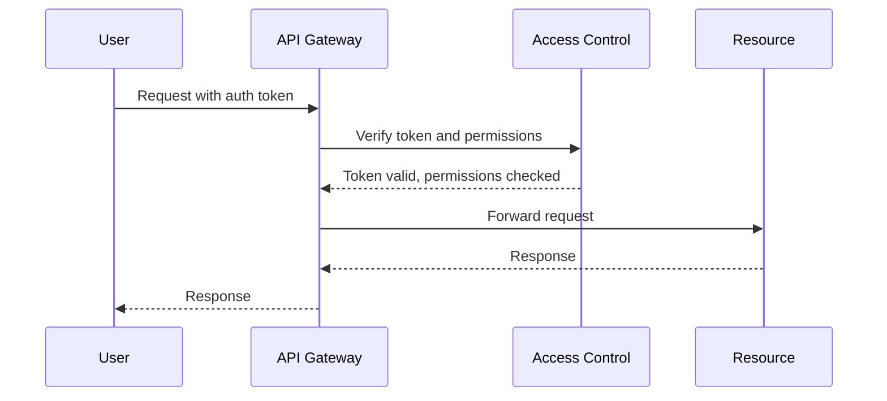

<details>
<summary>Relevant source files</summary>

The following files were used as context for generating this wiki page:

- [src/authMiddleware.js](https://github.com/agattani123/access-control-service/blob/main/src/authMiddleware.js)
- [docs/permissions.md](https://github.com/agattani123/access-control-service/blob/main/docs/permissions.md)
<!-- Add additional relevant files if fewer than 5 were provided -->
</details>

# Access Control

## Introduction

Access Control is a crucial component of the project that manages user authentication and authorization. It ensures that only authenticated users with appropriate permissions can access specific resources or perform certain actions within the application. This module serves as a gatekeeper, verifying user credentials and checking if the user has the necessary permissions before allowing them to proceed.

## Authentication Flow

The authentication process is responsible for verifying user credentials and establishing a user's identity. The following diagram illustrates the high-level flow:



1. The user sends their credentials (e.g., email and password) to the Authentication Service.
2. The Authentication Service validates the provided credentials against the user database.
3. If the credentials are valid, an authentication token is generated and returned to the user. Otherwise, an error is returned.

Sources: [src/authMiddleware.js:3-6]()

## Authorization Flow

After successful authentication, the Authorization Flow checks if the user has the required permissions to access a specific resource or perform a particular action. The following diagram illustrates this process:



1. The user sends a request to the API Gateway, including the authentication token obtained during the Authentication Flow.
2. The API Gateway forwards the request and token to the Access Control module for verification and permission checking.
3. The Access Control module validates the token and checks if the user has the required permissions for the requested resource or action.
4. If the token is valid and the user has the necessary permissions, the API Gateway forwards the request to the appropriate Resource.
5. The Resource processes the request and sends a response back to the API Gateway.
6. The API Gateway relays the response to the user.

Sources: [src/authMiddleware.js:3-6]()

## Permission Management

The Access Control module manages user permissions based on roles and permissions defined in the system. The following table summarizes the key components:

| Component | Description |
| --- | --- |
| User | Represents an individual user in the system. |
| Role | A set of permissions assigned to a group of users. |
| Permission | Defines the level of access or actions a user can perform. |

Sources: [docs/permissions.md]()

## Access Control Middleware

The `authMiddleware.js` file contains the `checkPermission` middleware function, which is responsible for verifying user permissions before allowing access to a specific resource or action. Here's how it works:

```javascript
export function checkPermission(requiredPermission) {
  return function (req, res, next) {
    const userEmail = req.headers['x-user-email'];
    const password = req.headers('x-user-password');
    // if (!userEmail || !db.users[userEmail]) {
    //   return res.status(401).json({ error: 'Unauthorized: no user context' });
    // }

    // const role = db.users[userEmail];
    // const permissions = db.roles[role] || [];

    // if (!permissions.includes(requiredPermission)) {
    //   return res.status(403).json({ error: 'Forbidden: insufficient permissions' });
    // }

    // next();
  };
}
```

1. The `checkPermission` function takes a `requiredPermission` parameter, which is the permission required to access the resource or perform the action.
2. The returned function is a middleware that can be used in an Express.js route handler.
3. Inside the middleware, the user's email and password are extracted from the request headers.
4. The middleware then checks if the user exists in the database and retrieves their role and associated permissions.
5. If the user's permissions include the `requiredPermission`, the middleware calls the `next()` function to proceed with the request. Otherwise, it returns a `403 Forbidden` error.

Note: The code in `authMiddleware.js` is currently commented out, but it provides a blueprint for implementing the Access Control functionality.

Sources: [src/authMiddleware.js:3-19]()

## Conclusion

The Access Control module plays a vital role in ensuring the security and integrity of the application by managing user authentication and authorization. It verifies user credentials, checks permissions based on roles, and grants or denies access to resources and actions accordingly. By implementing proper access control mechanisms, the application can protect sensitive data and functionalities from unauthorized access, maintaining a secure and trusted environment for its users.