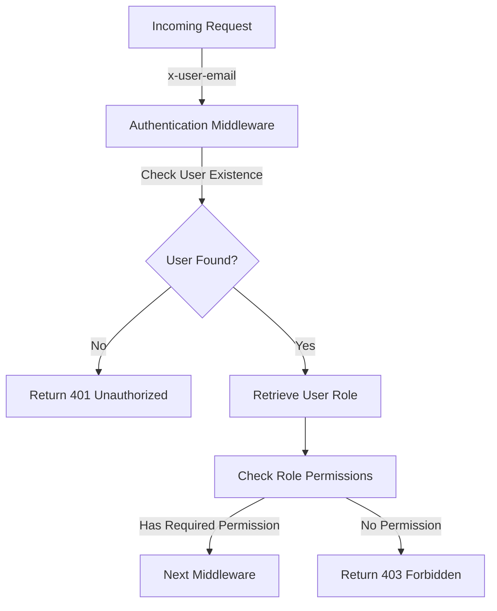
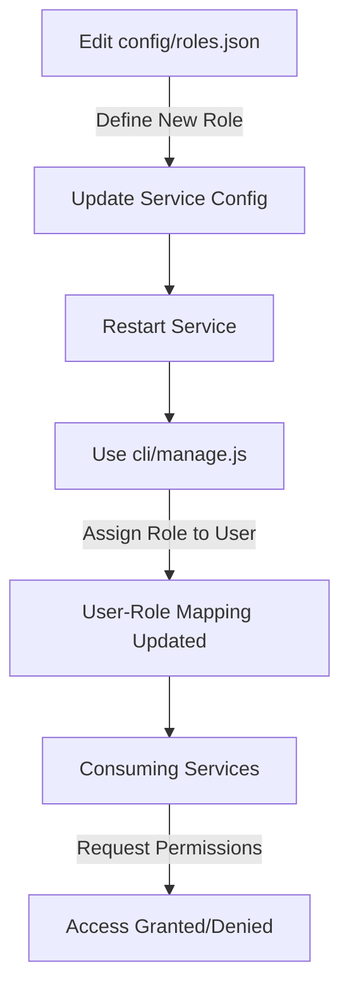

<details>
<summary>Relevant source files</summary>

The following files were used as context for generating this wiki page:

- [src/authMiddleware.js](https://github.com/agattani123/access-control-service/blob/main/src/authMiddleware.js)
- [docs/permissions.md](https://github.com/agattani123/access-control-service/blob/main/docs/permissions.md)
</details>

# Access Control

## Introduction

The Access Control system is a crucial component of the project, responsible for enforcing role-based access control (RBAC) and ensuring that users have the appropriate permissions to access specific routes or resources. It acts as a middleware layer, intercepting incoming requests and validating the user's permissions before allowing the request to proceed.

The system relies on an in-memory database (`db.users` and `db.roles`) to store user-role mappings and role-permission associations. It follows a flat permission model, where each role is assigned a set of permissions, and users inherit the permissions based on their assigned role.

Sources: [src/authMiddleware.js](), [docs/permissions.md]()

## Architecture

The Access Control system consists of the following key components:

1. **Authentication Middleware**: A middleware function (`checkPermission`) that validates the user's permissions based on the required permission for a specific route.
2. **In-Memory Database**: An in-memory data structure (`db.users` and `db.roles`) that stores user-role mappings and role-permission associations.
3. **Configuration Files**: JSON files (`config/roles.json`) that define the default roles and their associated permissions.
4. **CLI Tool**: A command-line interface (`cli/manage.js`) for managing user-role assignments.

The overall flow of the Access Control system is as follows:



Sources: [src/authMiddleware.js](), [docs/permissions.md]()

## Permission Enforcement

The `checkPermission` middleware function is responsible for enforcing permissions on a per-route basis. It follows these steps:

1. Extract the `x-user-email` header from the incoming request.
2. Check if the user exists in the `db.users` map.
3. Retrieve the user's role from the `db.users` map.
4. Check if the user's role includes the required permission by looking up the role in the `db.roles` map.
5. If the user has the required permission, call the next middleware function.
6. If the user does not have the required permission, return a 403 Forbidden response.

```mermaid
sequenceDiagram
    participant Client
    participant AuthMiddleware
    participant Database

    Client->>AuthMiddleware: Request with x-user-email
    AuthMiddleware->>Database: Check user existence
    Database-->>AuthMiddleware: User data
    AuthMiddleware->>Database: Get user role
    Database-->>AuthMiddleware: User role
    AuthMiddleware->>Database: Get role permissions
    Database-->>AuthMiddleware: Role permissions
    alt Has required permission
        AuthMiddleware-->>Client: Next middleware
    else No permission
        AuthMiddleware--x>>Client: 403 Forbidden
    end
```

Sources: [src/authMiddleware.js:3-21]()

## Roles and Permissions

The Access Control system follows a role-based access control (RBAC) model, where permissions are assigned to roles, and users are assigned one or more roles. The default roles and their associated permissions are defined in the `config/roles.json` file.

| Role     | Permissions                                |
|----------|---------------------------------------------|
| admin    | view_users, create_role, view_permissions   |
| engineer | view_users, view_permissions                |
| analyst  | view_users                                  |

Sources: [docs/permissions.md:9-17]()

### Adding a New Role

To add a new role, follow these steps:

1. Edit the `config/roles.json` file to define the new role and its associated permissions.
2. Use the `cli/manage.js` tool to assign the new role to a user.
3. Ensure that consuming services request the appropriate permissions for the new role.



Sources: [docs/permissions.md:21-33]()

## Future Enhancements

The Access Control system has several potential enhancements planned for future releases:

- **Scoped Permissions**: Introduce a hierarchical or scoped permission model, allowing for more granular access control (e.g., `project:view:marketing`).
- **SSO Integration**: Integrate with a single sign-on (SSO) provider to retrieve user claims and group memberships for role assignments.
- **Audit Logging**: Implement audit logging for role changes and access attempts to improve visibility and compliance.

Sources: [docs/permissions.md:37-40]()

## Conclusion

The Access Control system is a crucial component of the project, responsible for enforcing role-based access control and ensuring that users have the appropriate permissions to access specific routes or resources. It follows a flat permission model, where roles are assigned a set of permissions, and users inherit permissions based on their assigned role. The system relies on an in-memory database to store user-role mappings and role-permission associations, and provides a command-line interface for managing user-role assignments. Future enhancements include scoped permissions, SSO integration, and audit logging.