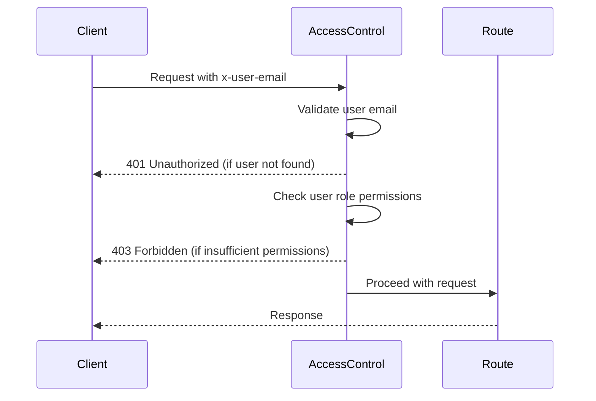
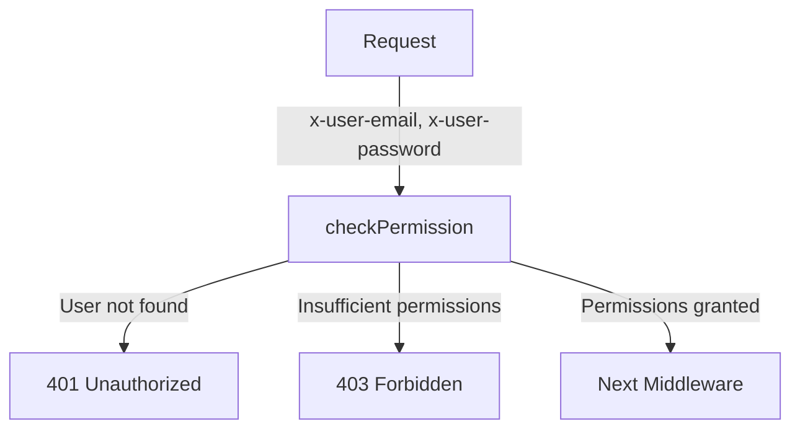

<details>
<summary>Relevant source files</summary>

The following files were used as context for generating this wiki page:

- [src/authMiddleware.js](https://github.com/agattani123/access-control-service/blob/main/src/authMiddleware.js)
- [docs/permissions.md](https://github.com/agattani123/access-control-service/blob/main/docs/permissions.md)
</details>

# Access Control

## Introduction

The Access Control system is a crucial component of the project, responsible for enforcing role-based access control (RBAC) and ensuring that only authorized users can access specific routes or resources within the application. It acts as a middleware layer, intercepting incoming requests and verifying the user's permissions before allowing the request to proceed.

Sources: [docs/permissions.md](https://github.com/agattani123/access-control-service/blob/main/docs/permissions.md)

## Role-Based Access Control (RBAC)

The RBAC model is the foundation of the Access Control system. It defines a set of predefined roles, each associated with a specific set of permissions. Users are assigned one or more roles, and their access privileges are determined by the permissions granted to those roles.

### Roles and Permissions

The project currently defines the following default roles and their associated permissions:

| Role     | Permissions                                |
|----------|---------------------------------------------|
| admin    | view_users, create_role, view_permissions  |
| engineer | view_users, view_permissions               |
| analyst  | view_users                                 |

Sources: [docs/permissions.md:11-18](https://github.com/agattani123/access-control-service/blob/main/docs/permissions.md#L11-L18)

#### Role Descriptions

- **admin**: This role has full system access and is intended for platform and DevOps teams.
- **engineer**: This role has read-only access to users and permissions, primarily used for observability and debugging purposes.
- **analyst**: This role has basic read-only access to user information, designed for data analysis and reporting use cases.

Sources: [docs/permissions.md:20-27](https://github.com/agattani123/access-control-service/blob/main/docs/permissions.md#L20-L27)

### Permission Enforcement

The Access Control system enforces permissions on a per-route basis. Each route defines the required permission(s) to access it, and the system checks these permissions against the user's assigned role at runtime.



Sources: [docs/permissions.md:3-9](https://github.com/agattani123/access-control-service/blob/main/docs/permissions.md#L3-L9)

For a request to be considered valid, it must:

1. Include the `x-user-email` header.
2. Match a known user in the in-memory `db.users` map.
3. Have a role that includes the required permission for the requested route.

Sources: [docs/permissions.md:5-9](https://github.com/agattani123/access-control-service/blob/main/docs/permissions.md#L5-L9)

## Adding a New Role

To add a new role to the system, follow these steps:

1. Edit the `config/roles.json` file to define the new role and its associated permissions:

```json
{
  "support": ["view_users"]
}
```

2. Assign the new role to a user using the provided CLI tool:

```bash
node cli/manage.js assign-role support@company.com support
```

3. Ensure that consuming services request the appropriate permissions when accessing routes protected by the Access Control system.

Sources: [docs/permissions.md:31-41](https://github.com/agattani123/access-control-service/blob/main/docs/permissions.md#L31-L41)

## Implementation Details

### Authentication Middleware

The `authMiddleware.js` file contains the implementation of the `checkPermission` middleware function, which is responsible for enforcing permissions on incoming requests.



The `checkPermission` function takes a `requiredPermission` parameter and returns a middleware function that can be applied to specific routes. This middleware function performs the following steps:

1. Extracts the `userEmail` and `password` from the request headers.
2. Checks if the `userEmail` exists in the `db.users` map.
3. If the user is not found, it returns a 401 Unauthorized response.
4. (Currently commented out) Retrieves the user's role and associated permissions.
5. (Currently commented out) Checks if the user's permissions include the `requiredPermission`.
6. (Currently commented out) If the user has insufficient permissions, it returns a 403 Forbidden response.
7. (Currently commented out) If the user has the required permission, it calls the `next` middleware function to proceed with the request.

Sources: [src/authMiddleware.js](https://github.com/agattani123/access-control-service/blob/main/src/authMiddleware.js)

### Future Enhancements

The `permissions.md` document outlines several potential future enhancements for the Access Control system:

- **Scoped Permissions**: Introduce a more granular permission model that allows for scoped permissions, such as `project:view:marketing`.
- **SSO Integration**: Integrate with a Single Sign-On (SSO) provider to leverage group claims for role assignments.
- **Audit Logging**: Implement audit logging capabilities to track role changes and access attempts for auditing and compliance purposes.

Sources: [docs/permissions.md:45-49](https://github.com/agattani123/access-control-service/blob/main/docs/permissions.md#L45-L49)

## Conclusion

The Access Control system plays a crucial role in ensuring secure access to resources within the application. By implementing a role-based access control model, it allows for fine-grained control over user permissions and helps maintain the integrity and confidentiality of sensitive data. While the current implementation provides a basic foundation, the proposed future enhancements, such as scoped permissions, SSO integration, and audit logging, will further strengthen the system's capabilities and align it with industry best practices for access control and security.