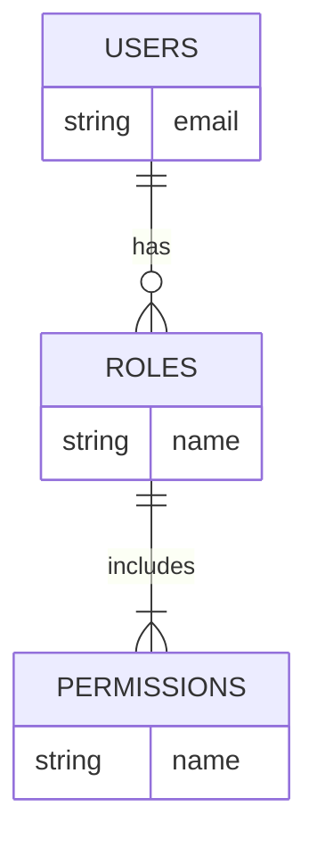
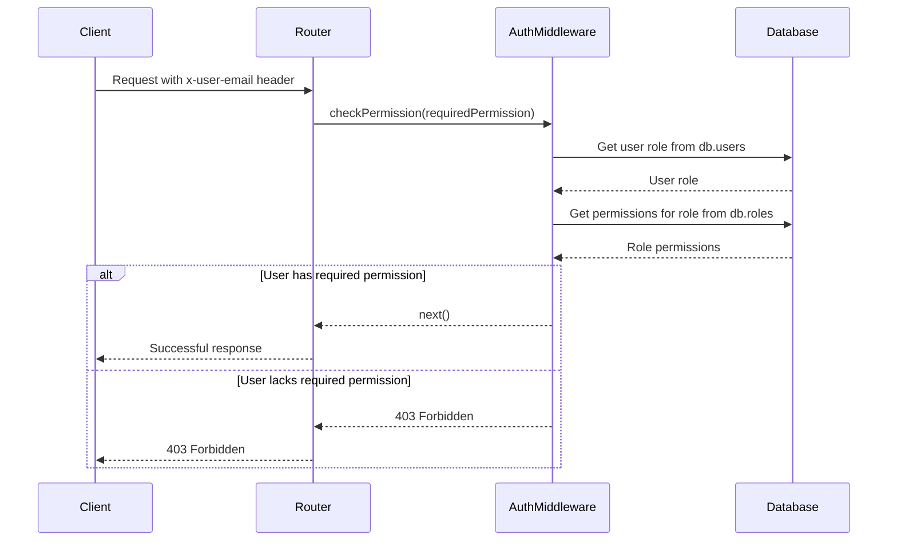
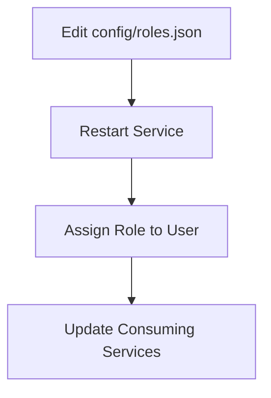

Relevant source files

The following files were used as context for generating this wiki page:

- [src/authMiddleware.js](https://github.com/agattani123/access-control-service/blob/main/src/authMiddleware.js)
- [docs/permissions.md](https://github.com/agattani123/access-control-service/blob/main/docs/permissions.md)

# Access Control

## Introduction

The access control system is a crucial component of the project, responsible for enforcing role-based access control (RBAC) and ensuring that users have the necessary permissions to access specific routes or resources. It acts as a middleware layer, validating user credentials and checking if the user's assigned role has the required permissions before allowing access to the requested resource.

The access control system is implemented using an in-memory database (`db.users` and `db.roles`) that stores user-role mappings and role-permission mappings. This design allows for efficient permission checks during runtime, but it also means that any changes to roles or permissions require a service restart.

## Role-Based Access Control (RBAC)

The RBAC model is the foundation of the access control system. It defines a set of roles, each with a specific set of permissions. Users are assigned one or more roles, and their access to resources is determined by the permissions associated with their roles.

### Roles and Permissions

The project defines three default roles: `admin`, `engineer`, and `analyst`. Each role has a predefined set of permissions, as shown in the following table:

| Role     | Permissions                                |
|----------|---------------------------------------------|
| admin    | `view_users`, `create_role`, `view_permissions` |
| engineer | `view_users`, `view_permissions`               |
| analyst  | `view_users`                                |

Sources: [docs/permissions.md:8-16]()

The `admin` role has full system access, allowing users with this role to view users, create new roles, and view permissions. The `engineer` role has read-only access to users and permissions, which is useful for observability and debugging purposes. The `analyst` role has basic read-only access to user data, intended for data analysis and reporting use cases.

Sources: [docs/permissions.md:8-16]()

The diagram above illustrates the relationships between users, roles, and permissions in the RBAC model. Users are assigned one or more roles, and each role includes a set of permissions.

### Permission Enforcement

The `checkPermission` middleware function in `src/authMiddleware.js` is responsible for enforcing permissions on a per-route basis. It follows these steps:

1. Extract the user's email from the `x-user-email` request header.
2. Check if the user exists in the `db.users` map.
3. Retrieve the user's role from `db.users`.
4. Check if the user's role includes the required permission.
5. If the user has the required permission, the request is allowed to proceed; otherwise, a `403 Forbidden` response is sent.

Sources: [src/authMiddleware.js:2-18]()

The sequence diagram above illustrates the flow of permission enforcement for each incoming request. The `checkPermission` middleware function interacts with the in-memory database to retrieve the user's role and associated permissions, and then either allows the request to proceed or returns a `403 Forbidden` response based on the permission check.

## Adding a New Role

To add a new role to the system, follow these steps:

1. Edit the `config/roles.json` file to define the new role and its associated permissions.
2. Use the `cli/manage.js` script to assign the new role to a user.
3. Ensure that consuming services request the appropriate permissions for the new role.

Sources: [docs/permissions.md:21-30]()

The diagram above illustrates the process of adding a new role to the system. First, the `config/roles.json` file is edited to define the new role and its permissions. Then, the service must be restarted for the changes to take effect. After that, the new role can be assigned to a user using the `cli/manage.js` script. Finally, any consuming services that rely on the new role must be updated to request the appropriate permissions.

## Limitations and Future Enhancements

While the current access control system provides a basic RBAC implementation, it has several limitations:

- **Flat Permissions**: The system only supports flat permissions without any wildcarding or nesting capabilities.
- **In-Memory Storage**: All user-role mappings are stored in-memory, which means that any changes to roles or permissions require a service restart.
- **Lack of Audit Logging**: There is no audit logging mechanism for tracking role changes or access attempts.

To address these limitations and enhance the access control system, the following improvements could be considered:

- **Scoped Permissions**: Implement a more granular permission system that supports scoped permissions (e.g., `project:view:marketing`).
- **Integration with SSO**: Integrate with a single sign-on (SSO) system to leverage group claims for role assignments.
- **Audit Logging**: Implement audit logging to track role changes, permission modifications, and access attempts for security and compliance purposes.

Sources: [docs/permissions.md:34-39]()

## Conclusion

The access control system plays a crucial role in ensuring that users have the appropriate permissions to access resources within the project. By implementing a role-based access control (RBAC) model, the system allows for flexible and granular control over user permissions. While the current implementation has some limitations, such as flat permissions and in-memory storage, the system provides a solid foundation for enforcing access control and can be enhanced with additional features like scoped permissions, SSO integration, and audit logging to meet evolving security and compliance requirements.