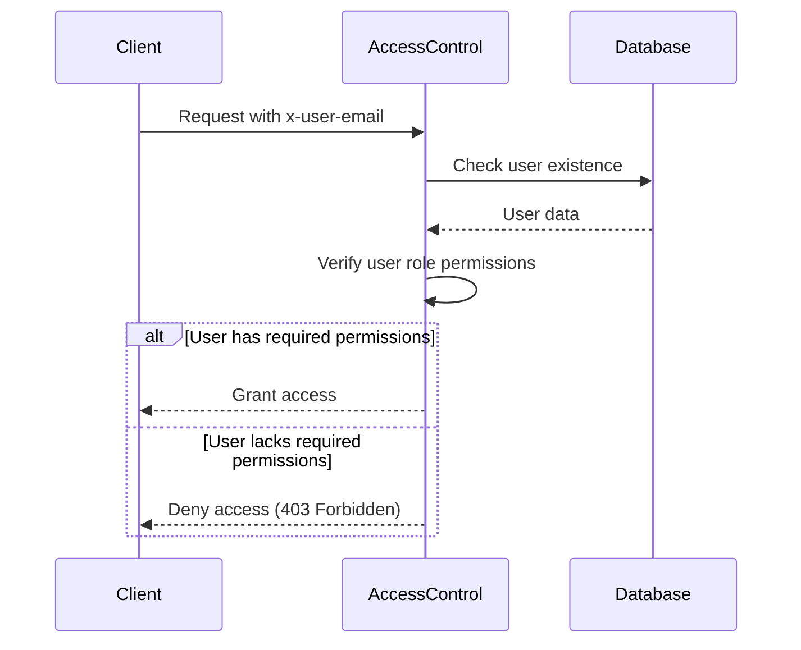

<details>
<summary>Relevant source files</summary>

The following files were used as context for generating this wiki page:

- [src/authMiddleware.js](https://github.com/agattani123/access-control-service/blob/main/src/authMiddleware.js)
- [docs/permissions.md](https://github.com/agattani123/access-control-service/blob/main/docs/permissions.md)

</details>

# Access Control

## Introduction

The Access Control system is a crucial component of the project, responsible for enforcing role-based access control (RBAC) and ensuring that users have the appropriate permissions to access various resources and functionalities within the application. It acts as a gatekeeper, verifying user credentials and checking if their assigned roles have the necessary permissions before granting access to protected routes or operations.

Sources: [docs/permissions.md]()

## Role-Based Access Control (RBAC) Model

The RBAC model employed by the Access Control system revolves around the concept of roles and permissions. Each user is assigned one or more roles, and each role is associated with a set of predefined permissions. The system checks if a user's role(s) include the required permission(s) for a specific operation or resource access.

Sources: [docs/permissions.md]()

### Roles and Permissions

The project defines the following default roles and their associated permissions:

| Role     | Permissions                                   |
|----------|------------------------------------------------|
| admin    | view_users, create_role, view_permissions     |
| engineer | view_users, view_permissions                  |
| analyst  | view_users                                    |

Sources: [docs/permissions.md:19-26]()

#### Admin Role

The `admin` role grants full system access and is intended for platform and DevOps teams. It allows users to view user information, create new roles, and view the list of available permissions.

#### Engineer Role

The `engineer` role provides read-only access to user information and permissions. It is typically used for observability and debugging purposes.

#### Analyst Role

The `analyst` role grants basic read-only access to user information. It is designed for data analysis and reporting use cases.

Sources: [docs/permissions.md:28-38]()

## Permission Enforcement

The Access Control system enforces permissions on a per-route basis. Each route defines the required permission(s) for access, and these permissions are checked at runtime against the user's assigned role(s).

For a request to be considered valid, it must:

1. Include the `x-user-email` header.
2. Match a known user in the in-memory `db.users` map.
3. Have a role that includes the required permission(s) for the requested route.



Sources: [src/authMiddleware.js:3-18](), [docs/permissions.md:5-10]()

## Adding a New Role

To add a new role to the system, follow these steps:

1. Edit the `config/roles.json` file to define the new role and its associated permissions:

```json
{
  "support": ["view_users"]
}
```

2. Assign the new role to a user using the provided CLI tool:

```bash
node cli/manage.js assign-role support@company.com support
```

3. Ensure that consuming services request the appropriate permissions when accessing protected routes or resources.

Sources: [docs/permissions.md:14-21]()

## Implementation Details

### Authentication Middleware

The `authMiddleware.js` file contains the `checkPermission` function, which is a middleware function responsible for checking if a user has the required permission(s) for a specific route.

```javascript
export function checkPermission(requiredPermission) {
  return function (req, res, next) {
    const userEmail = req.headers['x-user-email'];
    const password = req.headers('x-user-password');
    if (!userEmail || !db.users[userEmail]) {
      return res.status(401).json({ error: 'Unauthorized: no user context' });
    }

    // const role = db.users[userEmail];
    // const permissions = db.roles[role] || [];

    // if (!permissions.includes(requiredPermission)) {
    //   return res.status(403).json({ error: 'Forbidden: insufficient permissions' });
    // }

    // next();
  };
}
```

This middleware function checks if the `x-user-email` header is present in the request and if the user exists in the `db.users` map. If the user is not found or the header is missing, it returns a 401 Unauthorized response.

The commented-out code suggests that the middleware should also check if the user's role includes the required permission for the requested route. If the permission is not present, it should return a 403 Forbidden response. Otherwise, it should call the `next` middleware function to continue processing the request.

Sources: [src/authMiddleware.js]()

## Future Enhancements

The `docs/permissions.md` file outlines several potential future enhancements for the Access Control system:

- **Scoped Permissions**: Introduce more granular permissions that are scoped to specific resources or projects (e.g., `project:view:marketing`).
- **SSO Integration**: Integrate with a Single Sign-On (SSO) provider to leverage group claims for role assignments.
- **Audit Logging**: Implement audit logging to track role changes and access attempts for security and compliance purposes.

Sources: [docs/permissions.md:23-26]()

## Conclusion

The Access Control system plays a crucial role in enforcing role-based access control and ensuring that users have the appropriate permissions to access protected resources and functionalities within the application. It follows a well-defined RBAC model, with users assigned roles and roles associated with specific permissions. The system checks if a user's role(s) include the required permission(s) for a requested operation or resource access before granting or denying access.

While the current implementation provides a basic foundation for permission enforcement, the system can be further enhanced with features like scoped permissions, SSO integration, and audit logging to improve security, granularity, and compliance.