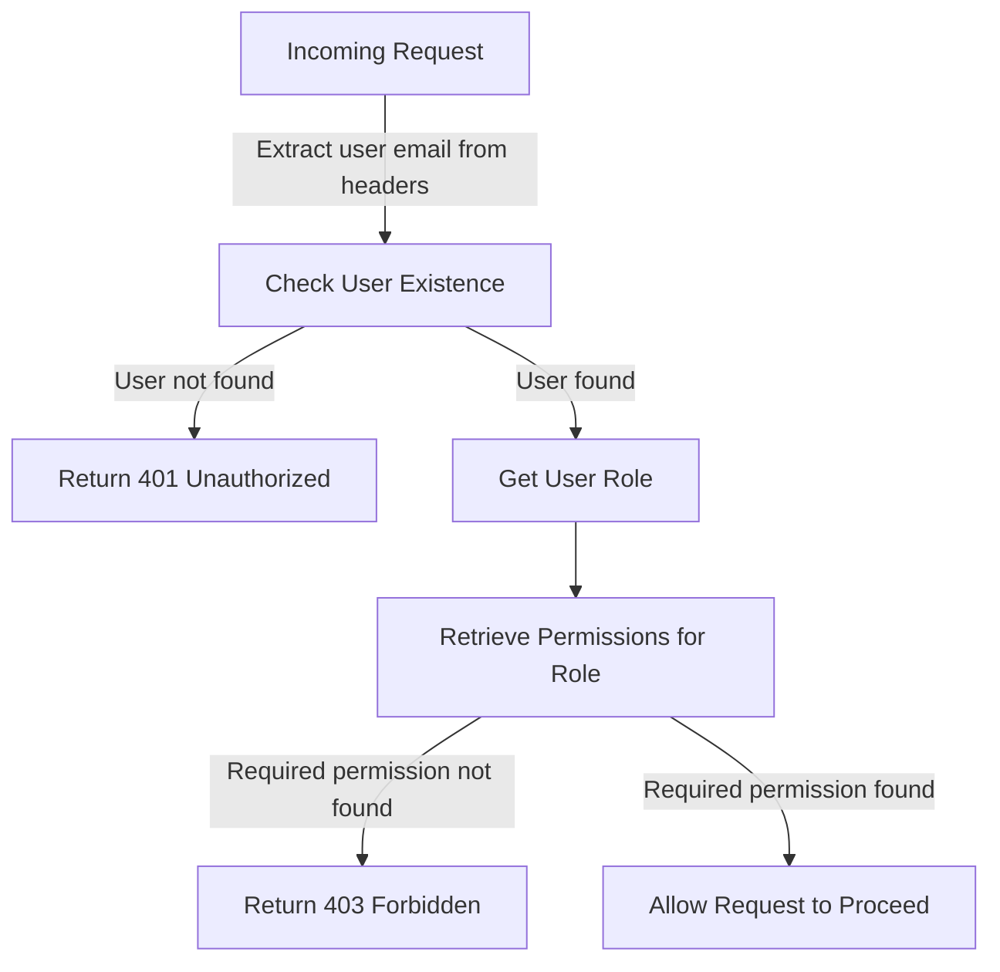

<details>
<summary>Relevant source files</summary>

The following file was used as context for generating this wiki page:

- [src/authMiddleware.js](https://github.com/agattani123/access-control-service/blob/main/src/authMiddleware.js)
</details>

# Authentication and Authorization

## Introduction

The provided source file `src/authMiddleware.js` contains a middleware function `checkPermission` that implements a simple role-based access control (RBAC) system for authenticating and authorizing user requests. This middleware is likely used in a larger application or service to enforce access control based on user roles and required permissions.

## Role-Based Access Control (RBAC)

The RBAC system in this project is based on the following key components:

1. **Users**: Represented by their email addresses, stored in the `db.users` object.
2. **Roles**: Each user is assigned a role, which is associated with a set of permissions.
3. **Permissions**: Defined permissions that grant access to specific resources or actions within the application.

The `checkPermission` middleware function is responsible for verifying the user's role and checking if the user has the required permission to access the requested resource or perform the desired action.

### Authentication Flow

The authentication flow implemented in the `checkPermission` middleware is as follows:



1. The user's email is extracted from the `x-user-email` header in the incoming request.
2. The middleware checks if the user exists in the `db.users` object.
   - If the user is not found, a 401 Unauthorized response is returned.
3. If the user exists, their role is retrieved from the `db.users` object.
4. The permissions associated with the user's role are retrieved from the `db.roles` object.
5. The middleware checks if the required permission (passed as an argument to `checkPermission`) is included in the user's permissions.
   - If the required permission is not found, a 403 Forbidden response is returned.
   - If the required permission is found, the request is allowed to proceed to the next middleware or route handler.

Sources: [src/authMiddleware.js:2-23]()

## Usage

The `checkPermission` function is a higher-order function that takes a `requiredPermission` string as an argument and returns a middleware function. This middleware function can be used in an Express.js application to protect routes or resources that require specific permissions.

Example usage:

```javascript
import express from 'express';
import { checkPermission } from './authMiddleware.js';

const app = express();

// Route that requires the 'view_users' permission
app.get('/users', checkPermission('view_users'), (req, res) => {
  // Route handler code to retrieve and return user data
});

// Route that requires the 'create_order' permission
app.post('/orders', checkPermission('create_order'), (req, res) => {
  // Route handler code to create a new order
});
```

In this example, the `checkPermission` middleware is used to protect the `/users` route, which requires the `view_users` permission, and the `/orders` route, which requires the `create_order` permission. If the authenticated user does not have the required permission, the middleware will return a 403 Forbidden response.

Sources: [src/authMiddleware.js:2-23]()

## Limitations and Potential Improvements

While the provided implementation offers a basic RBAC system, there are several limitations and potential improvements that could be considered:

1. **User Authentication**: The current implementation assumes that the user's email is already authenticated and present in the request headers. In a real-world scenario, an additional authentication mechanism (e.g., JSON Web Tokens, sessions) would be required to verify the user's identity before checking their permissions.

2. **Static Data Storage**: The user and role data are stored in-memory using static objects (`db.users` and `db.roles`). In a production environment, this data should be stored in a persistent database or other appropriate storage solution.

3. **Role Hierarchy and Inheritance**: The current implementation does not support role hierarchies or permission inheritance. For example, an "admin" role might inherit all permissions from a "manager" role, which in turn inherits permissions from a "user" role.

4. **Permission Granularity**: The current implementation treats permissions as simple strings. In more complex systems, permissions might need to be more granular, allowing for resource-level or action-level permissions (e.g., `users:read`, `users:create`, `orders:read`, `orders:update`).

5. **Error Handling and Logging**: The current implementation returns simple error messages as JSON responses. In a production environment, more robust error handling and logging mechanisms would be required.

6. **Scalability and Performance**: As the number of users, roles, and permissions grows, the current in-memory implementation may face scalability and performance challenges. Caching mechanisms or more efficient data structures might be necessary.

7. **Security Considerations**: The current implementation does not address potential security risks, such as preventing privilege escalation attacks or protecting against unauthorized access to sensitive data or functionality.

These limitations and potential improvements should be considered when integrating this RBAC system into a larger application or service.

Sources: [src/authMiddleware.js:2-23]()

## Conclusion

The `src/authMiddleware.js` file provides a basic implementation of a role-based access control (RBAC) system for authenticating and authorizing user requests based on their roles and associated permissions. While functional, this implementation has several limitations and potential areas for improvement, as discussed in the previous section. Integrating this RBAC system into a larger application or service would require addressing these limitations and considering additional security, scalability, and performance requirements.