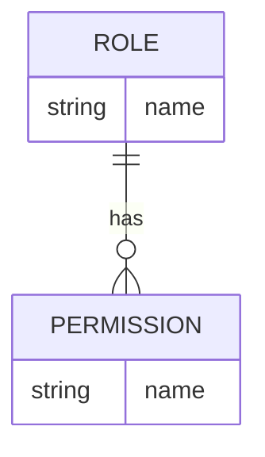
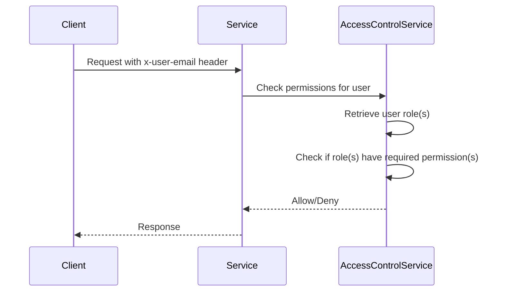

<details>
<summary>Relevant source files</summary>

The following files were used as context for generating this wiki page:

- [config/roles.json](https://github.com/agattani123/access-control-service/blob/main/config/roles.json)
- [docs/permissions.md](https://github.com/agattani123/access-control-service/blob/main/docs/permissions.md)

</details>

# Permission Management

## Introduction

The Permission Management system is a crucial component of the access-control-service project, responsible for enforcing role-based access control (RBAC) across various routes and services. It defines a set of predefined roles, each associated with specific permissions, and ensures that users can only access resources they are authorized for based on their assigned roles.

## Role-Based Access Control (RBAC)

The RBAC model implemented in this project follows a flat, non-hierarchical structure. Each role is explicitly mapped to a set of permissions, and users are assigned one or more roles. The permissions granted to a user are the union of all permissions associated with their assigned roles.

### Roles and Permissions

The project defines three default roles with their corresponding permissions:



Sources: [config/roles.json](https://github.com/agattani123/access-control-service/blob/main/config/roles.json)

| Role     | Permissions                                  |
|----------|-----------------------------------------------|
| admin    | view_users, create_role, view_permissions    |
| engineer | view_users, view_permissions                 |
| analyst  | view_users                                    |

Sources: [docs/permissions.md](https://github.com/agattani123/access-control-service/blob/main/docs/permissions.md)

## Permission Enforcement

The access-control-service enforces permissions on a per-route basis. Each route defines the required permission(s) for access, and the service checks if the user's assigned role(s) include those permissions at runtime.



Sources: [docs/permissions.md](https://github.com/agattani123/access-control-service/blob/main/docs/permissions.md)

For a request to be considered valid, it must:

1. Include the `x-user-email` header
2. Match a known user in the in-memory `db.users` map
3. Have a role that includes the required permission(s) for the requested route

Sources: [docs/permissions.md](https://github.com/agattani123/access-control-service/blob/main/docs/permissions.md)

## Role Management

### Adding a New Role

To add a new role, follow these steps:

1. Edit the `config/roles.json` file to define the new role and its associated permissions:

```json
{
  "support": ["view_users"]
}
```

2. Assign the new role to a user using the provided CLI tool:

```bash
node cli/manage.js assign-role support@company.com support
```

3. Ensure that consuming services request the appropriate permissions for the new role when making requests to the access-control-service.

Sources: [docs/permissions.md](https://github.com/agattani123/access-control-service/blob/main/docs/permissions.md)

## Implementation Details

### User-Role Mapping

The mapping between users and their assigned roles is stored in-memory in the `db.users` map. Any changes to the `roles.json` configuration file require a service restart to take effect.

Sources: [docs/permissions.md](https://github.com/agattani123/access-control-service/blob/main/docs/permissions.md)

## Future Enhancements

The following enhancements are planned for the Permission Management system:

- **Scoped Permissions**: Introduce a hierarchical permission structure to support scoped permissions (e.g., `project:view:marketing`).
- **SSO Integration**: Integrate with a Single Sign-On (SSO) provider to map user roles based on group claims.
- **Audit Logging**: Implement audit logging for role changes and access attempts to improve security and auditing capabilities.

Sources: [docs/permissions.md](https://github.com/agattani123/access-control-service/blob/main/docs/permissions.md)

## Conclusion

The Permission Management system in the access-control-service project provides a robust and flexible role-based access control mechanism. It defines a set of predefined roles with associated permissions, enforces permissions on a per-route basis, and allows for easy management of roles and user-role assignments. While currently flat and non-hierarchical, the system is designed to be extensible, with plans for future enhancements such as scoped permissions, SSO integration, and audit logging.