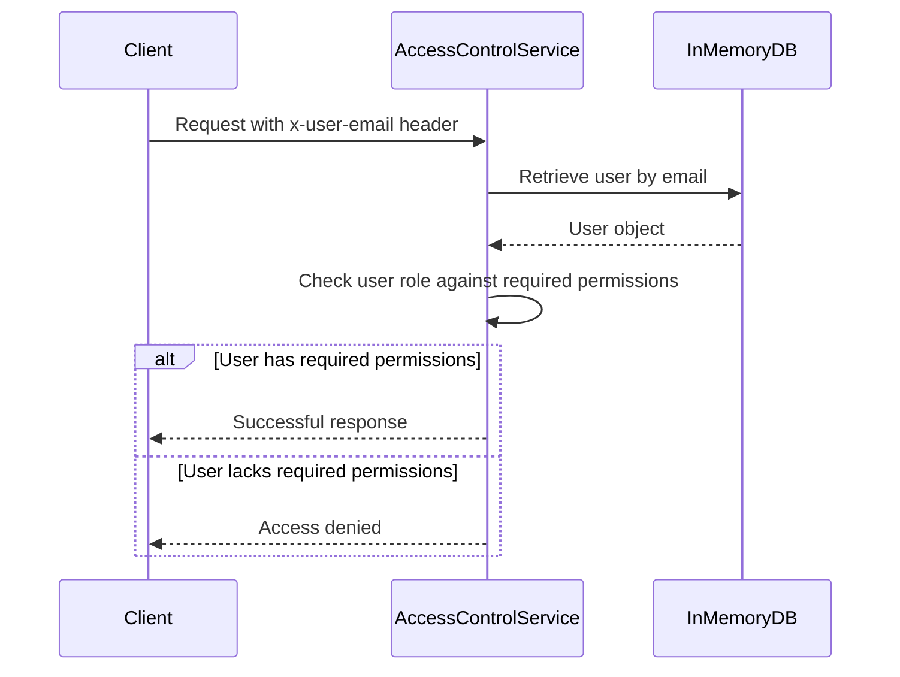

<details>
<summary>Relevant source files</summary>

The following files were used as context for generating this wiki page:

- [config/roles.json](https://github.com/agattani123/access-control-service/blob/main/config/roles.json)
- [src/models.js](https://github.com/agattani123/access-control-service/blob/main/src/models.js)
- [docs/permissions.md](https://github.com/agattani123/access-control-service/blob/main/docs/permissions.md)

</details>

# Permission Management

## Introduction

The Permission Management system is a crucial component of the access-control-service project, responsible for enforcing role-based access control (RBAC) across various routes and services within the application. It defines a set of predefined roles, each associated with specific permissions, and ensures that users are granted access only to the resources and functionalities they are authorized to access based on their assigned roles.

Sources: [docs/permissions.md](https://github.com/agattani123/access-control-service/blob/main/docs/permissions.md)

## Role Definition

The project defines a set of default roles, each with a predefined set of permissions. These roles are defined in the `config/roles.json` file, which serves as the central configuration for role-permission mappings.


Sources: [config/roles.json](https://github.com/agattani123/access-control-service/blob/main/config/roles.json), [docs/permissions.md](https://github.com/agattani123/access-control-service/blob/main/docs/permissions.md)

The default roles and their associated permissions are as follows:

| Role     | Permissions                                |
|----------|---------------------------------------------|
| admin    | view_users, create_role, view_permissions  |
| engineer | view_users, view_permissions               |
| analyst  | view_users                                 |

Sources: [config/roles.json](https://github.com/agattani123/access-control-service/blob/main/config/roles.json), [docs/permissions.md](https://github.com/agattani123/access-control-service/blob/main/docs/permissions.md)

## User Model

The `User` model is defined in the `src/models.js` file and consists of two properties: `email` and `role`.

```javascript
export const User = {
  email: 'string',
  role: 'string'
};
```

The `email` property serves as a unique identifier for the user, while the `role` property represents the user's assigned role, which determines their access privileges.

Sources: [src/models.js](https://github.com/agattani123/access-control-service/blob/main/src/models.js)

## Permission Enforcement

The permission enforcement mechanism is implemented at the route level. Each route defines the required permission(s) for access, and these permissions are checked at runtime against the user's assigned role.



For a request to be considered valid, it must:

1. Include the `x-user-email` header.
2. Match a known user in the in-memory `db.users` map.
3. Have a role that includes the required permission for the requested route.

Sources: [docs/permissions.md](https://github.com/agattani123/access-control-service/blob/main/docs/permissions.md)

## Adding a New Role

To add a new role to the system, follow these steps:

1. Edit the `config/roles.json` file to define the new role and its associated permissions.
   ```json
   {
     "support": ["view_users"]
   }
   ```
2. Assign the new role to a user using the provided CLI tool.
   ```bash
   node cli/manage.js assign-role support@company.com support
   ```
3. Ensure that consuming services request the appropriate permissions for the new role when accessing protected routes.

Sources: [docs/permissions.md](https://github.com/agattani123/access-control-service/blob/main/docs/permissions.md)

## Limitations and Future Enhancements

The current implementation of the Permission Management system has the following limitations:

- All permission checks are flat, without support for wildcarding or nesting.
- All user-role mappings are stored in-memory, which may not be suitable for large-scale deployments.
- Changes to the `roles.json` configuration file require a service restart to take effect.

To address these limitations and enhance the system's capabilities, the following future enhancements are proposed:

- Implement scoped permissions (e.g., `project:view:marketing`) to provide more granular access control.
- Integrate with a single sign-on (SSO) system to leverage group claims for role assignments.
- Introduce audit logging for role changes and access attempts to improve security and compliance.

Sources: [docs/permissions.md](https://github.com/agattani123/access-control-service/blob/main/docs/permissions.md)

## Conclusion

The Permission Management system is a critical component of the access-control-service project, responsible for enforcing role-based access control across various routes and services. It defines a set of predefined roles, each with specific permissions, and ensures that users are granted access only to the resources and functionalities they are authorized to access based on their assigned roles. While the current implementation has some limitations, the proposed future enhancements aim to address these limitations and enhance the system's capabilities, making it more robust and scalable for larger deployments.