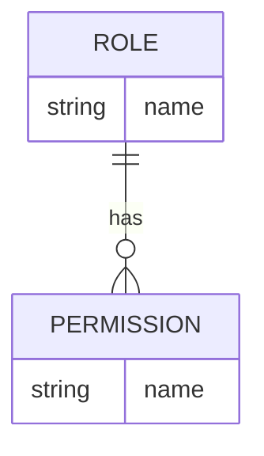
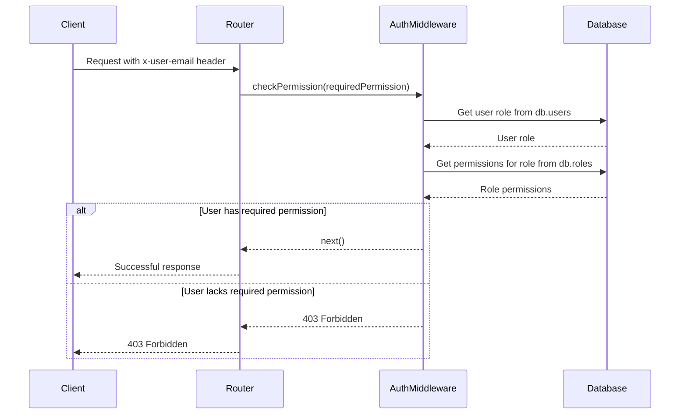
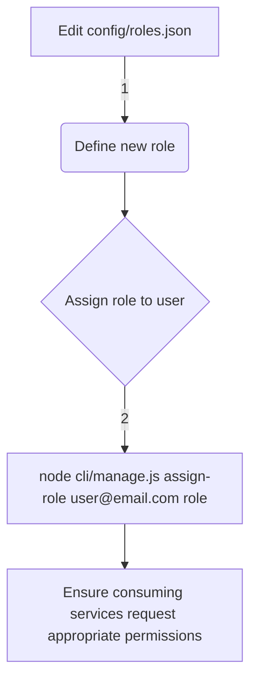

Relevant source files

The following files were used as context for generating this wiki page:

- [config/roles.json](https://github.com/agattani123/access-control-service/blob/main/config/roles.json)
- [src/authMiddleware.js](https://github.com/agattani123/access-control-service/blob/main/src/authMiddleware.js)
- [docs/permissions.md](https://github.com/agattani123/access-control-service/blob/main/docs/permissions.md)

# Permission Management

## Introduction

Permission Management is a crucial aspect of the access-control-service project, responsible for enforcing role-based access control (RBAC) across various routes and services. It ensures that users can only access resources and perform actions they are authorized for based on their assigned roles and associated permissions.

The Permission Management system is implemented using a combination of configuration files, middleware functions, and in-memory data structures. It defines a set of predefined roles with specific permissions, and provides mechanisms for checking permissions during runtime and assigning roles to users.

## Role and Permission Configuration

The project defines a set of default roles and their associated permissions in the `config/roles.json` file. This configuration file serves as the central source of truth for role-permission mappings.

Sources: [config/roles.json](https://github.com/agattani123/access-control-service/blob/main/config/roles.json), [docs/permissions.md:15-27](https://github.com/agattani123/access-control-service/blob/main/docs/permissions.md#L15-L27)

The default roles defined in the project are:

| Role     | Permissions                                  | Description                                    |
|----------|-----------------------------------------------|------------------------------------------------|
| admin    | view_users, create_role, view_permissions    | Full system access for platform and DevOps teams |
| engineer | view_users, view_permissions                 | Read-only access for observability and debugging |
| analyst  | view_users                                    | Basic read-only access for data/reporting use cases |

Sources: [docs/permissions.md:15-27](https://github.com/agattani123/access-control-service/blob/main/docs/permissions.md#L15-L27)

## Permission Enforcement Middleware

The `checkPermission` middleware function in `src/authMiddleware.js` is responsible for enforcing permissions on incoming requests. It checks if the user making the request has the required permission based on their assigned role.

Sources: [src/authMiddleware.js](https://github.com/agattani123/access-control-service/blob/main/src/authMiddleware.js)

The middleware follows these steps:

1. Extracts the `x-user-email` header from the incoming request.
2. Checks if the user exists in the `db.users` in-memory map.
3. Retrieves the user's assigned role from `db.users`.
4. Looks up the permissions associated with the user's role in the `db.roles` map.
5. If the required permission is present in the user's role permissions, the request is allowed to proceed.
6. If the required permission is not found, a 403 Forbidden response is sent.

Sources: [src/authMiddleware.js:3-17](https://github.com/agattani123/access-control-service/blob/main/src/authMiddleware.js#L3-L17)

## Role Assignment

The project documentation (`docs/permissions.md`) provides instructions for assigning a new role to a user:

Sources: [docs/permissions.md:31-38](https://github.com/agattani123/access-control-service/blob/main/docs/permissions.md#L31-L38)

1. Edit the `config/roles.json` file to define a new role and its associated permissions.
2. Use the `cli/manage.js` script to assign the new role to a user's email address.
3. Ensure that any consuming services or clients request the appropriate permissions when making requests to the access-control-service.

## Limitations and Future Enhancements

The current implementation of Permission Management has the following limitations:

- All permissions are flat, with no support for wildcarding or nested permissions.
- User-role mappings are stored in-memory, which means they are lost upon service restart.
- Changes to the `roles.json` configuration file require a service restart to take effect.

Sources: [docs/permissions.md:41-44](https://github.com/agattani123/access-control-service/blob/main/docs/permissions.md#L41-L44)

The project documentation outlines potential future enhancements to the Permission Management system:

- Support for scoped permissions (e.g., `project:view:marketing`).
- Integration with single sign-on (SSO) group claims for role assignment.
- Audit logging for role changes and access attempts.

Sources: [docs/permissions.md:47-50](https://github.com/agattani123/access-control-service/blob/main/docs/permissions.md#L47-L50)

## Conclusion

The Permission Management system in the access-control-service project provides a robust and configurable way to enforce role-based access control across various routes and services. It defines a set of default roles with specific permissions, and provides mechanisms for checking permissions during runtime and assigning roles to users. While the current implementation has some limitations, the project documentation outlines potential future enhancements to improve the system's functionality and scalability.