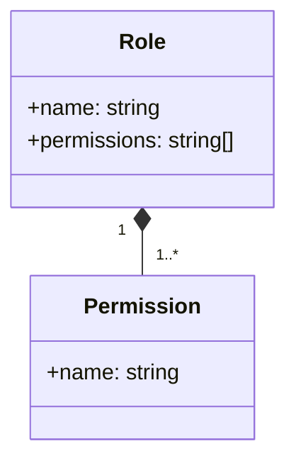
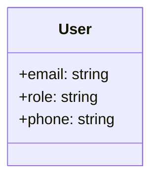
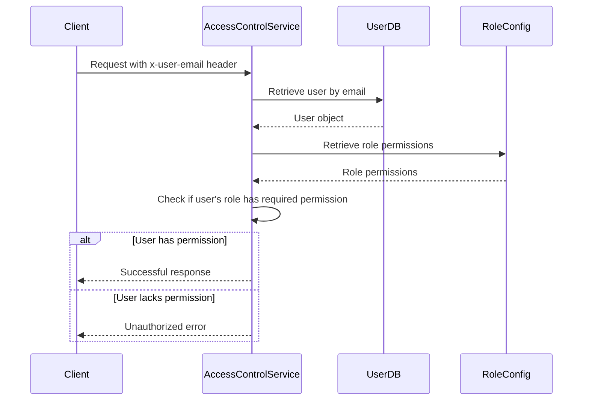
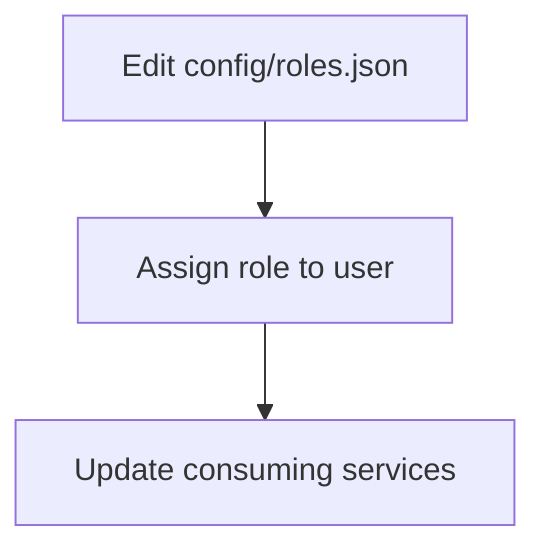

<details>
<summary>Relevant source files</summary>

The following files were used as context for generating this wiki page:

- [config/roles.json](https://github.com/agattani123/access-control-service/blob/main/config/roles.json)
- [src/models.js](https://github.com/agattani123/access-control-service/blob/main/src/models.js)
- [docs/permissions.md](https://github.com/agattani123/access-control-service/blob/main/docs/permissions.md)

</details>

# Permission Management

## Introduction

The Permission Management system is a crucial component of the access-control-service project, responsible for enforcing role-based access control (RBAC) across various routes and services within the application. It defines a set of predefined roles, each associated with specific permissions, and ensures that users are granted access to resources based on their assigned roles.

Sources: [docs/permissions.md](https://github.com/agattani123/access-control-service/blob/main/docs/permissions.md)

## Role Definition

The project defines a set of default roles, each with a predefined set of permissions. These roles are defined in the `config/roles.json` file, which maps role names to an array of permitted actions.



Sources: [config/roles.json](https://github.com/agattani123/access-control-service/blob/main/config/roles.json), [docs/permissions.md:11-18](https://github.com/agattani123/access-control-service/blob/main/docs/permissions.md#L11-L18)

The default roles and their associated permissions are as follows:

| Role     | Permissions                                |
|----------|---------------------------------------------|
| admin    | view_users, create_role, view_permissions   |
| engineer | view_users, view_permissions                |
| analyst  | view_users                                  |

Sources: [docs/permissions.md:11-18](https://github.com/agattani123/access-control-service/blob/main/docs/permissions.md#L11-L18)

## User Model

The `User` model represents a user within the system and is defined in the `src/models.js` file. It consists of the following fields:

| Field  | Type     | Description                                  |
|--------|----------|----------------------------------------------|
| email  | string   | The user's email address (unique identifier) |
| role   | string   | The user's assigned role                     |
| phone  | string   | The user's phone number                      |



Sources: [src/models.js:1-5](https://github.com/agattani123/access-control-service/blob/main/src/models.js#L1-L5)

## Permission Enforcement

The access-control-service enforces permissions on a per-route basis. Each route defines the required permission(s) to access it, and these permissions are checked at runtime against the user's assigned role.



Sources: [docs/permissions.md:5-10](https://github.com/agattani123/access-control-service/blob/main/docs/permissions.md#L5-L10)

For a request to be considered valid, it must:

1. Include the `x-user-email` header.
2. Match a known user in the in-memory `db.users` map.
3. Have a role that includes the required permission for the requested route.

Sources: [docs/permissions.md:5-10](https://github.com/agattani123/access-control-service/blob/main/docs/permissions.md#L5-L10)

## Role Management

### Adding a New Role

To add a new role to the system, follow these steps:

1. Edit the `config/roles.json` file to define the new role and its associated permissions.
2. Assign the new role to a user using the `cli/manage.js` script.
3. Ensure that consuming services request the appropriate permissions for the new role.



For example, to add a new "support" role with the "view_users" permission:

1. Edit `config/roles.json`:
   ```json
   {
     "support": ["view_users"]
   }
   ```
2. Assign the role to a user:
   ```bash
   node cli/manage.js assign-role support@company.com support
   ```
3. Update consuming services to request the "view_users" permission for the "support" role.

Sources: [docs/permissions.md:22-29](https://github.com/agattani123/access-control-service/blob/main/docs/permissions.md#L22-L29)

### Limitations and Future Enhancements

The current implementation of the Permission Management system has the following limitations:

- All permission checks are flat; no wildcarding or nesting is supported.
- All user-role mappings are stored in-memory, requiring a service restart for changes to take effect.

Potential future enhancements include:

- Scoped permissions (e.g., `project:view:marketing`).
- Integration with single sign-on (SSO) group claims.
- Audit logging for role changes and access attempts.

Sources: [docs/permissions.md:32-37](https://github.com/agattani123/access-control-service/blob/main/docs/permissions.md#L32-L37)

## Conclusion

The Permission Management system plays a crucial role in the access-control-service project by enforcing role-based access control across various routes and services. It defines a set of predefined roles with associated permissions, manages user-role assignments, and ensures that users are granted access to resources based on their assigned roles. While the current implementation is relatively simple, the system provides a solid foundation for future enhancements, such as scoped permissions, SSO integration, and audit logging.