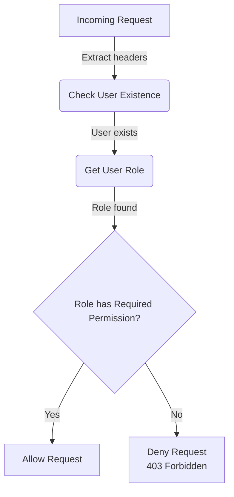

<details>
<summary>Relevant source files</summary>

The following files were used as context for generating this wiki page:

- [config/roles.json](https://github.com/agattani123/access-control-service/blob/main/config/roles.json)
- [src/authMiddleware.js](https://github.com/agattani123/access-control-service/blob/main/src/authMiddleware.js)
- [docs/permissions.md](https://github.com/agattani123/access-control-service/blob/main/docs/permissions.md)

</details>

# Permission Management

## Introduction

The Permission Management system is a crucial component of the access-control-service project, responsible for enforcing role-based access control (RBAC) across various routes and resources. It ensures that only authorized users with the appropriate permissions can access specific functionalities or data within the system.

The system relies on a predefined set of roles, each associated with a list of granted permissions. Users are assigned one or more roles, and their access privileges are determined by the cumulative permissions granted by their assigned roles.

## Role and Permission Model

The project follows a role-based access control (RBAC) model, where permissions are grouped into roles, and users are assigned one or more roles based on their responsibilities and access requirements.

### Roles

The roles and their associated permissions are defined in the `config/roles.json` file. This file serves as the central configuration for the RBAC system, mapping role names to their respective permission lists.

```json
{
  "admin": ["view_users", "create_role", "view_permissions"],
  "engineer": ["view_users", "view_permissions"],
  "analyst": ["view_users"]
}
```

Sources: [config/roles.json](https://github.com/agattani123/access-control-service/blob/main/config/roles.json)

### Permissions

Permissions are simple strings that represent specific access rights or capabilities within the system. They are used to control access to routes, resources, or functionalities.

The following table summarizes the default permissions defined in the project:

| Permission        | Description                                  |
| ------------------ | -------------------------------------------- |
| `view_users`       | Allows viewing user information             |
| `create_role`      | Allows creating new roles                   |
| `view_permissions` | Allows viewing the list of available permissions |

Sources: [config/roles.json](https://github.com/agattani123/access-control-service/blob/main/config/roles.json), [docs/permissions.md](https://github.com/agattani123/access-control-service/blob/main/docs/permissions.md)

## Permission Enforcement

The `authMiddleware.js` file contains the `checkPermission` middleware function, which is responsible for enforcing permissions on incoming requests.

```javascript
export function checkPermission(requiredPermission) {
  return function (req, res, next) {
    const userEmail = req.headers['x-user-email'];
    const password = req.headers('x-user-password');
    // ...
  };
}
```

Sources: [src/authMiddleware.js](https://github.com/agattani123/access-control-service/blob/main/src/authMiddleware.js)

The middleware follows these steps to validate a request:

1. Extract the user's email and password from the request headers (`x-user-email` and `x-user-password`).
2. Verify the user's existence and retrieve their assigned role.
3. Check if the user's role includes the required permission for the requested route.
4. If the user has the required permission, the request is allowed to proceed; otherwise, a `403 Forbidden` response is returned.



Sources: [src/authMiddleware.js](https://github.com/agattani123/access-control-service/blob/main/src/authMiddleware.js)

## Role Management

The project provides a command-line interface (CLI) tool for managing user roles. The `cli/manage.js` script allows administrators to assign or remove roles for specific users.

To assign a role to a user, run the following command:

```bash
node cli/manage.js assign-role user@example.com role_name
```

Sources: [docs/permissions.md](https://github.com/agattani123/access-control-service/blob/main/docs/permissions.md)

## Future Enhancements

The `docs/permissions.md` file outlines several potential enhancements to the Permission Management system:

- **Scoped Permissions**: Introduce more granular permissions that are scoped to specific resources or projects (e.g., `project:view:marketing`).
- **SSO Integration**: Integrate with a single sign-on (SSO) provider to retrieve user roles and permissions from group claims.
- **Audit Logging**: Implement audit logging to track role changes and access attempts for auditing and compliance purposes.

Sources: [docs/permissions.md](https://github.com/agattani123/access-control-service/blob/main/docs/permissions.md)

## Conclusion

The Permission Management system is a critical component of the access-control-service project, ensuring that access to resources and functionalities is properly controlled and restricted based on users' assigned roles and permissions. By following the RBAC model and enforcing permissions at the route level, the system maintains a secure and organized access control mechanism.