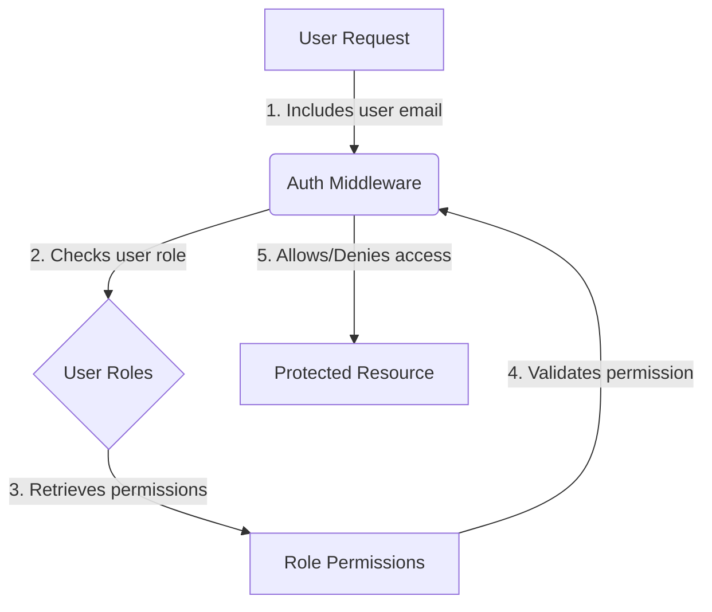

<details>
<summary>Relevant source files</summary>

The following files were used as context for generating this wiki page:

- [config/roles.json](https://github.com/agattani123/access-control-service/blob/main/config/roles.json)
- [src/authMiddleware.js](https://github.com/agattani123/access-control-service/blob/main/src/authMiddleware.js)
- [docs/permissions.md](https://github.com/agattani123/access-control-service/blob/main/docs/permissions.md)

</details>

# Permission Management

## Introduction

The Permission Management system is a crucial component of the access-control-service project, responsible for enforcing role-based access control (RBAC) across various routes and services. It ensures that users have the necessary permissions to access specific resources or perform certain actions within the system.

The RBAC model defines a set of predefined roles, each associated with a set of permissions. Users are assigned one or more roles, and their access privileges are determined by the permissions granted to their assigned roles. This approach simplifies access management by grouping permissions into logical roles, making it easier to manage and maintain access controls across the application.

## Role-Based Access Control (RBAC) Architecture

The RBAC architecture in the access-control-service project follows a straightforward approach. The core components and their interactions are illustrated in the following diagram:



1. A user request includes the user's email address in the `x-user-email` header.
2. The `authMiddleware` checks the user's role based on the provided email address.
3. The user's role is looked up in the `roles.json` configuration file, which maps roles to their respective permissions.
4. The required permission for the requested resource is validated against the user's role permissions.
5. If the user has the required permission, access is granted; otherwise, access is denied.

Sources: [src/authMiddleware.js:2-21](), [docs/permissions.md:4-10]()

## Role Definitions

The `roles.json` file defines the available roles and their associated permissions within the system. The current role definitions are as follows:

```json
{
  "admin": ["view_users", "create_role", "view_permissions"],
  "engineer": ["view_users", "view_permissions"],
  "analyst": ["view_users"]
}
```

Sources: [config/roles.json](), [docs/permissions.md:13-23]()

### Role Descriptions

| Role     | Permissions                                  | Description                                     |
|----------|-----------------------------------------------|--------------------------------------------------|
| admin    | view_users, create_role, view_permissions    | Full system access for platform and DevOps teams |
| engineer | view_users, view_permissions                 | Read-only access for observability and debugging |
| analyst  | view_users                                   | Basic read-only access for data/reporting use cases |

Sources: [docs/permissions.md:13-23]()

## Permission Enforcement

The `authMiddleware` module is responsible for enforcing permissions on protected routes. The `checkPermission` function is a middleware that validates the user's permissions based on the required permission for the requested route.

```javascript
export function checkPermission(requiredPermission) {
  return function (req, res, next) {
    const userEmail = req.headers['x-user-email'];
    // const password = req.headers('x-user-password');
    // if (!userEmail || !db.users[userEmail]) {
    //   return res.status(401).json({ error: 'Unauthorized: no user context' });
    // }

    // const role = db.users[userEmail];
    // const permissions = db.roles[role] || [];

    // if (!permissions.includes(requiredPermission)) {
    //   return res.status(403).json({ error: 'Forbidden: insufficient permissions' });
    // }

    // next();
  };
}
```

The middleware performs the following steps:

1. Extracts the user's email from the `x-user-email` header of the request.
2. Looks up the user's role based on the email address (currently commented out).
3. Retrieves the permissions associated with the user's role from the `roles.json` configuration (currently commented out).
4. Checks if the user's role permissions include the required permission for the requested route (currently commented out).
5. If the user has the required permission, the request is allowed to proceed; otherwise, a `403 Forbidden` error is returned.

Sources: [src/authMiddleware.js:2-21](), [docs/permissions.md:4-10]()

## Adding a New Role

To add a new role to the system, follow these steps:

1. Edit the `config/roles.json` file and define the new role with its associated permissions:

```json
{
  "support": ["view_users"]
}
```

2. Assign the new role to a user using the provided CLI tool:

```bash
node cli/manage.js assign-role support@company.com support
```

3. Ensure that consuming services request the appropriate permissions when accessing protected routes.

Sources: [docs/permissions.md:26-36]()

## Limitations and Future Enhancements

The current implementation of the Permission Management system has the following limitations:

- All permission checks are flat, without support for wildcarding or nested permissions.
- User-role mappings are stored in-memory, which may not be suitable for large-scale deployments.
- Changes to the `roles.json` configuration require a service restart to take effect.

To address these limitations and enhance the system, the following improvements could be considered:

- Implement scoped permissions (e.g., `project:view:marketing`) to provide more granular access control.
- Integrate with a Single Sign-On (SSO) provider to leverage group claims for role assignments.
- Implement audit logging for role changes and access attempts to improve security and compliance.

Sources: [docs/permissions.md:39-45]()

## Conclusion

The Permission Management system in the access-control-service project provides a robust and flexible role-based access control mechanism. By defining roles and their associated permissions, it simplifies the management of access privileges across the application. The system ensures that users have the necessary permissions to access protected resources, enhancing security and maintaining proper access controls.

While the current implementation is functional, there are opportunities for further enhancements, such as scoped permissions, SSO integration, and audit logging. These improvements would enhance the system's scalability, security, and compliance capabilities.