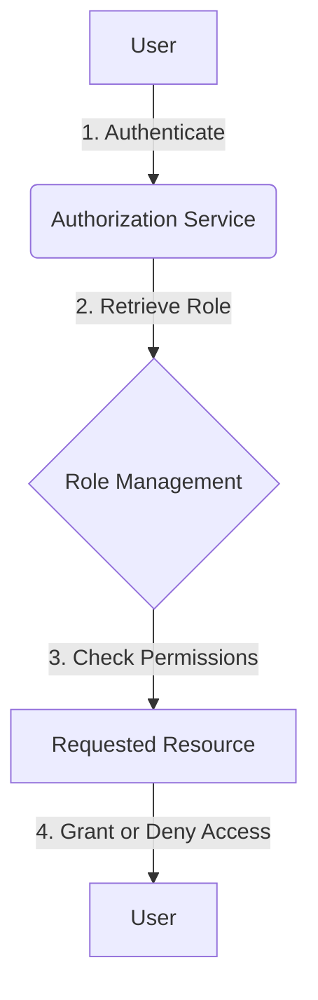

<details>
<summary>Relevant source files</summary>

The following files were used as context for generating this wiki page:

- [config/roles.json](https://github.com/agattani123/access-control-service/blob/main/config/roles.json)
- [src/models.js](https://github.com/agattani123/access-control-service/blob/main/src/models.js)
</details>

# Role Management

## Introduction

The Role Management system within this project is responsible for defining and managing user roles and their associated permissions. It provides a way to control access to various features or functionalities based on a user's assigned role. This system ensures proper authorization and helps maintain a secure and organized access control mechanism.

Sources: [config/roles.json](), [src/models.js]()

## Role Definition

Roles are defined in the `config/roles.json` file, where each role is associated with a list of permissions. The structure of this file is a JSON object, with the role name as the key and an array of permission strings as the value.

```json
{
  "admin": ["view_users", "create_role", "view_permissions"],
  "engineer": ["view_users", "view_permissions"],
  "analyst": ["view_users"]
}
```

This configuration defines three roles: `admin`, `engineer`, and `analyst`. The `admin` role has permissions to view users, create roles, and view permissions. The `engineer` role can view users and permissions, while the `analyst` role can only view users.

Sources: [config/roles.json]()

## Data Models

The project defines two main data models related to role management: `User` and `Role`.

### User Model

The `User` model represents a user in the system and has the following properties:

```javascript
export const User = {
  email: 'string',
  role: 'string',
  phone: 'string'
};
```

- `email`: A string representing the user's email address.
- `role`: A string representing the user's assigned role.
- `phone`: A string representing the user's phone number.

Sources: [src/models.js:1-5]()

### Role Model

The `Role` model represents a role in the system and has the following properties:

```javascript
export const Role = {
  name: 'string',
  email: 'string',
  permissions: ['string']
};
```

- `name`: A string representing the name of the role.
- `email`: A string representing the email associated with the role (potentially for administrative purposes).
- `permissions`: An array of strings representing the permissions granted to this role.

Sources: [src/models.js:7-11]()

## Role Management Flow

The following diagram illustrates the high-level flow of role management within the system:



1. A user authenticates with the system, typically through an Authentication Service.
2. The Authorization Service retrieves the user's assigned role from the Role Management system.
3. The Role Management system checks the permissions associated with the user's role against the requested resource.
4. Based on the permissions, access to the requested resource is either granted or denied, and the result is returned to the user.

Sources: [config/roles.json](), [src/models.js]()

## Role-Based Access Control (RBAC)

This project implements a Role-Based Access Control (RBAC) model, where permissions are assigned to roles, and users are assigned specific roles. This approach simplifies the management of permissions by grouping them into roles and assigning roles to users, rather than managing individual permissions for each user.

The RBAC model typically involves the following components:

- **Roles**: Predefined sets of permissions that define the level of access and operations allowed for a particular job function or responsibility.
- **Permissions**: Specific actions or operations that can be performed within the system, such as viewing users, creating roles, or accessing certain resources.
- **Users**: Individuals or entities that are assigned one or more roles based on their responsibilities and access requirements.

By associating permissions with roles and assigning roles to users, the RBAC model provides a flexible and scalable way to manage access control within the system.

Sources: [config/roles.json](), [src/models.js]()

## Sequence Diagram: User Access Request

The following sequence diagram illustrates the typical flow of a user requesting access to a resource and the role-based access control process:

```mermaid
sequenceDiagram
    participant User
    participant AuthService
    participant RoleManagement
    participant ResourceService

    User->>AuthService: Authenticate
    AuthService-->>User: Authentication Token
    User->>ResourceService: Request Resource Access
    ResourceService->>RoleManagement: Get User Role
    RoleManagement-->>ResourceService: User Role
    ResourceService->>RoleManagement: Check Permissions
    RoleManagement-->>ResourceService: Permissions
    opt Has Permission
        ResourceService-->>User: Grant Access
    else No Permission
        ResourceService-->>User: Deny Access
    end
```

1. The user authenticates with the Authentication Service and receives an authentication token.
2. The user requests access to a resource from the Resource Service.
3. The Resource Service retrieves the user's role from the Role Management system.
4. The Role Management system provides the user's role to the Resource Service.
5. The Resource Service checks the permissions associated with the user's role by querying the Role Management system.
6. The Role Management system returns the permissions for the user's role.
7. If the user has the required permission, the Resource Service grants access to the requested resource. Otherwise, access is denied.

This sequence illustrates how the Role Management system is integrated with other components to facilitate role-based access control and ensure proper authorization for user requests.

Sources: [config/roles.json](), [src/models.js]()

## Summary

The Role Management system in this project provides a robust and flexible way to manage user roles and their associated permissions. By defining roles and their permissions in a centralized configuration file (`config/roles.json`), and associating users with specific roles, the system can effectively control access to various resources and functionalities based on the user's assigned role. This approach follows the Role-Based Access Control (RBAC) model, which simplifies the management of permissions and enhances the overall security and organization of the access control mechanism.

Sources: [config/roles.json](), [src/models.js]()