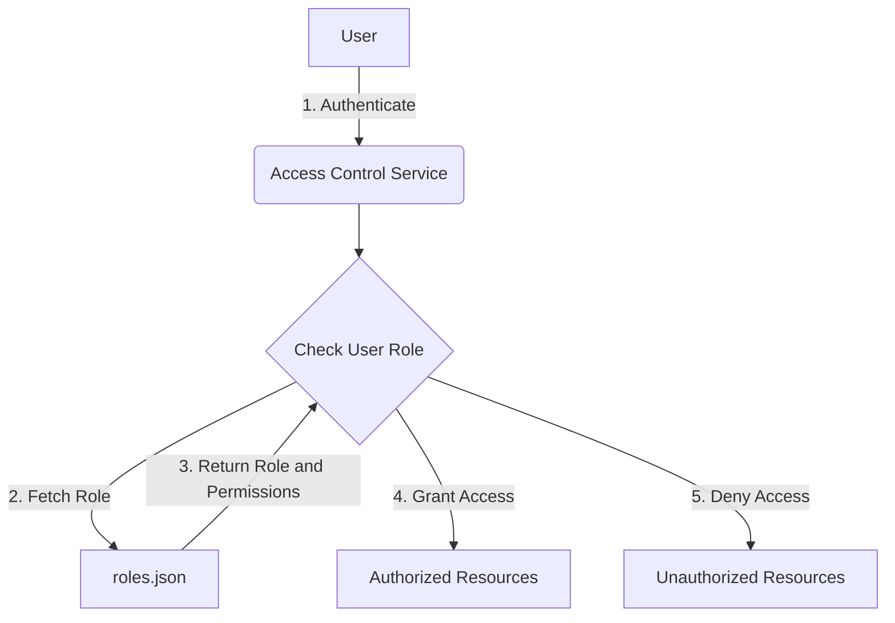
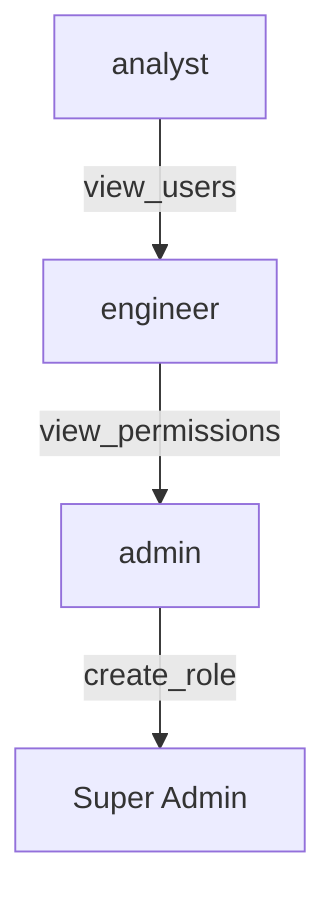

<details>
<summary>Relevant source files</summary>

The following files were used as context for generating this wiki page:

- [config/roles.json](https://github.com/agattani123/access-control-service/blob/main/config/roles.json)
- [src/models.js](https://github.com/agattani123/access-control-service/blob/main/src/models.js)
</details>

# Role Management

## Introduction

The Role Management system is a core component of the access control service, responsible for defining and managing user roles and their associated permissions within the application. It provides a structured way to grant or restrict access to various features and resources based on a user's assigned role. This system ensures proper separation of concerns and adheres to the principle of least privilege, allowing users to perform only the actions necessary for their respective roles.

## Role Definition

The roles and their corresponding permissions are defined in the `config/roles.json` file. This configuration file serves as the central source of truth for role management within the application.

```json
{
  "admin": ["view_users", "create_role", "view_permissions"],
  "engineer": ["view_users", "view_permissions"],
  "analyst": ["view_users"]
}
```

Each key in the JSON object represents a distinct role, and its value is an array of strings representing the permissions granted to that role.

Sources: [config/roles.json](https://github.com/agattani123/access-control-service/blob/main/config/roles.json)

## Data Models

The `src/models.js` file defines the data models for users and roles within the application.

### User Model

```javascript
export const User = {
  email: 'string',
  role: 'string'
};
```

The `User` model has two properties:

- `email`: A string representing the user's email address.
- `role`: A string representing the user's assigned role, which corresponds to the keys defined in the `roles.json` configuration file.

Sources: [src/models.js:1-4](https://github.com/agattani123/access-control-service/blob/main/src/models.js#L1-L4)

### Role Model

```javascript
export const Role = {
  name: 'string',
  permissions: ['string']
};
```

The `Role` model has two properties:

- `name`: A string representing the name of the role, which corresponds to the keys defined in the `roles.json` configuration file.
- `permissions`: An array of strings representing the permissions granted to the role, which corresponds to the values defined in the `roles.json` configuration file.

Sources: [src/models.js:6-9](https://github.com/agattani123/access-control-service/blob/main/src/models.js#L6-L9)

## Role Management Flow

The following diagram illustrates the high-level flow of role management within the application:



1. A user authenticates with the Access Control Service.
2. The service checks the user's assigned role.
3. The service fetches the role and its associated permissions from the `roles.json` configuration file.
4. Based on the user's role and permissions, the service grants access to authorized resources.
5. The service denies access to unauthorized resources for the user's role.

Sources: [config/roles.json](https://github.com/agattani123/access-control-service/blob/main/config/roles.json), [src/models.js](https://github.com/agattani123/access-control-service/blob/main/src/models.js)

## Role Hierarchy

The roles defined in the `roles.json` file exhibit a hierarchical structure, where higher-level roles inherit permissions from lower-level roles. The following diagram illustrates the role hierarchy and the cumulative permissions for each role:



- The `analyst` role has the `view_users` permission.
- The `engineer` role inherits the `view_users` permission from the `analyst` role and additionally has the `view_permissions` permission.
- The `admin` role inherits the `view_users` and `view_permissions` permissions from the `engineer` role and additionally has the `create_role` permission.
- A hypothetical `Super Admin` role (not defined in the provided files) would inherit all permissions from the `admin` role.

Sources: [config/roles.json](https://github.com/agattani123/access-control-service/blob/main/config/roles.json)

## Role Management Summary

The Role Management system in the access control service provides a structured way to define and manage user roles and their associated permissions. It ensures proper access control and adheres to the principle of least privilege, granting users only the necessary permissions for their respective roles. The system is defined and configured in the `roles.json` file, which serves as the central source of truth for role definitions and permissions. The `User` and `Role` models in the `models.js` file represent the data structures used to store user and role information within the application.