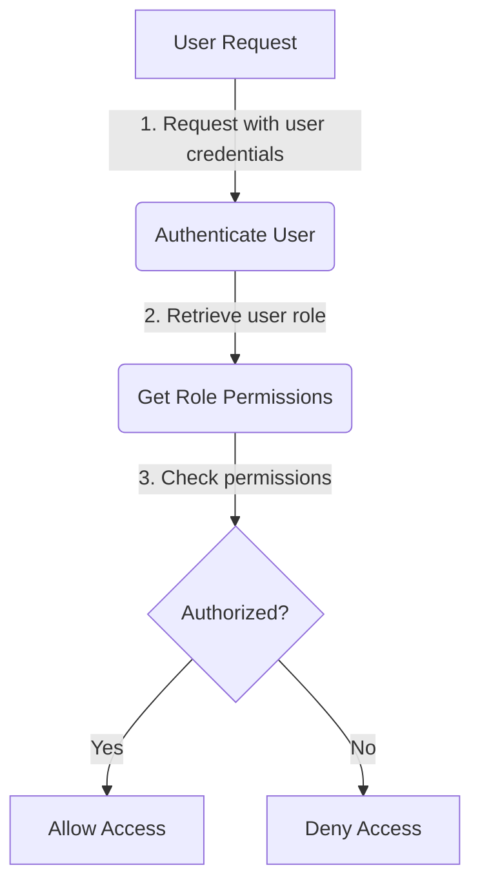

<details>
<summary>Relevant source files</summary>

The following files were used as context for generating this wiki page:

- [config/roles.json](https://github.com/agattani123/access-control-service/blob/main/config/roles.json)
- [src/models.js](https://github.com/agattani123/access-control-service/blob/main/src/models.js)
</details>

# Role Management

## Introduction

The Role Management system within this project provides a way to define and manage user roles and their associated permissions. It allows for the creation of roles with specific sets of permissions, and the assignment of these roles to individual users. This system is crucial for implementing access control and ensuring that users have the appropriate level of access to various features or resources within the application.

Sources: [config/roles.json](), [src/models.js]()

## Role Definition

Roles are defined in the `config/roles.json` file, where each role is represented as a key-value pair. The key represents the role name, and the value is an array of permission strings.

```json
{
  "admin": ["view_users", "create_role", "view_permissions"],
  "engineer": ["view_users", "view_permissions"],
  "analyst": ["view_users"]
}
```

This configuration defines three roles: `admin`, `engineer`, and `analyst`. The `admin` role has permissions to view users, create roles, and view permissions. The `engineer` role can view users and permissions, while the `analyst` role can only view users.

Sources: [config/roles.json]()

## Data Models

The project defines two data models related to role management: `User` and `Role`.

### User Model

```javascript
export const User = {
  email: 'string',
  role: 'string',
  phone: 'string'
};
```

The `User` model represents a user in the system and has the following fields:

| Field | Type     | Description                |
|-------|----------|----------------------------|
| email | `string` | The user's email address   |
| role  | `string` | The name of the user's role|
| phone | `string` | The user's phone number    |

Sources: [src/models.js:1-4]()

### Role Model

```javascript
export const Role = {
  name: 'string',
  email: 'string',
  permissions: ['string']
};
```

The `Role` model represents a role in the system and has the following fields:

| Field       | Type       | Description                                  |
|-------------|------------|----------------------------------------------|
| name        | `string`   | The name of the role                        |
| email       | `string`   | The email associated with the role          |
| permissions | `string[]` | An array of permission strings for the role |

Sources: [src/models.js:6-9]()

## Role Assignment

Based on the provided source files, it is not clear how roles are assigned to users or how the role-based access control is implemented. However, the `User` model includes a `role` field, suggesting that each user is associated with a specific role.

## Role-based Access Control Flow

The following diagram illustrates a hypothetical flow for role-based access control in the system:



1. A user sends a request to the system with their credentials.
2. The system authenticates the user and retrieves their associated role.
3. Based on the user's role, the system retrieves the corresponding permissions from the `Role` model or configuration.
4. The system checks if the user's role has the required permissions for the requested operation.
5. If the user has the necessary permissions, access is granted. Otherwise, access is denied.

Note that this is a hypothetical flow based on the provided information, and the actual implementation may differ.

Sources: [config/roles.json](), [src/models.js]()

## Potential Improvements

Based on the provided source files, the following potential improvements could be considered for the Role Management system:

- **Role Hierarchy**: Implement a role hierarchy or inheritance mechanism to allow roles to inherit permissions from other roles, reducing duplication and simplifying permission management.
- **Dynamic Permission Assignment**: Instead of hardcoding permissions in the `config/roles.json` file, consider a more dynamic approach where permissions can be assigned or modified at runtime, potentially through an administrative interface or API.
- **Permission Granularity**: Explore the possibility of introducing more granular permissions beyond the current `view_users`, `create_role`, and `view_permissions`. This could provide finer-grained access control based on specific application features or resources.
- **Role Assignment Process**: Implement a clear process or mechanism for assigning roles to users, either through an administrative interface, user self-service, or programmatic API.
- **Role Auditing and Logging**: Consider implementing auditing and logging mechanisms to track changes to roles, permissions, and user role assignments for security and compliance purposes.

These potential improvements are based on the limited information provided in the source files and may require further analysis and design considerations based on the project's specific requirements and constraints.

Sources: [config/roles.json](), [src/models.js]()

## Conclusion

The Role Management system in this project provides a basic framework for defining roles, associating permissions with those roles, and assigning roles to users. While the provided source files offer a glimpse into the system's structure, there are opportunities for enhancement and expansion to meet more complex access control requirements. Implementing role hierarchies, dynamic permission assignment, granular permissions, and robust role assignment processes could significantly improve the system's flexibility and maintainability.