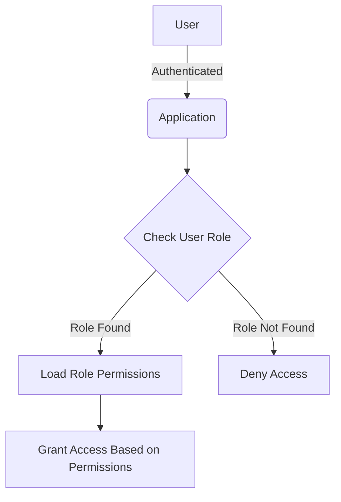
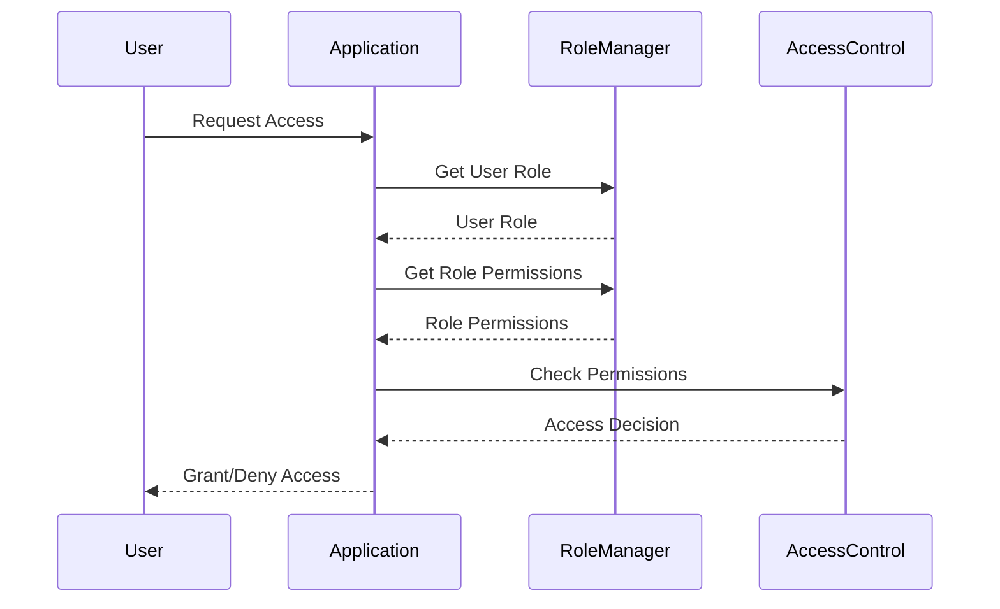

<details>
<summary>Relevant source files</summary>

The following files were used as context for generating this wiki page:

- [src/models.js](https://github.com/agattani123/access-control-service/blob/main/src/models.js)
- [config/roles.json](https://github.com/agattani123/access-control-service/blob/main/config/roles.json)

</details>

# Role Management

## Introduction

The Role Management system within this project provides a way to define and manage user roles and their associated permissions. It allows for the creation of roles with specific sets of permissions, which can then be assigned to individual users. This system is crucial for implementing access control and ensuring that users have the appropriate level of access to various features or resources within the application.

Sources: [src/models.js](), [config/roles.json]()

## Data Models

### User Model

The `User` model represents an individual user within the system. It has the following properties:

```javascript
export const User = {
  email: 'string',
  role: 'string',
  phone: 'string'
};
```

- `email`: A string representing the user's email address.
- `role`: A string representing the user's assigned role.
- `phone`: A string representing the user's phone number.

Sources: [src/models.js:1-5]()

### Role Model

The `Role` model defines a role within the system and its associated permissions. It has the following properties:

```javascript
export const Role = {
  name: 'string',
  email: 'string',
  permissions: ['string']
};
```

- `name`: A string representing the name of the role.
- `email`: A string representing the email associated with the role (potentially for administrative purposes).
- `permissions`: An array of strings representing the permissions granted to this role.

Sources: [src/models.js:8-12]()

## Role Configuration

The roles and their associated permissions are defined in the `config/roles.json` file. Here's an example of the structure:

```json
{
  "admin": ["view_users", "create_role", "view_permissions"],
  "engineer": ["view_users", "view_permissions"],
  "analyst": ["view_users"]
}
```

In this example, there are three roles defined:

- `admin`: This role has the permissions to view users, create new roles, and view permissions.
- `engineer`: This role has the permissions to view users and view permissions.
- `analyst`: This role has the permission to view users.

Sources: [config/roles.json]()

## Role Management Flow

The Role Management system likely follows a flow similar to the one depicted in the following diagram:



1. A user authenticates with the application.
2. The application checks the user's assigned role.
3. If the role is found, the associated permissions for that role are loaded.
4. Access to features or resources is granted based on the user's role permissions.
5. If the user's role is not found, access is denied.

Sources: [src/models.js](), [config/roles.json]()

## Role Management Components

The Role Management system likely consists of the following key components:

### Role Manager

This component is responsible for managing roles and their associated permissions. It may provide functionality such as:

- Creating new roles
- Modifying existing roles
- Assigning or revoking permissions for roles
- Retrieving a role's permissions

### User Manager

This component is responsible for managing users and their assigned roles. It may provide functionality such as:

- Creating new users
- Assigning roles to users
- Modifying a user's assigned role
- Retrieving a user's assigned role

### Access Control

This component is responsible for enforcing access control based on a user's assigned role and its associated permissions. It may provide functionality such as:

- Checking if a user has permission to perform a specific action
- Granting or denying access to features or resources based on the user's permissions

Sources: [src/models.js](), [config/roles.json]()

## Role Management Sequence

The following sequence diagram illustrates a possible flow for checking a user's permissions and granting or denying access based on their role:



1. The user requests access to a feature or resource.
2. The application retrieves the user's assigned role from the Role Manager.
3. The application retrieves the permissions associated with the user's role from the Role Manager.
4. The application checks with the Access Control component if the user has the required permissions.
5. The Access Control component evaluates the user's permissions and returns an access decision.
6. The application grants or denies access to the user based on the access decision.

Sources: [src/models.js](), [config/roles.json]()

## Conclusion

The Role Management system in this project provides a way to define and manage user roles and their associated permissions. It allows for the creation of roles with specific sets of permissions, which can then be assigned to individual users. This system is crucial for implementing access control and ensuring that users have the appropriate level of access to various features or resources within the application.

Sources: [src/models.js](), [config/roles.json]()