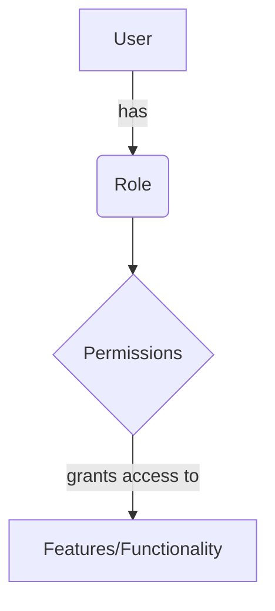

<details>
<summary>Relevant source files</summary>

The following files were used as context for generating this wiki page:

- [config/roles.json](https://github.com/agattani123/access-control-service/blob/main/config/roles.json)
- [src/models.js](https://github.com/agattani123/access-control-service/blob/main/src/models.js)
</details>

# Role Management

## Introduction

The Role Management system is a crucial component of the access control service, responsible for defining and managing user roles and their associated permissions within the application. It provides a structured way to control access to various features and functionalities based on a user's assigned role.

Sources: [config/roles.json](), [src/models.js]()

## Role Definition

Roles are defined in the `config/roles.json` file, where each role is associated with a list of permissions. The structure of the roles configuration is as follows:

```json
{
  "role_name": ["permission1", "permission2", ...],
  ...
}
```

The following roles are currently defined:

| Role     | Permissions                                |
|----------|---------------------------------------------|
| admin    | view_users, create_role, view_permissions |
| engineer | view_users, view_permissions              |
| analyst  | view_users                                |

Sources: [config/roles.json]()

## Data Models

The application uses two main data models: `User` and `Role`. These models are defined in the `src/models.js` file.

### User Model

```javascript
export const User = {
  email: 'string',
  role: 'string',
  phone: 'string'
};
```

The `User` model represents a user in the system and contains the following fields:

| Field | Type     | Description                      |
|-------|----------|----------------------------------|
| email | string   | The user's email address         |
| role  | string   | The user's assigned role         |
| phone | string   | The user's phone number          |

Sources: [src/models.js:1-5]()

### Role Model

```javascript
export const Role = {
  name: 'string',
  email: 'string',
  permissions: ['string']
};
```

The `Role` model defines a role and its associated permissions:

| Field       | Type     | Description                                  |
|-------------|----------|----------------------------------------------|
| name        | string   | The name of the role                         |
| email       | string   | The email associated with the role (optional)|
| permissions | string[] | The list of permissions granted to the role  |

Sources: [src/models.js:7-11]()

## Role Assignment and Permission Checking

The application likely has functionality to assign roles to users and check if a user has specific permissions based on their assigned role. However, the provided source files do not contain implementation details for these operations.



Sources: [config/roles.json](), [src/models.js]()

## Potential Improvements

Based on the provided source files, the following improvements could be considered for the Role Management system:

- Implement role inheritance or hierarchical roles to simplify permission management.
- Add support for dynamic permission assignment or revocation without modifying the configuration file.
- Introduce role-based access control (RBAC) middleware or decorators to enforce permissions at the code level.
- Enhance the `Role` model to include additional metadata, such as role descriptions or creation/modification timestamps.
- Implement role auditing and logging mechanisms to track changes to roles and permissions.

However, without access to the application's implementation details, it is difficult to provide more specific recommendations.

Sources: [config/roles.json](), [src/models.js]()

## Conclusion

The Role Management system in this access control service provides a structured way to define roles and their associated permissions. It allows for controlling access to various features and functionalities based on a user's assigned role. While the provided source files offer a basic understanding of the system, further implementation details would be required to fully comprehend and enhance its capabilities.