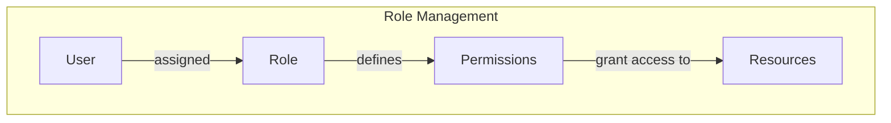

<details>
<summary>Relevant source files</summary>

The following files were used as context for generating this wiki page:

- [src/models.js](https://github.com/agattani123/access-control-service/blob/main/src/models.js)
</details>

# Role Management

## Introduction

The Role Management system within this project defines and manages user roles and their associated permissions. It provides a structured way to control access to various features or resources based on a user's assigned role. The core components of this system are the `User` and `Role` models, which encapsulate the necessary data structures and relationships.

## User Model

The `User` model represents an individual user within the system. It consists of the following properties:

### User Properties

| Property | Type     | Description                                |
|----------|----------|----------------------------------------------|
| `email`  | `string` | The email address associated with the user. |
| `role`   | `string` | The name of the role assigned to the user.  |
| `phone`  | `string` | The phone number of the user.               |

```javascript
export const User = {
  email: 'string',
  role: 'string',
  phone: 'string'
};
```

Sources: [src/models.js:1-5]()

The `User` model defines the basic information about a user, including their email, assigned role, and phone number. The `role` property is a string that corresponds to a defined role within the system, which determines the user's permissions and access levels.

## Role Model

The `Role` model represents a specific role within the system, defining its name, associated email (if applicable), and a list of permissions.

### Role Properties

| Property     | Type       | Description                                                |
|--------------|------------|--------------------------------------------------------------|
| `name`       | `string`   | The name or identifier of the role.                         |
| `email`      | `string`   | An optional email address associated with the role.         |
| `permissions`| `string[]` | An array of strings representing the permissions granted to this role. |

```javascript
export const Role = {
  name: 'string',
  email: 'string',
  permissions: ['string']
};
```

Sources: [src/models.js:8-12]()

The `Role` model encapsulates the details of a specific role within the system. Each role has a unique `name` and an optional `email` associated with it. The `permissions` property is an array of strings that define the specific actions or resources that users assigned to this role are allowed to access or perform.

## Role-Based Access Control (RBAC)

The Role Management system implements a Role-Based Access Control (RBAC) approach, where permissions are assigned to roles rather than individual users. This simplifies the management of access control and ensures consistent application of permissions across users with the same role.



Sources: [src/models.js]()

The diagram above illustrates the high-level architecture of the Role Management system:

1. Users are assigned to specific roles defined within the system.
2. Each role has a set of associated permissions defined.
3. These permissions grant access to various resources or features within the application.

By managing permissions at the role level, it becomes easier to add, modify, or revoke access for multiple users simultaneously by updating the permissions associated with their assigned role.

## Conclusion

The Role Management system provides a structured and scalable approach to managing user access and permissions within the application. By defining roles and associating them with specific permissions, it enables fine-grained control over what users can access or perform based on their assigned roles. This approach promotes security, maintainability, and consistency in access control across the application.