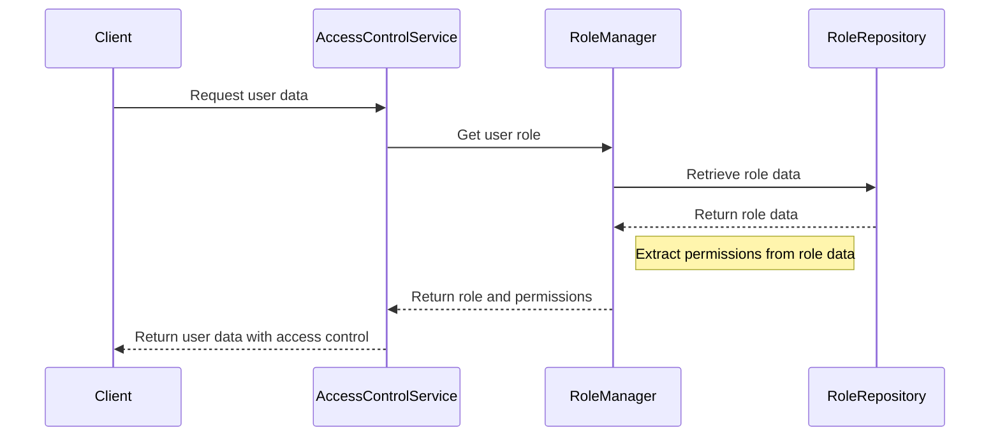
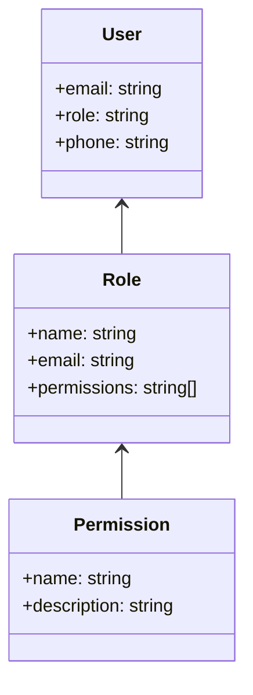

<details>
<summary>Relevant source files</summary>

The following files were used as context for generating this wiki page:

- [config/roles.json](https://github.com/agattani123/access-control-service/blob/main/config/roles.json)
- [src/models.js](https://github.com/agattani123/access-control-service/blob/main/src/models.js)
</details>

# Role Management

## Introduction

The Role Management system is a crucial component of the access control service, responsible for defining and managing user roles and their associated permissions within the application. It provides a structured way to grant or restrict access to various features and functionalities based on a user's assigned role.

Sources: [config/roles.json](), [src/models.js]()

## Role Definition

Roles are defined in the `config/roles.json` file, where each role is mapped to an array of permission strings. This file serves as the central configuration for role-based access control (RBAC) in the application.

```json
{
  "admin": ["view_users", "create_role", "view_permissions"],
  "engineer": ["view_users", "view_permissions"],
  "analyst": ["view_users"]
}
```

In the example above, three roles are defined: `admin`, `engineer`, and `analyst`. The `admin` role has permissions to view users, create roles, and view permissions. The `engineer` role can view users and permissions, while the `analyst` role can only view users.

Sources: [config/roles.json]()

## Data Models

The `src/models.js` file defines the data models for `User` and `Role` entities.

### User Model

```javascript
export const User = {
  email: 'string',
  role: 'string',
  phone: 'string'
};
```

The `User` model has the following fields:

| Field | Type     | Description |
|-------|----------|-------------|
| email | `string` | User's email address |
| role  | `string` | User's assigned role |
| phone | `string` | User's phone number |

Sources: [src/models.js:1-4]()

### Role Model

```javascript
export const Role = {
  name: 'string',
  email: 'string',
  permissions: ['string']
};
```

The `Role` model has the following fields:

| Field       | Type       | Description |
|-------------|------------|-------------|
| name        | `string`   | Name of the role |
| email       | `string`   | Email associated with the role (optional) |
| permissions | `string[]` | Array of permission strings for the role |

Sources: [src/models.js:6-9]()

## Role Management Flow

The Role Management system likely follows a sequence similar to the one depicted in the diagram below:



1. The client (e.g., a frontend application or API) sends a request to the Access Control Service to retrieve user data.
2. The Access Control Service delegates the task of fetching the user's role to the Role Manager component.
3. The Role Manager interacts with the Role Repository (e.g., a database or configuration file) to retrieve the role data.
4. The Role Repository returns the role data to the Role Manager.
5. The Role Manager extracts the permissions associated with the user's role from the retrieved role data.
6. The Role Manager sends the user's role and permissions back to the Access Control Service.
7. The Access Control Service uses the role and permissions to filter or modify the user data as needed before returning it to the client.

This flow ensures that user data is only accessible based on the user's assigned role and its corresponding permissions.

Sources: [config/roles.json](), [src/models.js]()

## Role-based Access Control (RBAC) Architecture

The Role Management system likely follows a role-based access control (RBAC) architecture, where permissions are assigned to roles, and users are assigned specific roles. This approach simplifies the management of permissions and access control within the application.



In this architecture:

- **Users** are assigned one or more **Roles**.
- **Roles** are associated with a set of **Permissions**.
- **Permissions** define the specific actions or resources that a user can access within the application.

By managing permissions at the role level, it becomes easier to grant or revoke access to multiple users by simply modifying the permissions associated with their assigned roles.

Sources: [config/roles.json](), [src/models.js]()

## Conclusion

The Role Management system is a critical component of the access control service, providing a structured way to manage user roles and their associated permissions. By defining roles and their permissions in a centralized configuration file, and associating users with specific roles, the system ensures that access to various features and functionalities is granted or restricted based on the user's assigned role. This approach simplifies the management of permissions and access control within the application, promoting better security and maintainability.