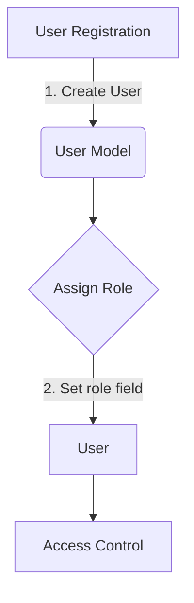
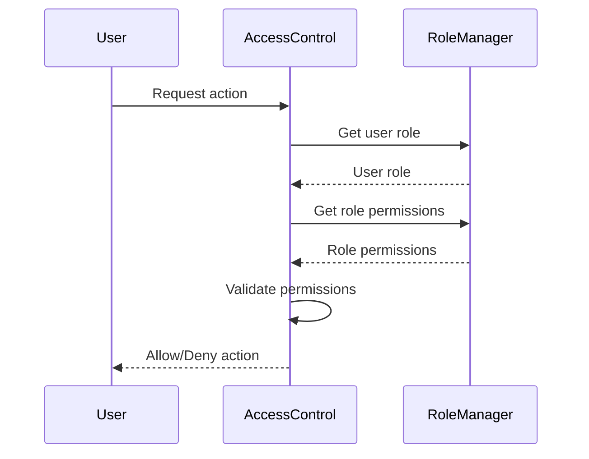

<details>
<summary>Relevant source files</summary>

The following files were used as context for generating this wiki page:

- [config/roles.json](https://github.com/agattani123/access-control-service/blob/main/config/roles.json)
- [src/models.js](https://github.com/agattani123/access-control-service/blob/main/src/models.js)
</details>

# Role Management

## Introduction

The Role Management system is a crucial component of the access control service, responsible for defining and managing user roles and their associated permissions within the application. It provides a structured way to grant or restrict access to various features and functionalities based on a user's assigned role.

Sources: [config/roles.json](), [src/models.js]()

## Role Definition

Roles are defined in the `config/roles.json` file, where each role is mapped to a list of permissions. The available roles and their corresponding permissions are as follows:

```json
{
  "admin": ["view_users", "create_role", "view_permissions"],
  "engineer": ["view_users", "view_permissions"],
  "analyst": ["view_users"]
}
```

Sources: [config/roles.json]()

## Data Models

The application uses two main data models related to role management: `User` and `Role`.

### User Model

The `User` model represents a user in the system and has the following fields:

| Field  | Type    | Description                   |
|--------|---------|-------------------------------|
| email  | string  | The user's email address      |
| role   | string  | The user's assigned role      |
| phone  | string  | The user's phone number       |

Sources: [src/models.js:1-4]()

### Role Model

The `Role` model defines a role and its associated permissions:

| Field       | Type     | Description                                  |
|-------------|----------|----------------------------------------------|
| name        | string   | The name of the role                         |
| email       | string   | The email associated with the role           |
| permissions | string[] | An array of permissions granted to the role |

Sources: [src/models.js:6-9]()

## Role Assignment

Users are assigned roles during the registration or user creation process. The `role` field in the `User` model is used to store the user's assigned role.



Sources: [src/models.js:2]()

## Permission Validation

When a user attempts to perform an action within the application, the system checks if the user's assigned role has the required permission(s) for that action. This validation is likely performed by comparing the requested permission(s) against the list of permissions associated with the user's role in the `config/roles.json` file.



Sources: [config/roles.json](), [src/models.js:6-9]()

## Role Management Operations

Based on the available information, the following role management operations are likely supported:

- **View Users**: Allows users with the `view_users` permission to view a list of registered users in the system.
- **View Permissions**: Allows users with the `view_permissions` permission to view the list of available permissions and their associated roles.
- **Create Role**: Allows users with the `create_role` permission to create new roles and define their associated permissions.

Sources: [config/roles.json]()

## Conclusion

The Role Management system provides a flexible and scalable way to manage user access and permissions within the application. By defining roles and their associated permissions, the system can effectively control what actions users can perform based on their assigned roles. This approach promotes security and helps maintain a clear separation of concerns within the application.